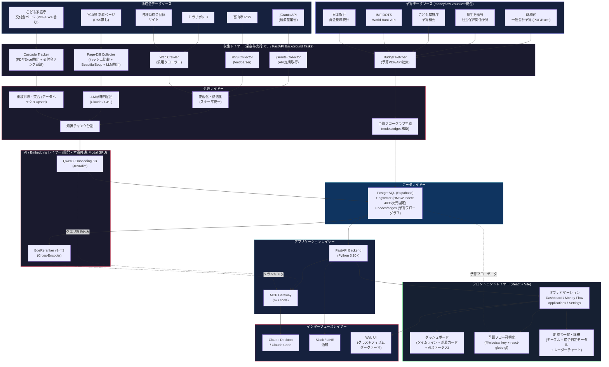
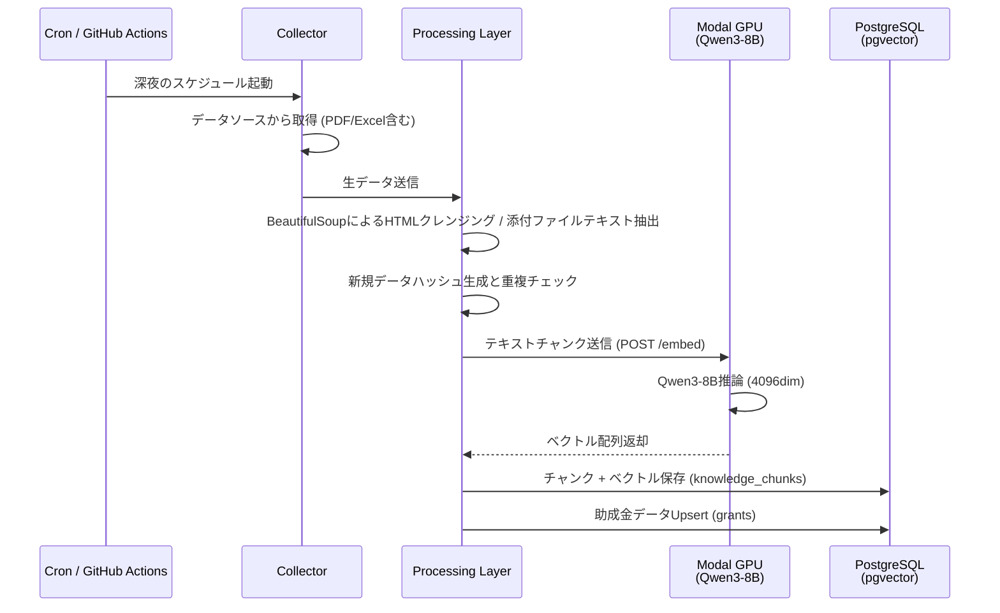
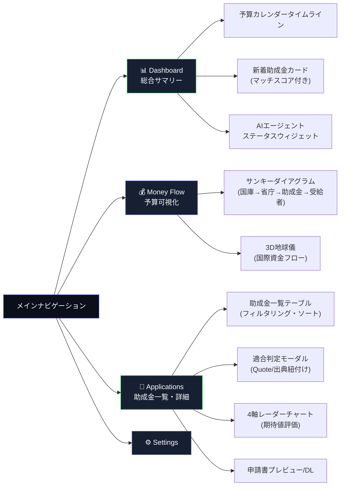

# auto-grants-integrated アーキテクチャ設計書

> **Version**: 1.3 (Revised)  
> **更新日**: 2026-07-15  
> **ステータス**: Draft

---

## 1. システム全体構成図



---

## 2. レイヤー構成の設計方針

| レイヤー | 役割 | 実装方針 |
|---|---|---|
| **GrantSources** | 助成金・補助金データソースとの接続ポイント | 各ソースの特性（API/RSS/HTML/PDF/Excel）に応じた個別コレクター。 |
| **BudgetSources** | 国・自治体の予算データソース | 財務省/厚労省/こども家庭庁の予算PDF/Excel、IMF DOTS/World Bank API、日本銀行資金循環統計などの公式データソース。moneyflow-visualizerの10種のデータソースを継承。 |
| **Collectors** | データの取得・初期加工 | **CLIスクリプト**（深夜のcron/GitHub Actions実行用）または **FastAPIの非同期バックグラウンドタスク**。予算データ用の Budget Fetcher を新設。 |
| **Processing** | 正規化・構造化・重複排除 | 統一スキーマへの変換、HTMLタグ等の不要ノイズ除去、個別データのハッシュ値を用いたUpsert重複排除。予算データは nodes/edges グラフ構造へ変換。 |
| **AI/Embedding** | ベクトル埋め込み・リランキング | **開発・本番共通**でModal上の Qwen3-8B + BgeReranker を実行。 |
| **Data** | 永続化・ベクトル検索・グラフデータ | PostgreSQL (Supabase) + pgvector (4096次元HNSW)。助成金データ (grants) と予算フローグラフ (nodes/edges) を一元管理。 |
| **Application** | ビジネスロジック・API | FastAPI + MCP Gateway。Modal APIのエラー時はキーワード検索へ自動フォールバック。 |
| **Frontend** | ビュー切り替え・UI | React + Vite。タブナビ (Dashboard / Money Flow / Applications / Settings) によるビュー切替。グラスモフィズムダークテーマを統一適用。 |
| **Interface** | ユーザー接点 | Claude Desktop/Code (MCP)、Slack/LINE (通知)、Web UI (グラスモフィズムダークテーマ)。 |

---

## 3. Embeddingプロバイダアーキテクチャ

本プロジェクトでは、開発環境・本番環境ともに `EMBEDDING_PROVIDER=modal` を基本構成とすることで、データベースのベクトル次元数（4096次元）を統一し、環境間での不整合（スキーマ変更エラー）を排除する。

```
[開発・本番環境共通]
EMBEDDING_PROVIDER=modal 
  └─► ModalEmbeddingService ──► Modal API (Qwen3-8B, 4096dim) ──► PostgreSQL vector(4096)

[オフライン/テスト用フォールバック]
EMBEDDING_PROVIDER=mock (または none)
  └─► MockEmbeddingService ──► 極小のランダムノイズを含む4096次元ベクトルを返却してゼロ除算とDBエラーを回避
```

---

## 4. データフロー設計

### 4.1 助成金収集 & ベクトル埋め込みフロー



(セマンティック検索フローは前バージョンと同様のため省略)

---

## 5. フロントエンド UI アーキテクチャ

ユーザーはメインナビゲーション（タブ）でビューを切り替え、異なる視点から予算・助成金データにアクセスする。全ビューは共通の「ダークインディゴ＋グラスモフィズム」デザインシステム（`index.css`）で構築する。



### 5.1 デザインシステム

全ビューに共通するデザイントークンは `index.css` の CSS カスタムプロパティで定義する。

| トークン | 値 | 用途 |
|---|---|---|
| `--bg-gradient-start` | `#0b0f19` | 背景グラデーション開始 |
| `--bg-gradient-end` | `#162032` | 背景グラデーション終了 |
| `--surface-glass` | `rgba(22,32,50,0.45)` | グラスモフィズムカード/パネル背景 |
| `--color-primary` | `#5e5ce6` | エレクトリックインディゴ (ボタン・アクティブタブ) |
| `--color-accent-mint` | `#30d158` | ネオンミント (マッチスコア・正常ステータス) |
| `--font-display` | `Outfit` | ヘッダー・タイトル |
| `--font-sans` | `Inter` | 本文テキスト |

### 5.2 主要コンポーネント一覧

| コンポーネント | ライブラリ | ビュー |
|---|---|---|
| サンキーダイアグラム | `@nivo/sankey` | Money Flow |
| 3D地球儀 | `react-globe.gl` + `three` | Money Flow |
| レーダーチャート | `recharts` | Applications 詳細モーダル |
| タイムライン/ガント | カスタム実装 | Dashboard |
| データフェッチ | TanStack Query | 全ビュー共通 |

---

## 6. ベクトル次元マイグレーション設計

`EMBEDDING_PROVIDER` を何らかの理由で切り替える場合、データベースのカラム次元不整合によるエラーを防ぐため、起動時に次元数セーフティチェックを実行する。

1. **セーフティチェック**: 起動時にDB上の `knowledge_chunks.embedding` 次元数をSQLクエリで取得し、`.env` の `EMBEDDING_DIMENSIONS` (デフォルト4096) と一致しない場合は起動を抑止する。
2. **Re-embedding CLI**: 開発環境から本番環境への移行時など、手動で再埋め込みを行うためのユーティリティを提供（`rebuild_embeddings.py`）。
