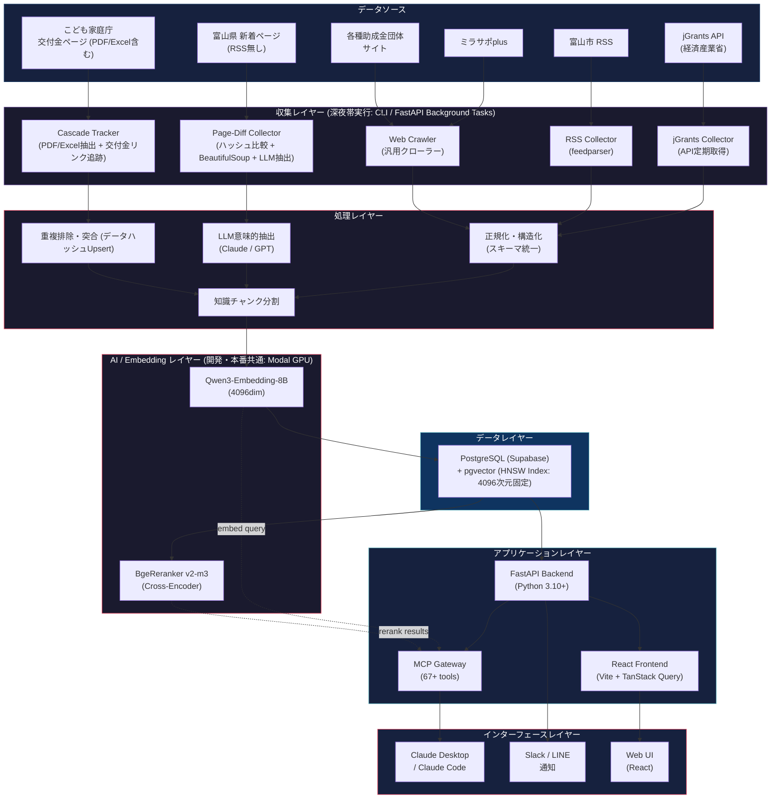
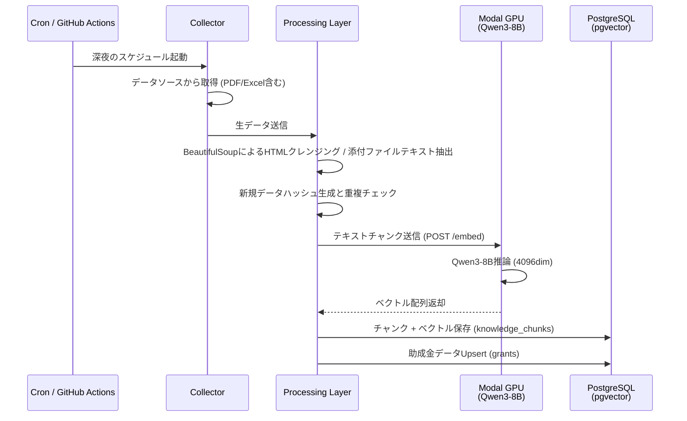

# auto-grants-integrated アーキテクチャ設計書

> **Version**: 1.2 (Revised)  
> **更新日**: 2026-07-15  
> **ステータス**: Draft

---

## 1. システム全体構成図



---

## 2. レイヤー構成の設計方針

| レイヤー | 役割 | 実装方針 |
|---|---|---|
| **DataSources** | 外部データソースとの接続ポイント | 各ソースの特性（API/RSS/HTML/PDF/Excel）に応じた個別コレクター。 |
| **Collectors** | データの取得・初期加工 | **CLIスクリプト**（深夜のcron/GitHub Actions実行用）または **FastAPIの非同期バックグラウンドタスク**。 |
| **Processing** | 正規化・構造化・重複排除 | 統一スキーマへの変換、HTMLタグ等の不要ノイズ除去、個別データ（タイトル等）のハッシュ値を用いたUpsert重複排除。 |
| **AI/Embedding** | ベクトル埋め込み・リランキング | **開発・本番共通**でModal上の Qwen3-8B + BgeReranker を実行。 |
| **Data** | 永続化・ベクトル検索 | PostgreSQL (Supabase) + pgvector。開発・本番共通で **4096次元のHNSWインデックス** に固定。 |
| **Application** | ビジネスロジック・API | FastAPI + MCP Gateway。Modal APIのエラー時はキーワード検索へ自動フォールバック。 |
| **Interface** | ユーザー接点 | Claude Desktop/Code (MCP)、Slack/LINE (通知)、React (Web UI)。 |

---

## 3. Embeddingプロバイダアーキテクチャ

本プロジェクトでは、開発環境・本番環境ともに `EMBEDDING_PROVIDER=modal` を基本構成とすることで、データベースのベクトル次元数（4096次元）を統一し、環境間での不整合（スキーマ変更エラー）を排除する。

```
[開発・本番環境共通]
EMBEDDING_PROVIDER=modal 
  └─► ModalEmbeddingService ──► Modal API (Qwen3-8B, 4096dim) ──► PostgreSQL vector(4096)

[オフライン/テスト用フォールバック]
EMBEDDING_PROVIDER=mock (または none)
  └─► MockEmbeddingService ──► 極小のランダムノイズを含む4096次元ベクトルを返却してゼロ除算とDBエラーを回避
```

---

## 4. データフロー設計

### 4.1 助成金収集 & ベクトル埋め込みフロー



(セマンティック検索フローは前バージョンと同様のため省略)

---

## 5. ベクトル次元マイグレーション設計

`EMBEDDING_PROVIDER` を何らかの理由で切り替える場合、データベースのカラム次元不一致によるエラーを防ぐため、起動時に次元数セーフティチェックを実行する。

1. **セーフティチェック**: 起動時にDB上の `knowledge_chunks.embedding` 次元数をSQLクエリで取得し、`.env` の `EMBEDDING_DIMENSIONS` (デフォルト4096) と一致しない場合は起動を抑止する。
2. **Re-embedding CLI**: 開発環境から本番環境への移行時など、手動で再埋め込みを行うためのユーティリティを提供（`rebuild_embeddings.py`）。
