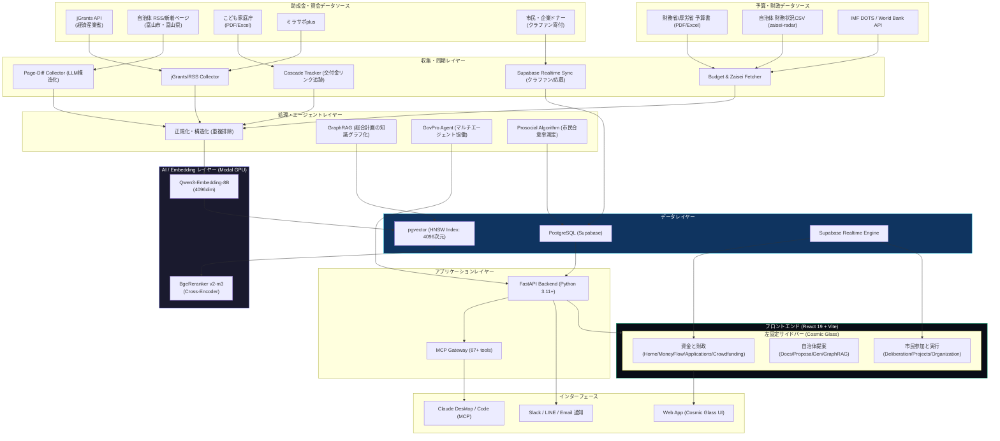
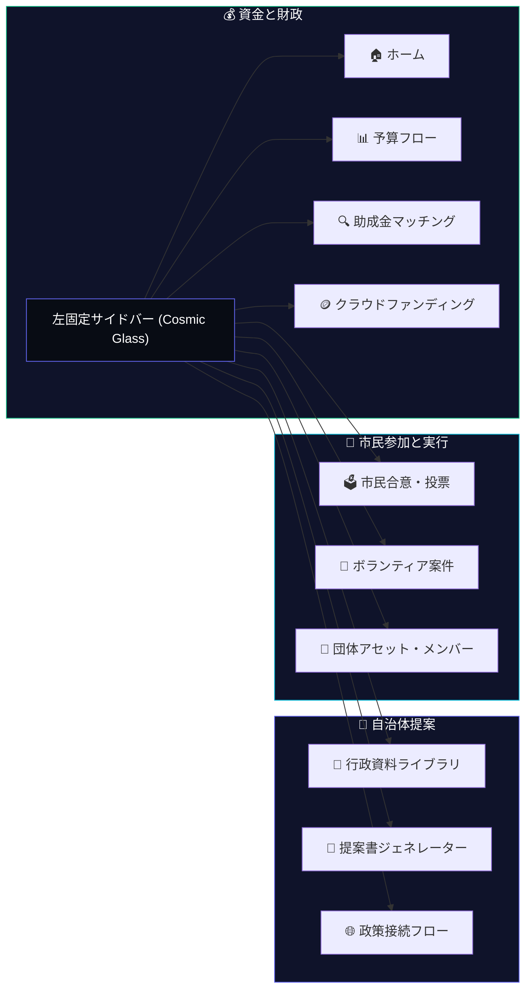

# auto-grants-integrated アーキテクチャ設計書

> **Version**: 2.0 (Integrated)  
> **更新日**: 2026-07-15  
> **ステータス**: Draft

---

## 1. システム全体構成図



---

## 2. レイヤー構成の設計方針

| レイヤー | 役割 | 統合・実装方針 |
|---|---|---|
| **GrantSources** | 助成金および直接的資金調達元 | 従来の公募情報に加え、市民や企業からのクラウドファンディングの寄付フロー（リアルタイムトランザクション）を統合。 |
| **BudgetSources** | 国・自治体の財務情報 | 財務省等の予算PDFのほか、`zaisei-radar`が使用する自治体の財務データCSVをインポート。 |
| **Collectors** | データ収集・同期 | 日次/週次バッチスクリプトに加え、ボランティア応募やクラファン決済時のSupabase Realtimeリスナーによる即時反映。 |
| **Processing** | データ構造化・エージェント | `BeautifulSoup` + `LLM` によるテキスト抽出。自治体基本計画のGraphRAGコミュニティ生成。プロソーシャル（市民合意）指標の算出。 |
| **AI/Embedding** | セマンティック処理 | Modal GPU上のQwen3 (4096次元) で統一。BgeRerankerによる高精度リランキング。 |
| **Security & Privacy** | 信頼・プライバシー保護 | W3C規格の **DID（分散型ID）** を用いた自己主権型認証、および **zk-SNARKs** を用いた個人情報不要の実績・住民属性証明。 |
| **Data** | 永続化とリアルタイム連携 | PostgreSQL (Supabase) 上に、助成金、予算フロー、クラファン、プロジェクト（ボランティア）、市民投票、団体アセット、およびZKP検証用資格（VC）テーブルを一元化。 |
| **Application** | ロジック・インターフェース | FastAPIによるAIエージェントのオーケストレーション、ZKP検証エンジン、外部接続用MCPサーバー。 |
| **Frontend** | ユーザーインターフェース | React 19 + Vite。「Cosmic Glass」デザインシステムを採用した、左固定多階層ナビゲーションによるSPA。 |
| **Interface** | マルチチャネルアクセス | Web UI、Slack/LINE/Emailによる期日・応募通知、Claudeによる自然言語MCP操作。 |

---

## 3. 統合データフロー設計

### 3.1 市民合意・エビデンス付きプロポーザル生成フロー
市民からの合意と実績データを、自治体への提案書（プロポーザル）にエビデンスとしてシームレスに組み込むデータフロー。

```mermaid
sequenceDiagram
    participant Citizen as 市民 (Web UI)
    participant Delib as 協議・投票DB
    participant Fact as 団体アセットDB
    participant GraphRAG as GraphRAG (GovPro)
    participant Writer as 執筆エージェント
    participant Proposal as 提案書 (PDF/MD)

    Citizen->>Delib: プロジェクト案に投票 (Quadratic Voting)
    Delib->>Delib: 合意率・統計データを集計 (例: 合意率 89%)
    Fact->>Fact: 過去のボランティア活動実績を登録
    GraphRAG->>GraphRAG: 自治体の総合計画・施策を分析
    Writer->>Delib: 市民合意データ・投票ログを読み込み
    Writer->>Fact: 活動実績・参加メンバー数を読み込み
    Writer->>GraphRAG: 政策適合性のエビデンスを取得
    Writer->>Writer: 提案書の下書きとエビデンスを自動生成
    Writer-->>Proposal: 根拠（出典）付き提案書をエクスポート

### 3.2 ゼロ知識証明 (ZKP) を用いたプライバシー保護型属性証明フロー
市民が機微な個人データ（本名、住所、過去の個別の被支援者情報）を開示せずに、「住民資格」や「活動実績」のみを安全に検証者に証明する流れ。

```mermaid
sequenceDiagram
    participant Wallet as シビック・ウォレット (WASM)
    participant Issuer as 発行者 (NPO/自治体)
    participant DB as Supabase (ZKP / VCストア)
    participant Verifier as 検証者 (自治体/AI審査官)

    %% 資格発行フェーズ
    Issuer->>Wallet: ボランティア実績 / 住民権の暗号署名データ(VC)を発行
    Wallet->>Wallet: ウォレット（ブラウザ）へ実績の生データを安全に格納

    %% 証明・検証フェーズ
    Wallet->>Wallet: 生データから「合計活動時間 >= 50」のゼロ知識証明(zk_proof)を生成 (zk-SNARKs)
    Wallet->>DB: zk_proof とコミットメントハッシュを登録
    Verifier->>DB: ユーザーの zk_proof とコミットメントをロード
    Verifier->>Verifier: 公開パラメータを用いて ZKP の正当性を検証 (生データは見えない)
    Verifier-->>Verifier: 検証成功 (属性が真であることを承認)
```

```

---

## 4. フロントエンド UI アーキテクチャ

プラットフォーム全体は、左側に固定された「Cosmic Glass」スタイルの多階層ナビゲーションからアクセスします。従来の4つのタブを廃止し、3つの大セクション、12の機能モジュールへ整理・再設計します。



### 4.1 共通デザインシステム仕様 (Cosmic Glass)

全コンポーネントは、`index.css` にて一元管理される以下のデザイントークンに従って描画されます。

| トークン名 | 値 | 用途 |
|---|---|---|
| `--bg-cosmic` | `linear-gradient(135deg, #060913 0%, #0F132A 100%)` | アプリケーション全体の背景色 |
| `--surface-glass` | `rgba(15, 20, 38, 0.45)` | カード、モーダル、サイドバー等の磨りガラス背景 |
| `--border-glass` | `rgba(255, 255, 255, 0.06)` | パネルの極細境界線（1px） |
| `--blur-glass` | `blur(16px)` | 背景の磨りガラス（ぼかし）フィルター (パネル用) |
| `--blur-glass-md` | `blur(12px)` | 背景の磨りガラス（ぼかし）フィルター (カード用) |
| `--blur-glass-sm` | `blur(8px)` | 背景の磨りガラス（ぼかし）フィルター (ボタン用) |
| `--color-indigo` | `#6366F1` | プライマリ・AI・ジェネレーター用アクセント |
| `--color-mint` | `#10B981` | 資金・適合・正常ステータス用アクセント |
| `--color-aqua` | `#06B6D4` | 市民参加・Plurality・合意形成用アクセント |
| `--color-coral` | `#EF4444` | アラート・締切・エラー用アクセント |
| `--font-display` | `Outfit` | タイトル、見出し、ヘッダー |
| `--font-sans` | `Inter` | 本文、ログ、コード表示 |

### 4.2 主要ライブラリの役割分担

* **グラフ可視化**:
  * **サンキーダイアグラム**: `@nivo/sankey` (国庫→自治体→採択者までの資金フロー)
  * **レーダーチャート/進捗チャート**: `recharts` (期待値評価、クラファン支援進捗)
  * **ネットワークグラフ**: `d3-force` または `react-force-graph` (GraphRAGの施策マップ)
* **リアルタイム通信**:
  * `@supabase/supabase-js` (Realtime機能を用いた投票集計、ボランティア応募、メッセージ同期)
