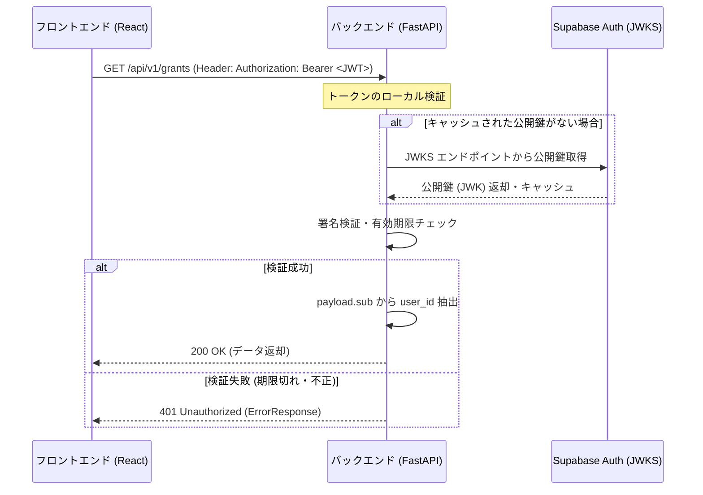
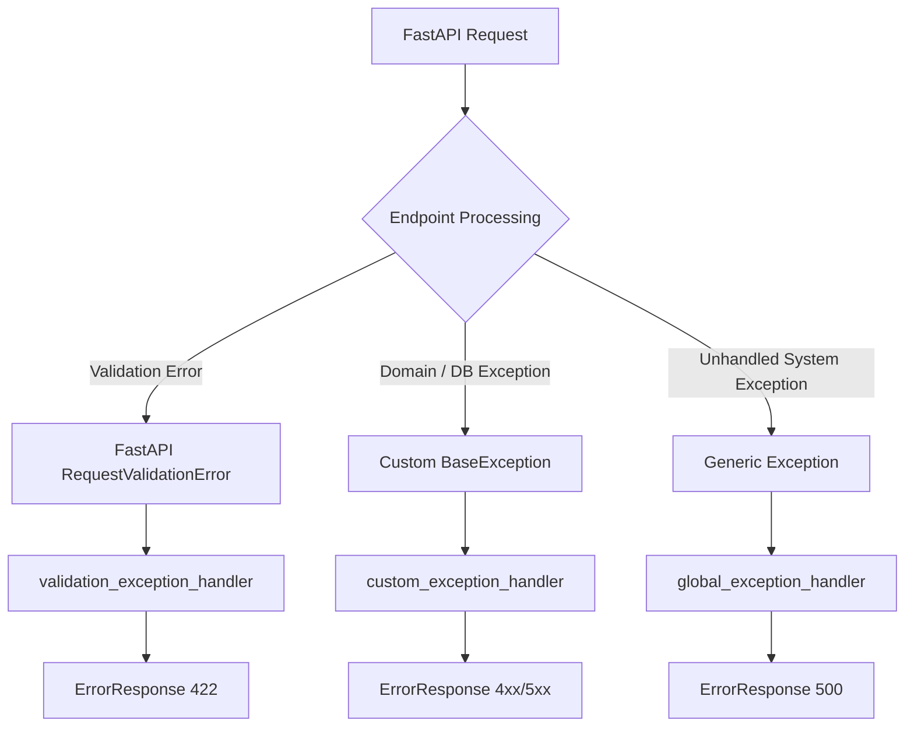

# auto-grants-integrated 詳細設計書

> **Version**: 1.2 (Revised)  
> **更新日**: 2026-07-15  
> **ステータス**: Draft

---

## 1. コレクター詳細設計

### 1.1 富山県ページ差分コレクター (`diff_toyama_pref.py`)

#### クラス構成と処理フロー
```python
class ToyamaPrefDiffCollector:
    def __init__(self, db_client: PostgreSQLClient, llm_client: ClaudeClient):
        self.db = db_client
        self.llm = llm_client
        self.url = "https://www.pref.toyama.jp/shinchaku.html"

    async def run(self) -> CollectorResult:
        # 1. ページ取得
        html = await self.fetch_html()
        
        # 2. 前処理 (HTMLクレンジング)
        clean_text = self.clean_html(html)
        
        # 3. 差分検知
        current_hash = self.generate_hash(clean_text)
        last_run = await self.get_last_run_status("diff_toyama_pref")
        
        if last_run and last_run.page_hash == current_hash:
            return CollectorResult(status="success", items_found=0, message="No changes detected")
            
        # 4. 差分量サーキットブレーカー
        if last_run and self.calculate_diff_ratio(last_run.clean_text, clean_text) > 0.8:
            await self.register_alert("Diff threshold exceeded (80%). Circuit breaker activated.")
            return CollectorResult(status="error", message="Circuit breaker activated")

        # 5. LLMによる構造化抽出
        raw_subsidies = await self.extract_subsidies_via_llm(clean_text)
        
        # 6. 重複排除 (Upsert) 処理
        new_count, updated_count = await self.upsert_subsidies(raw_subsidies)
        
        # 7. 実行ログの保存
        await self.save_run_log(current_hash, new_count, updated_count)
```

#### 個別データ単位の重複排除 (Upsert) ロジック
```python
async def upsert_subsidies(self, raw_subsidies: list[dict]) -> tuple[int, int]:
    new_count = 0
    updated_count = 0
    
    for item in raw_subsidies:
        # 一意のキーを生成 (タイトル、管轄自治体、公募開始日)
        unique_string = f"{item['title']}_{item.get('agency', '富山県')}_{item.get('accept_start', '')}"
        data_hash = hashlib.sha256(unique_string.encode('utf-8')).hexdigest()
        
        # grants テーブルから data_hash を検索
        # ※ payload_json->>'data_hash' に対する関数インデックス (idx_grants_payload_data_hash) が貼られている前提
        existing = await self.db.fetch_one(
            "SELECT id FROM grants WHERE payload_json->>'data_hash' = :data_hash",
            {"data_hash": data_hash}
        )
        
        item['data_hash'] = data_hash
        
        if existing:
            # 既存レコードをアップデート
            await self.db.execute("""
                UPDATE grants 
                SET title = :title, provider = :provider, category = 'PUBLIC', 
                    payload_json = :payload::jsonb, updated_at = NOW() 
                WHERE id = :id
            """, {
                "title": item['title'], 
                "provider": item.get('agency', '富山県'), 
                "payload": json.dumps(item), 
                "id": existing['id']
            })
            updated_count += 1
        else:
            # 新規レコードをインサート
            await self.db.execute("""
                INSERT INTO grants (title, provider, category, source, payload_json, created_at, updated_at) 
                VALUES (:title, :provider, 'PUBLIC', 'toyama_pref', :payload::jsonb, NOW(), NOW())
            """, {
                "title": item['title'], 
                "provider": item.get('agency', '富山県'), 
                "payload": json.dumps(item)
            })
            new_count += 1
            
    return new_count, updated_count


### 1.2 民間助成金コレクター (`collectors/private/private_grant_fetcher.py`)

#### クラス構成と処理フロー
```python
class PrivateGrantFetcher:
    """
    民間助成情報ポータルまたは特定の助成財団のWebページ・RSSをクローリングし、
    DOMプロファイルおよびPlaywrightを用いて、LLM構造化を経て grants テーブルに category='PRIVATE' として保存する。
    クオリティゲートおよびLLM自己修復（Self-Healing）機構を備える。
    """
    def __init__(self, db_client: PostgreSQLClient, llm_client: ClaudeClient, playwright_client: PlaywrightClient):
        self.db = db_client
        self.llm = llm_client
        self.pw = playwright_client

    async def run(self, source_id: str) -> CollectorResult:
        # 1. 登録されているDOMプロファイル（CSSセレクタ定義）の取得
        profile = await self.db.fetch_one("SELECT * FROM grant_source_profiles WHERE source_id = :id AND active = true", {"id": source_id})
        
        # 2. Playwrightを用いたDOMツリー巡回とコンテンツ抽出
        # profile 内のセレクタ (list_selector, detail_selector, etc.) に基づく
        pages_content = await self.pw.crawl_pages(profile)
        
        # 3. LLMを用いた民間助成金情報の構造化抽出
        # ※民間特有の項目（財団の設立趣旨、適合する特定NPO活動領域など）を抽出
        raw_grants = await self.extract_private_grants_via_llm(pages_content)
        
        # 4. クオリティゲート（Quality Gate）による網羅性チェック
        # 必須項目（タイトル、提供団体、締切、URL）が埋まっているか、Coverage Rate (埋まり率) >= 0.95 かを評価
        is_valid, coverage_rate = self.evaluate_quality_gate(raw_grants)
        
        if not is_valid:
            # クオリティゲート違反の場合：自己修復 (Self-Healing) をトリガー
            # LLMが現在のHTML木構造と期待されるスキーマの乖離を分析し、DOMプロファイルを修正
            await self.trigger_self_healing_repair(source_id, pages_content)
            return CollectorResult(status="needs_user_input", items_found=0, message="Quality gate failed. Self-healing triggered.")
            
        # 5. 重複排除 (Upsert) 処理
        new_count, updated_count = await self.upsert_private_grants(raw_grants)
        
        return CollectorResult(status="success", items_found=new_count, message=f"Added {new_count}, updated {updated_count}")

    async def upsert_private_grants(self, raw_grants: list[dict]) -> tuple[int, int]:
        new_count = 0
        updated_count = 0
        
        for item in raw_grants:
            # 重複排除用のキー (タイトル、提供団体名、締切日) を元にハッシュ生成
            unique_string = f"{item['title']}_{item['provider']}_{item.get('deadline', '')}"
            data_hash = hashlib.sha256(unique_string.encode('utf-8')).hexdigest()
            item['data_hash'] = data_hash
            
            existing = await self.db.fetch_one(
                "SELECT id FROM grants WHERE payload_json->>'data_hash' = :data_hash",
                {"data_hash": data_hash}
            )
            
            if existing:
                # 既存レコードの更新 (category='PRIVATE' を維持)
                await self.db.execute("""
                    UPDATE grants 
                    SET title = :title, provider = :provider, category = 'PRIVATE',
                        payload_json = :payload::jsonb, updated_at = NOW() 
                    WHERE id = :id
                """, {
                    "title": item['title'],
                    "provider": item['provider'],
                    "payload": json.dumps(item),
                    "id": existing['id']
                })
                updated_count += 1
            else:
                # 新規レコードの登録
                await self.db.execute("""
                    INSERT INTO grants (title, provider, category, source, payload_json, created_at, updated_at) 
                    VALUES (:title, :provider, 'PRIVATE', :source, :payload::jsonb, NOW(), NOW())
                """, {
                    "title": item['title'],
                    "provider": item['provider'],
                    "source": self.source_name,
                    "payload": json.dumps(item)
                })
                new_count += 1
                
        return new_count, updated_count
```

---

## 2. 交付金カスケードウォッチャー (`cascade_watch.py`)

### 2.1 PDF/Excel解析とLLM構造化連携

```python
import pdfminer.high_level
import openpyxl

class CascadeWatchCollector:
    def __init__(self, db_client: PostgreSQLClient, llm_client: ClaudeClient, embedding_service: EmbeddingServiceBase):
        self.db = db_client
        self.llm = llm_client
        self.embedder = embedding_service

    async def process_attachment(self, url: str) -> str:
        # 一時ファイルへダウンロード
        temp_path = await self.download_temp_file(url)
        
        if url.endswith('.pdf'):
            # PDFテキスト抽出
            return pdfminer.high_level.extract_text(temp_path)
        elif url.endswith(('.xlsx', '.xls')):
            # Excelテキスト抽出 (巨大ファイルによるOOM対策として read_only=True を明示)
            try:
                wb = openpyxl.load_workbook(temp_path, read_only=True)
                text_lines = []
                for sheet in wb.worksheets:
                    for row in sheet.iter_rows(values_only=True):
                        row_text = " ".join([str(cell) for cell in row if cell is not None])
                        text_lines.append(row_text)
                return "\n".join(text_lines)
            except Exception as e:
                # パース失敗時やメモリ不足発生時の安全なフォールバック
                # (監視と追跡のため、単なるprintではなくログ出力とアラート登録を行う)
                logger.error(f"Error parsing Excel file {url}: {e}")
                await self.register_alert(f"Excel parse failed for {url}", error=str(e))
                # (必要に応じて pandas + python-calamine 等の軽量ライブラリへの移行を推奨)
                return ""
        return ""

    async def analyze_cascade_via_llm(self, extracted_text: str) -> dict:
        # 単純な4000文字クリップを避け、LLM (Claude) の大きなコンテキストウィンドウを活かして
        # 主要情報が含まれる十分なサイズ（例: 50,000文字）まで入力として受け入れる
        max_chars = 50000
        prompt = f"""
        以下の予算・交付金添付資料のテキストを解析し、
        国の交付金名、およびそれに関連する都道府県・市町村の事業計画のつながり（カスケード）を抽出し、
        指定のJSON形式で出力してください。
        
        テキスト:
        {extracted_text[:max_chars]}
        """
        response = await self.llm.generate_json(prompt)
        return response

    async def resolve_cascade_entities(self, cascade_data: dict) -> dict:
        """
        LLM が抽出したテキスト名称（例: '国の交付金名'）と、DB 内の既存ノード (grants/budget nodes) の
        セマンティック類似度を計算して紐付ける名寄せ（Entity Resolution）処理。
        """
        resolved_results = {}
        for level in ["national_subsidy", "prefecture_project", "city_project"]:
            name = cascade_data.get(level)
            if not name:
                continue

            # 1. 抽出されたテキストのベクトル化
            embedding = await self.embedder.embed_texts([name])
            vector = embedding[0]

            # 2. pgvector コサイン類似度による類似ノードの検索
            #    (ノード種別(category)や階層(depth)をターゲットに指定)
            matched_node = await self.db.fetch_one("""
                SELECT id, name, 1 - (embedding <=> :vector::vector) as similarity
                FROM public.nodes
                WHERE depth_level = :level
                ORDER BY similarity DESC
                LIMIT 1
            """, {"vector": vector, "level": level})

            # 3. 類似度が閾値 (0.85) 以上の場合は既存IDを採用。無ければ新規作成フラグを立てる
            if matched_node and matched_node["similarity"] >= 0.85:
                resolved_results[level] = {
                    "id": matched_node["id"],
                    "name": matched_node["name"],
                    "is_new": False
                }
            else:
                resolved_results[level] = {
                    "id": None,
                    "name": name,
                    "is_new": True
                }

        return resolved_results
```
```

---

## 3. Embeddingプロバイダ設計 (Mock/Offline対応)

開発環境で完全にオフライン動作させたい場合や、テスト時にModal接続を行わないための `MockEmbeddingService` を実装する。

```python
import random

class MockEmbeddingService(EmbeddingServiceBase):
    """
    オフラインおよびローカルテスト用のモックプロバイダ。
    pgvector コサイン類似度計算時のゼロ除算 (division by zero) エラーを防ぐため、
    極小のランダムなノイズを乗せた 4096 次元ベクトルを返却する。
    """
    def __init__(self, dimensions: int = 4096):
        self.dimensions = dimensions

    async def embed_texts(self, texts: list[str], type: str = "passage") -> list[list[float]]:
        # ゼロ除算を避けるため、極小のランダムノイズを含むベクトルを生成
        return [
            [random.uniform(-0.0001, 0.0001) for _ in range(self.dimensions)]
            for _ in texts
        ]

    async def rerank(self, query: str, passages: list[str]) -> list[float]:
        # 単純なインデックス順に降順のダミースコアを返却
        return [1.0 - (i * 0.01) for i in range(len(passages))]


# 3.2 Modalコールドスタート時のローカルフォールバック検索仕様
# Modalが起動するまでの最大3分間、またはオフライン環境において、pg_trgm（日本語3-gram）を用いた
# トリグラム類似度検索を PostgreSQL/Supabase 側で実行して暫定的な検索結果を返す。
#
# [重要] フォールバック時はベクトル検索 (pgvector) を使用しない。
#   Modal GPU の Qwen3-Embedding (4096次元) と次元が一致しないローカルモデルで
#   pgvector カラムに書き込むと、次元不整合エラーが発生するため。
#   フォールバック = PostgreSQL pg_trgm による純粋なテキスト類似度検索。
#
# [SQL インデックスの作成（事前適用前提）]
# CREATE EXTENSION IF NOT EXISTS pg_trgm;
# CREATE INDEX IF NOT EXISTS idx_grants_title_trgm ON public.grants USING gin (title gin_trgm_ops);
#
# [ローカルフォールバック用 SQL クエリ]
# SELECT id, title, provider, amount_max, deadline, details_url, payload_json,
#        similarity(title, :query) AS text_score
# FROM public.grants
# WHERE title % :query -- トリグラム類似度閾値（デフォルト0.3）以上のものを抽出
#   AND category = :category -- 助成金区分（PUBLIC/PRIVATE）によるフィルタリング
# ORDER BY text_score DESC
# LIMIT :limit;
#
# [API 側での切り替え判定]
# 1. API リクエスト受信時、まず Modal AI インフラにヘルスチェック（ ping / 起動状態確認 ）を送信。
# 2. 応答がタイムアウト、または 503 (コールドスタート中) の場合、ローカルフォールバック検索を実行。
# 3. レスポンスに 'is_fallback: true' を含めてフロントエンドに返し、UI上で「AI検索起動中のため暫定結果を表示中...」のステータスとプログレスバー（3分目安）を描画する。
```

### 3.3 Modal本番環境セマンティック検索・AIマッチング詳細設計

Modal GPU上で稼働する `Qwen3-Embedding-8B` と `BgeReranker v2-m3` にアクセスし、Supabase（pgvector）と連携してセマンティック検索およびマッチングを行う本番ロジックの設計。

#### クラス構成と処理フロー

```python
class ModalAIService:
    """
    Modal GPU インフラ上で稼働する Embedding / Reranking API との通信を担当。
    """
    def __init__(self, endpoint_url: str, api_key: str):
        self.endpoint = endpoint_url
        self.headers = {"Authorization": f"Bearer {api_key}"}

    async def get_embedding(self, text: str) -> list[float]:
        """Qwen3-Embedding-8B による4096次元のベクトル生成"""
        async with httpx.AsyncClient() as client:
            response = await client.post(
                f"{self.endpoint}/v1/embeddings",
                json={"input": text, "model": "Qwen3-Embedding-8B"},
                headers=self.headers,
                timeout=10.0
            )
            response.raise_for_status()
            return response.json()["data"][0]["embedding"]

    async def compute_rerank_scores(self, query: str, documents: list[str]) -> list[float]:
        """BgeReranker v2-m3 によるクロスエンコーダ類似度スコアリング"""
        async with httpx.AsyncClient() as client:
            response = await client.post(
                f"{self.endpoint}/v1/rerank",
                json={
                    "query": query,
                    "documents": documents,
                    "model": "bge-reranker-v2-m3"
                },
                headers=self.headers,
                timeout=15.0
            )
            response.raise_for_status()
            return [item["relevance_score"] for item in response.json()["results"]]


class RAGMatchingEngine:
    """
    助成金およびボランティアのセマンティック検索・マッチングエンジン。
    """
    def __init__(self, db_client: PostgreSQLClient, ai_service: ModalAIService, llm_client: ClaudeClient):
        self.db = db_client
        self.ai = ai_service
        self.llm = llm_client

    async def search_matched_projects(self, user_id: str, limit: int = 10) -> list[dict]:
        # 1. ユーザープロフィールの取得とテキスト表現（活動履歴サマリー等）の構築
        user_profile = await self.db.fetch_one(
            "SELECT display_name, bio, interest_areas FROM public.profiles WHERE id = :id",
            {"id": user_id}
        )
        profile_text = f"名前: {user_profile['display_name']}. 興味: {user_profile['interest_areas']}. 自己紹介: {user_profile['bio']}"

        # 2. ユーザープロフィールベクトルの生成
        user_vector = await self.ai.get_embedding(profile_text)

        # 3. SQL事前フィルタ ＋ pgvector コサイン類似度による一次絞り込み (上位30件)
        candidates_raw = await self.db.fetch_all("""
            SELECT id, title, description, max_participants, participants, event_date, location, npo_name
            FROM public.projects
            WHERE event_date >= NOW()::date
              AND participants < max_participants
            ORDER BY embedding <=> :vector::vector
            LIMIT 30
        """, {"vector": user_vector})

        if not candidates_raw:
            return []

        # データベースのRowオブジェクトを書き込み可能なdictに変換
        candidates = [dict(c) for c in candidates_raw]

        # 4. Modal BgeReranker によるクロスエンコーダ・リランキング
        docs = [f"タイトル: {c['title']}. 詳細: {c['description']}. 地域: {c['location']}" for c in candidates]
        rerank_scores = await self.ai.compute_rerank_scores(profile_text, docs)

        # スコアを紐付けてソート
        for idx, score in enumerate(rerank_scores):
            candidates[idx]["match_score"] = score
        candidates.sort(key=lambda x: x["match_score"], reverse=True)
        results = candidates[:limit]

        # 5. 上位候補に対して LLM で推薦理由を非同期並行に生成 (Explainable Matching)
        import asyncio
        tasks = [self.generate_explainability_text(profile_text, item) for item in results]
        reasons = await asyncio.gather(*tasks)
        
        for idx, reason in enumerate(reasons):
            results[idx]["match_reason"] = reason

        return results

    async def generate_explainability_text(self, profile_summary: str, project: dict) -> str:
        prompt = f"""
        あなたは親しみやすいマッチングアドバイザーです。
        以下のユーザープロフィールと、ボランティアプロジェクトの情報に基づき、なぜこのプロジェクトがユーザーにおすすめなのか、その理由をユーザーへのメッセージとして2〜3行で簡潔に生成してください。
        
        ユーザープロフィール:
        {profile_summary}
        
        プロジェクト情報:
        タイトル: {project['title']}
        概要: {project['description']}
        
        回答ルール:
        - ユーザーの過去の関心や自己紹介の内容と、プロジェクトの特徴的な要求事項のつながりを具体的に指摘すること。
        - 2〜3行（最大150文字程度）で簡潔に出力すること。
        - ハルシネーション（推測による経歴の捏造など）を避けること。
        """
        return await self.llm.generate_text(prompt)
```

---

## 4. データベース移行設計 (SQLite -> PostgreSQL)

### 4.1 移行手順
(前バージョンと同様のため省略。)

### 4.1.5 FastAPI JWT 認証ミドルウェア設計

FastAPIバックエンドは、フロントエンドの `supabase-js` から送信された Supabase Auth の JWT（JSON Web Token）ベアラー・トークンを検証し、リクエスト元のユーザーIDおよびロールを安全に識別する。

#### A. JWT検証フロー



1. **トークンのローカルデコード**: `Authorization: Bearer <token>` ヘッダーから抽出したトークンをデコードし、署名・有効期限（`exp`）・発行元（`iss`）・オーディエンス（`aud`）をローカルで検証する。これにより、リクエストごとの Supabase への外部ネットワーク通信を回避し、高速に処理する。
2. **JWKS（JSON Web Key Sets）の利用**: 検証に必要な公開鍵は、Supabase の公開 JWKS エンドポイント（`https://<project_ref>.supabase.co/auth/v1/certs`）から自動取得し、インメモリにキャッシュする。
3. **ユーザーコンテキストの返却**: 検証成功後、JWT 内のクレーム `sub`（Supabase における `auth.uid()`）および `email`, `role` などのメタデータを格納したオブジェクトを FastAPI の `Depends` 経由でエンドポイントハンドラーに引き渡す。

#### B. 実装コード仕様案

```python
# backend/src/civic_grants/core/auth.py
# NOTE: JWT 検証ライブラリとして python-jose[cryptography] を使用
#   uv add python-jose[cryptography]
#   (PyJWT ではなく python-jose を採用 — JWKSの RS256 検証を簡潔に記述可能)
import os
import time
import threading

from fastapi import Depends, status
from fastapi.responses import JSONResponse
from fastapi.security import HTTPBearer, HTTPAuthorizationCredentials
from jose import jwt, JWTError
from pydantic import BaseModel
import requests

from civic_grants.core.schemas import ErrorResponse

security = HTTPBearer()

# Supabase JWT検証に必要な定数 (.env から取得)
SUPABASE_URL = os.environ["SUPABASE_URL"]       # 必須: https://<project_ref>.supabase.co
JWT_AUDIENCE = "authenticated"
JWT_ISSUER = f"{SUPABASE_URL}/auth/v1"           # iss クレーム検証用
JWKS_URL = f"{SUPABASE_URL}/auth/v1/certs"

# ---------------------------------------------------------------------------
# JWKS 公開鍵キャッシュ (TTL: 1h, Double-check locking, Stampede 防止)
# ---------------------------------------------------------------------------
_jwks_cache: dict = {}
_jwks_cache_lock = threading.Lock()
JWKS_CACHE_TTL = 3600  # 1時間 (Supabase の鍵ローテーション間隔に対して十分短い)

def get_jwks_keys() -> dict:
    """JWKS 公開鍵をキャッシュ付きで取得。鍵ローテーション対応。"""
    now = time.time()
    if _jwks_cache.get("keys") and now - _jwks_cache.get("fetched_at", 0) < JWKS_CACHE_TTL:
        return _jwks_cache["keys"]

    with _jwks_cache_lock:
        # Double-check locking: 別スレッドが既に更新済みなら再取得しない
        if _jwks_cache.get("keys") and now - _jwks_cache.get("fetched_at", 0) < JWKS_CACHE_TTL:
            return _jwks_cache["keys"]

        response = requests.get(JWKS_URL, timeout=5)
        response.raise_for_status()
        keys = response.json()
        _jwks_cache["keys"] = keys
        _jwks_cache["fetched_at"] = time.time()
        return keys

def _invalidate_jwks_cache():
    """署名検証失敗時に呼び出し、次回リクエストで JWKS を再取得させる。"""
    _jwks_cache.clear()

# ---------------------------------------------------------------------------
# ユーザーコンテキスト (Pydantic BaseModel で統一)
# ---------------------------------------------------------------------------
class UserContext(BaseModel):
    user_id: str
    email: str | None = None       # phone 認証時は None になり得る
    role: str = "authenticated"

# ---------------------------------------------------------------------------
# FastAPI 依存関数: JWT 検証 → UserContext 返却
# ---------------------------------------------------------------------------
async def get_current_user(
    credentials: HTTPAuthorizationCredentials = Depends(security)
) -> UserContext:
    token = credentials.credentials
    try:
        # JWKS 公開鍵はインメモリキャッシュ (TTL: 1h) から取得 — get_jwks_keys() 参照
        payload = jwt.decode(
            token,
            key=get_jwks_keys(),
            algorithms=["RS256"],
            audience=JWT_AUDIENCE,
            issuer=JWT_ISSUER,           # iss 検証: 別プロジェクトの JWT を拒否
        )
        user_id: str | None = payload.get("sub")
        email: str | None = payload.get("email")
        role: str = payload.get("role", "authenticated")
        if user_id is None:
            return JSONResponse(
                status_code=status.HTTP_401_UNAUTHORIZED,
                content=ErrorResponse(
                    error="UNAUTHORIZED",
                    message="Invalid user subject in token",
                ).model_dump(),
            )
        return UserContext(user_id=user_id, email=email, role=role)
    except JWTError as e:
        # 署名検証失敗時はキャッシュを無効化し、鍵ローテーション後の復旧を試みる
        _invalidate_jwks_cache()
        return JSONResponse(
            status_code=status.HTTP_401_UNAUTHORIZED,
            content=ErrorResponse(
                error="UNAUTHORIZED",
                message=f"Could not validate credentials: {str(e)}",
            ).model_dump(),
        )
```

#### C. エンドポイントでの依存関係使用例

```python
# backend/src/civic_grants/domains/projects/router.py
from fastapi import APIRouter, Depends
from civic_grants.core.auth import get_current_user, UserContext
from civic_grants.core.schemas import ProjectCreate, ProjectResponse

router = APIRouter(prefix="/api/v1/projects", tags=["projects"])

@router.post("", response_model=ProjectResponse, status_code=201)
async def create_project(
    project: ProjectCreate,
    current_user: UserContext = Depends(get_current_user)
):
    # current_user.user_id を created_by として DB に保存
    # (フロントエンドから user_id を受け取るのではなく、トークン由来のIDを用いることで偽装を防止)
    ...
```

### 4.2 コアテーブル Row Level Security (RLS) 設計
Supabase / PostgreSQL を用いた、各データエンティティに対するロールベースアクセス制御。

```sql
-- RLSの有効化
ALTER TABLE public.profiles ENABLE ROW LEVEL SECURITY;
ALTER TABLE public.npo_profiles ENABLE ROW LEVEL SECURITY;
ALTER TABLE public.company_profiles ENABLE ROW LEVEL SECURITY;
ALTER TABLE public.grants ENABLE ROW LEVEL SECURITY;
ALTER TABLE public.projects ENABLE ROW LEVEL SECURITY;

-- 1. profiles テーブルポリシー
-- 誰でも他ユーザーの公開プロフィールを閲覧可能
CREATE POLICY profiles_select_policy ON public.profiles
  FOR SELECT USING (true);

-- 自身のプロフィールのみ全操作 (INSERT/UPDATE/DELETE) が可能
-- NOTE: specifications.md §1.1 と統一 (FOR ALL)
CREATE POLICY profiles_self_policy ON public.profiles
  FOR ALL USING (auth.uid() = id);

-- 2. npo_profiles テーブルポリシー
-- 誰でもNPOプロフィールを閲覧可能
CREATE POLICY npo_profiles_select_policy ON public.npo_profiles
  FOR SELECT USING (true);

-- NPO所有者のみ全操作が可能
-- NOTE: カラム名は specifications.md §1.1 の owner_user_id に統一
CREATE POLICY npo_profiles_owner_policy ON public.npo_profiles
  FOR ALL USING (auth.uid() = owner_user_id);

-- 3. company_profiles テーブルポリシー (specifications.md §1.1 より追加)
-- 誰でも企業プロフィールを閲覧可能
CREATE POLICY company_profiles_select_policy ON public.company_profiles
  FOR SELECT USING (true);

-- 企業所有者のみ全操作が可能
CREATE POLICY company_profiles_owner_policy ON public.company_profiles
  FOR ALL USING (auth.uid() = owner_user_id);

-- 4. grants (助成金情報) テーブルポリシー
-- 誰でも助成金情報を閲覧可能
CREATE POLICY grants_select_policy ON public.grants
  FOR SELECT USING (true);

-- 一般ユーザーによる挿入・更新・削除はデフォルトで禁止
-- ※Supabaseのservice_role(管理者/クローラー)は自動的にRLSをバイパスするため、明示的な書き込みポリシーは不要

-- 5. projects (実行プロジェクト) テーブルポリシー
-- 誰でもプロジェクト情報を閲覧可能
CREATE POLICY projects_select_policy ON public.projects
  FOR SELECT USING (true);

-- 認証済みユーザーのみ新規プロジェクトの作成が可能 (かつ作成者が自分自身であること)
CREATE POLICY projects_insert_policy ON public.projects
  FOR INSERT WITH CHECK (
    auth.role() = 'authenticated' AND 
    auth.uid() = created_by
  );

-- プロジェクト作成者のみ更新・削除が可能
CREATE POLICY projects_write_policy ON public.projects
  FOR ALL USING (auth.uid() = created_by);
```

---

## 5. 予算データフェッチャー詳細設計 (`budget_fetch.py`)

### 5.1 クラス構成と処理フロー

```python
import pdfminer.high_level
import openpyxl
import httpx

class BudgetFetcher:
    """
    国・自治体の予算PDF/Excel/APIからデータを取得し、
    nodes/edges グラフ構造としてDBにUpsertする。
    """
    def __init__(self, db_client: PostgreSQLClient, llm_client: ClaudeClient):
        self.db = db_client
        self.llm = llm_client
        self.sources = self._load_data_sources()

    async def run(self) -> CollectorResult:
        total_nodes = 0
        total_edges = 0

        for source in self.sources:
            # 1. データ取得 (PDF/Excel/API)
            raw_text = await self._fetch_source(source)
            if not raw_text:
                continue

            # 2. LLMによる省庁別・事業別予算額の構造化抽出
            budget_items = await self._extract_budget_via_llm(raw_text, source)

            # 3. nodes/edges への変換とUpsert
            n, e = await self._upsert_graph(budget_items, source)
            total_nodes += n
            total_edges += e

            # 4. 助成金データとの自動紐付け
            await self._link_grants_to_edges(budget_items)

        await self._save_run_log(total_nodes, total_edges)
        return CollectorResult(
            status="success",
            items_found=total_edges,
            message=f"Upserted {total_nodes} nodes, {total_edges} edges"
        )
```

### 5.2 LLM構造化抽出プロンプト

```python
    async def _extract_budget_via_llm(self, text: str, source: DataSource) -> list[dict]:
        prompt = f"""
以下の予算資料のテキストを解析し、各予算項目を以下のJSON形式で抽出してください。

出力JSON形式:
[
  {{
    "source_entity": "送金元のエンティティ名 (例: 一般会計)",
    "target_entity": "送金先のエンティティ名 (例: こども家庭庁)",
    "amount_jpy": 金額(円),
    "fiscal_year": 会計年度,
    "category": "分類 (例: welfare, trade, subsidy_grant)",
    "sub_category": "詳細分類 (例: 子育て支援)",
    "page_number": 参照ページ番号,
    "confidence": 1.0
  }}
]

注意:
- 金額は円単位で出力 (兆円→円へ変換)
- 公式PDFから直接読み取れる値は confidence: 1.0
- LLMが推計した配分値は confidence: 0.7
- 参照ページ番号が特定できない場合は null
- カテゴリ(category)は、該当する分類（welfare / trade / subsidy_grant / subsidy_award 等）を推論して記述

テキスト:
{text[:50000]}
        """
        return await self.llm.generate_json(prompt)
```

### 5.3 nodes/edges Upsert ロジック

```python
    def _generate_node_id(self, entity_name: str) -> str:
        """エンティティ名から一意かつ決定論的なIDを生成する (ハッシュ化)。"""
        # 国などの主要な既知ノードは定義済みの定数IDを返し、それ以外はハッシュ値をベースにする
        known_ids = {
            "一般会計": "GEN_ACC",
            "特別会計": "SPL_ACC",
            "財務省": "MIN_MOF",
            "厚生労働省": "MIN_MHLW",
            "こども家庭庁": "MIN_CFA",
            "日本国": "JPN"
        }
        if entity_name in known_ids:
            return known_ids[entity_name]
        
        # 決定論的なハッシュ生成 (SHA-256)
        import hashlib
        hasher = hashlib.sha256(entity_name.encode("utf-8"))
        # プレフィックスを付けて32文字に制限
        return f"NODE_{hasher.hexdigest()[:16].upper()}"

    def _infer_node_type(self, entity_name: str) -> str:
        """エンティティ名からノード種別を推論する。"""
        name = entity_name.lower()
        if "日本" in name or "国庫" in name:
            return "country"
        elif "一般会計" in name or "特別会計" in name or "支出" in name:
            return "mof_expenditure"
        elif "省" in name or "庁" in name:
            return "ministry"
        elif "県" in name or "市" in name or "都" in name or "道" in name:
            return "prefecture"
        elif "助成" in name or "補助" in name or "事業" in name:
            return "subsidy"
        else:
            return "recipient_org"

    async def _upsert_graph(self, budget_items: list[dict], source: DataSource) -> tuple[int, int]:
        node_count = 0
        edge_count = 0

        for item in budget_items:
            # source_entity を node として Upsert
            source_id = self._generate_node_id(item["source_entity"])
            await self.db.execute("""
                INSERT INTO nodes (id, name, type, dataset)
                VALUES (:id, :name, :type, :dataset)
                ON CONFLICT (id) DO UPDATE SET name = EXCLUDED.name
            """, {
                "id": source_id,
                "name": item["source_entity"],
                "type": self._infer_node_type(item["source_entity"]),
                "dataset": source.name
            })
            node_count += 1

            # target_entity を node として Upsert
            target_id = self._generate_node_id(item["target_entity"])
            await self.db.execute("""
                INSERT INTO nodes (id, name, type, dataset)
                VALUES (:id, :name, :type, :dataset)
                ON CONFLICT (id) DO UPDATE SET name = EXCLUDED.name
            """, {
                "id": target_id,
                "name": item["target_entity"],
                "type": self._infer_node_type(item["target_entity"]),
                "dataset": source.name
            })
            node_count += 1

            # edge を Upsert (source_id + target_id + fiscal_year で一意)
            await self.db.execute("""
                INSERT INTO edges (source_id, target_id, category, sub_category,
                                   value_jpy, fiscal_year, confidence, source_dataset)
                VALUES (:src, :tgt, :cat, :sub, :val, :fy, :conf, :ds)
                ON CONFLICT ON CONSTRAINT uq_edges_src_tgt_fy
                DO UPDATE SET value_jpy = EXCLUDED.value_jpy,
                              confidence = EXCLUDED.confidence
            """, {
                "src": source_id, "tgt": target_id,
                "cat": item.get("category", "subsidy_grant"), "sub": item.get("sub_category"),
                "val": item["amount_jpy"], "fy": item["fiscal_year"],
                "conf": item.get("confidence", 0.7),
                "ds": source.name
            })
            edge_count += 1

        return node_count, edge_count
```

---

## 6. サンキーダイアグラム用データ変換設計

DB上の `nodes`/`edges` を `@nivo/sankey` が受け付ける JSON フォーマットに変換する API エンドポイントを提供する。

### 6.1 API エンドポイント

```
GET /api/v1/flow/sankey?fiscal_year=2025&categories=welfare,subsidy_grant&min_value_jpy=10000000&limit=50
```

### 6.2 レスポンス形式 (@nivo/sankey 互換)

```typescript
interface SankeyResponse {
  nodes: { id: string; label: string; color?: string }[];
  links: { source: string; target: string; value: number }[];
}
```

### 6.3 変換ロジック (FastAPI / Prisma $queryRaw 想定)

```python
from fastapi import APIRouter, Query

router = APIRouter(prefix="/api/v1/flow")

@router.get("/sankey")
async def get_sankey_data(
    fiscal_year: int = Query(default=2025),
    categories: str = Query(default=None),        # カンマ区切り
    min_value_jpy: float = Query(default=0.0),    # 最小金額閾値 (描画保護用)
    limit: int = Query(default=50),               # 最大エッジ取得数 (描画保護用)
    db=Depends(get_db)                            # Prisma Client想定
):
    """
    nodes/edges テーブルから @nivo/sankey 互換の JSON を生成する。
    「国庫 → 省庁 → 予算事業 → 助成金 → 受給者」のチェーンを一本のサンキーとして返却。
    描画パフォーマンス保護のため、デフォルトで上位50件の制限と閾値フィルタを設ける。
    """
    # クエリパラメータとプレースホルダの組み立て
    query = """
        SELECT e.source_id, e.target_id, e.value_jpy,
               n1.name AS source_name, n1.type AS source_type,
               n2.name AS target_name, n2.type AS target_type
        FROM edges e
        JOIN nodes n1 ON e.source_id = n1.id
        JOIN nodes n2 ON e.target_id = n2.id
        WHERE e.fiscal_year = :fy 
          AND e.value_jpy >= :min_val
    """
    
    params: dict = {
        "fy": fiscal_year,
        "min_val": min_value_jpy,
        "limit": limit
    }
    
    if categories:
        cat_list = [c.strip() for c in categories.split(",")]
        query += " AND e.category = ANY(:cats::text[])"
        params["cats"] = cat_list
        
    query += " ORDER BY e.value_jpy DESC LIMIT :limit"

    rows = await db.fetch_all(query, params)

    # @nivo/sankey 形式へ変換
    node_ids = set()
    nodes = []
    links = []

    for row in rows:
        for nid, name, ntype in [
            (row["source_id"], row["source_name"], row["source_type"]),
            (row["target_id"], row["target_name"], row["target_type"]),
        ]:
            if nid not in node_ids:
                node_ids.add(nid)
                nodes.append({
                    "id": nid,
                    "label": name,
                    "color": _node_color(ntype),
                })

        links.append({
            "source": row["source_id"],
            "target": row["target_id"],
            "value": row["value_jpy"],
        })

    return {"nodes": nodes, "links": links}


def _node_color(node_type: str) -> str:
    """node type に応じたデザインシステム色を返却。"""
    colors = {
        "country": "#5e5ce6",       # --color-primary
        "mof_expenditure": "#706ffd",
        "ministry": "#5e5ce6",
        "subsidy": "#30d158",        # --color-accent
        "recipient_org": "#30d158",
        "prefecture": "#64748b",
        "vision": "#06b6d4",        # --color-civic (Aqua Blue)
        "policy": "#6366f1",        # --color-primary (Electric Indigo)
        "project": "#10b981",       # --color-accent (Neon Mint)
    }
    return colors.get(node_type, "#94a3b8")
```

## 6.4 助成金期待値評価（4軸スコア）の保存・計算仕様
RAG適合判定時に、LLM (Gemini/Claude) を用いて助成金に対する団体の期待値スコア（0〜100）を算出し、`grants` テーブルの `payload_json` に格納します。これにより、一覧表示やレーダーチャート描画（`GET /api/v1/grants/{id}/radar`）を高速に処理します。

### データの保存スキーマ (`grants.payload_json`)
```json
{
  "evaluation_scores": {
    "amount_efficiency": 85,    -- 金額効率 (金額に対する書類作成・報告コストのバランス)
    "adoption_likelihood": 70,  -- 採択見込み (過去実績と適合度による確率推定)
    "document_burden": 40,      -- 書類負担 (反比例値: スコアが高いほど負担が少ない)
    "strategic_alignment": 95    -- 戦略整合性 (団体の活動方針と助成目標の適合度)
  }
}
```

### 期待値の計算タイミング
1. **初期構造化時**: 助成金情報が収集されて `grants` に初めて登録される際、または自団体のプロフィールが更新された際に、バックグラウンドのバッチ処理（AI適合判定タスク）によって自動的にスコアを計算し、`payload_json` 内にキャッシュします。
2. **API レスポンスの生成**: `GET /api/v1/grants/{id}/radar` が呼び出された際は、DB から `payload_json->'evaluation_scores'` を抽出し、そのままフロントエンドが解釈できるフォーマットで即座に返却します（オンザフライ計算による遅延を防ぎます）。

### 【設計備考】公的・民間での評価基準（モデルプロンプト）の差異
助成金の区分（`category = 'PUBLIC'` または `'PRIVATE'`) に応じて、LLM の判定ロジックおよび適合度スコア算出のプロンプトを以下のように分岐させます。
*   **戦略整合性 (`strategic_alignment`)**:
    *   **公的 (PUBLIC)**: 自治体の総合計画・個別施策（政策目標）との整合性を評価。
    *   **民間 (PRIVATE)**: 助成財団の設立趣旨、活動助成テーマ、および対象領域（NPO活動分野）との親和性を評価。
*   **書類負担 (`document_burden`)**:
    *   **公的 (PUBLIC)**: 国・県・市特有の複雑な会計基準、厳格な入札・証憑管理、実績報告書のフォーマット負担を評価。
    *   **民間 (PRIVATE)**: 財団ごとの簡略化された報告フロー、または中間支援組織を通じた柔軟な経費報告基準を反映。
```

---

## 7. フロントエンド API エンドポイント仕様 (Single Source of Truth)

詳細な API 定義（リクエスト/レスポンス、共通仕様、書き込み系エンドポイント、Pydantic モデル定義など）については、一元管理されている [api_contract.md](file:///Users/2005nk/Works/npo/civic/auto-grants-integrated/docs/api_contract.md) を参照してください。

本詳細設計書内の各機能モジュールは、すべて上記の `api_contract.md` に定義されたエンドポイント契約に準拠して動作します。

---

## 8. 申請書・提案書作成詳細設計 (`proposal_generator.py`)

Excel/Word原本テンプレートへの自動マッピング、および自治体総合計画等を行政文書GraphRAGで解析・エビデンス参照し、政策適合度の高い提案書（GovPro）を自動生成するクラス・フロー設計。

#### クラス構成と処理フロー

```python
class DocumentTemplateMapper:
    """
    原本テンプレート（Excel/Word）に対して、抽出された構造化データを指定箇所にマッピングする。
    """
    def __init__(self, template_path: str):
        self.template_path = template_path

    def fill_excel_fields(self, data_mappings: dict[str, any], output_path: str):
        """
        Prisma等から取得した申請データをExcelのセル番地へマッピング
        data_mappings: {'B4': '団体名', 'C5': '事業名', ...}
        """
        import openpyxl
        wb = openpyxl.load_workbook(self.template_path)
        sheet = wb.active
        for cell_ref, value in data_mappings.items():
            sheet[cell_ref] = value
        wb.save(output_path)

    def fill_word_placeholders(self, data_mappings: dict[str, str], output_path: str):
        """
        Word文書内のプレースホルダ（例: {{npo_name}}）を実際のデータ値へ置換
        """
        from docx import Document
        doc = Document(self.template_path)
        for p in doc.paragraphs:
            for key, val in data_mappings.items():
                if key in p.text:
                    p.text = p.text.replace(key, val)
        doc.save(output_path)


class ProposalGenerator:
    """
    団体プロファイルと行政文書GraphRAGの解析結果からエビデンス（引用）付き提案書を生成する。
    """
    LLM_TIMEOUT_SECONDS = 60
    LLM_MAX_RETRIES = 1

    def __init__(self, db_client: PostgreSQLClient, llm_client: ClaudeClient, graph_rag: GraphRAGClient):
        self.db = db_client
        self.llm = llm_client
        self.graph_rag = graph_rag

    async def generate_proposal_draft(self, npo_id: str, target_policy_query: str, proposal_outline: str) -> dict:
        # 0. 入力サニタイゼーション (プロンプトインジェクション対策)
        #    - Pydantic 側で max_length=500/2000 のバリデーション済み (api_contract.md 参照)
        #    - ここではデリミタ構造で LLM プロンプトを構築し、ユーザー入力を隔離する
        target_policy_query = target_policy_query.strip()
        proposal_outline = proposal_outline.strip()

        # 1. 団体情報（実績・プロフィール）の取得
        npo_profile = await self.db.fetch_one("SELECT name, bio, history FROM npo_profiles WHERE id = :id", {"id": npo_id})

        # 2. 自治体総合計画等を格納したGraphRAGからエビデンス付きコンテキストを検索
        #    (セマンティック検索: ベクトル類似度 + コミュニティレベルのグラフ走査)
        rag_context = await self.graph_rag.query_community_context(
            query=target_policy_query,
            community_level=2
        )

        # 3. LLMを用いたエビデンス参照型プロポーザル生成
        #    デリミタ (<system> / <context> / <user_input>) でプロンプトインジェクションを緩和
        prompt = f"""<system>
あなたは行政へのプロポーザル提案を支援するコンサルタントです。
以下の「団体プロフィール」「行政文書コンテキスト」「提案方針」を基に、提案書（GovPro）を生成してください。
エビデンスは必ず <context> 内の行政文書から引用し、存在しない文書を参照しないでください。
</system>

<context>
【自団体プロフィール】
名称: {npo_profile['name']}
概要: {npo_profile['bio']}
実績: {npo_profile['history']}

【行政文書コンテキスト (GraphRAG検索結果)】
{rag_context['context_text']}
</context>

<user_input>
{proposal_outline}
</user_input>

<output_format>
以下のJSONフォーマットで厳格に出力すること。
{{
  "proposal_title": "提案のタイトル",
  "proposal_body_markdown": "Markdown形式の提案本文 (構成: 1.目的, 2.事業内容, 3.予算計画, 4.期待される効果)",
  "evidences": [
    {{
      "assertion": "提案本文中の特定の主張・根拠",
      "source_document": "根拠となった行政文書名 (例: 富山市総合計画2026)",
      "page_number": "引用ページ番号または章番号",
      "snippet": "引用された具体的な文章"
    }}
  ]
}}
</output_format>"""

        # 4. LLM 呼び出し (タイムアウト + リトライ + フォールバック)
        import asyncio
        response_json = None
        for attempt in range(1 + self.LLM_MAX_RETRIES):
            try:
                response_json = await asyncio.wait_for(
                    self.llm.generate_json(prompt),
                    timeout=self.LLM_TIMEOUT_SECONDS
                )
                break
            except (asyncio.TimeoutError, Exception) as e:
                if attempt >= self.LLM_MAX_RETRIES:
                    # 全リトライ失敗 → テンプレートベースのフォールバック
                    return {
                        "proposal_title": f"[下書き] {npo_profile['name']} — {target_policy_query}",
                        "proposal_body_markdown": f"## 提案概要\n\n{proposal_outline}\n\n"
                            f"## 団体実績\n\n{npo_profile['history']}\n\n"
                            f"## 注意\n\nAI 生成に失敗したため、テンプレートベースの下書きです。",
                        "evidences": [],
                        "is_fallback": True
                    }

        # 5. エビデンスのハルシネーション検証
        #    GraphRAG/ベクトルストアで source_document の存在と snippet の類似度を検証
        verified_evidences = []
        for ev in response_json.get("evidences", []):
            try:
                verification = await self.graph_rag.verify_snippet(
                    source_document=ev.get("source_document", ""),
                    snippet=ev.get("snippet", ""),
                    similarity_threshold=0.85
                )
                ev["verified"] = verification.get("is_verified", False)
            except Exception:
                ev["verified"] = False
            verified_evidences.append(ev)
        
        response_json["evidences"] = verified_evidences
        response_json["is_fallback"] = False
        return response_json
```

---

## 9. 市民合意・協議詳細設計 (`deliberation_engine.py`)

二次投票（Quadratic Voting）の計算およびPol.isライクな意見クラスタリングによる合意形成分析を行う。

#### クラス構成と処理フロー

```python
class DeliberationEngine:
    """
    市民合意形成分析およびデジタル投票集計エンジン。
    """
    MAX_CREDITS = 100  # ユーザーあたりの二次投票クレジット上限

    def __init__(self, db_client: PostgreSQLClient, llm_client: ClaudeClient):
        self.db = db_client
        self.llm = llm_client

    async def validate_vote_submission(self, topic_id: str, user_id: str, vote_weight: int):
        """
        投票受付前のバリデーション:
        1. トピックが OPEN かつ voting_end_date 未到来であること
        2. ユーザーの投票コスト Σ(weight²) が MAX_CREDITS 以内であること
        """
        # トピック状態チェック
        topic = await self.db.fetch_one(
            "SELECT status, voting_end_date FROM public.deliberation_topics WHERE id = :id",
            {"id": topic_id}
        )
        if not topic or topic["status"] != "OPEN":
            raise DomainException("TOPIC_CLOSED", "This topic is not open for voting", 409)
        if topic["voting_end_date"] and topic["voting_end_date"] < datetime.utcnow():
            raise DomainException("VOTING_ENDED", "Voting period has ended", 409)

        # クレジット残高チェック (現在の投票を除外して再計算)
        existing_cost = await self.db.fetch_one("""
            SELECT COALESCE(SUM(vote_weight * vote_weight), 0) as total_cost
            FROM public.deliberation_votes
            WHERE user_id = :uid AND topic_id != :tid
        """, {"uid": user_id, "tid": topic_id})
        new_total_cost = existing_cost["total_cost"] + (vote_weight ** 2)
        if new_total_cost > self.MAX_CREDITS:
            raise DomainException(
                "CREDIT_EXCEEDED",
                f"Vote cost {vote_weight}²={vote_weight**2} exceeds remaining credits "
                f"({self.MAX_CREDITS - existing_cost['total_cost']} available)",
                422
            )

    async def calculate_quadratic_voting(self, topic_id: str) -> dict:
        """
        投票ウェイトの平方根の和による二次投票結果の集計。
        実効投票力 = sign(weight) × √|weight|
        """
        votes = await self.db.fetch_all(
            "SELECT user_id, vote_weight FROM public.deliberation_votes WHERE topic_id = :topic_id",
            {"topic_id": topic_id}
        )
        
        total_consensus_score = 0.0
        total_voters = len(votes)
        
        for vote in votes:
            weight = vote["vote_weight"]
            if weight == 0:
                continue
            # 二次投票計算 (平方根による重み調整、符号を保持)
            direction = 1 if weight > 0 else -1
            voter_impact = direction * (abs(weight) ** 0.5)
            total_consensus_score += voter_impact
            
        return {
            "topic_id": topic_id,
            "total_voters": total_voters,
            "consensus_score": total_consensus_score
        }

    async def run_opinion_clustering(self, topic_id: str) -> dict:
        """
        未分類コメントのみをLLMにより分類（クラスタリング）し、対立軸や賛同傾向を分析する。
        """
        # 未分類コメントのみ取得 (再実行時のコスト削減)
        comments = await self.db.fetch_all(
            "SELECT id, message FROM public.deliberation_comments "
            "WHERE topic_id = :topic_id AND opinion_cluster IS NULL",
            {"topic_id": topic_id}
        )
        
        clustering_results = []
        for comm in comments:
            prompt = f"""
            以下の協議コメントをトピックへのスタンスに基づいて3つのクラスタに分類し、
            クラスタID（1, 2, 3のいずれかの数値）のみを返してください。
            1: 推進・肯定的, 2: 懸念・否定的, 3: 第三の提案・中立
            
            コメント:
            "{comm['message']}"
            """
            cluster_id_str = await self.llm.generate_text(prompt)
            
            # LLM出力の安全なパース (数値以外の出力に対応)
            import re
            match = re.search(r'[123]', cluster_id_str.strip())
            if not match:
                continue  # パース不能な場合はスキップ
            cluster_id = int(match.group())
            
            # DBにクラスタ分類を反映 (updated_at も更新)
            await self.db.execute(
                "UPDATE public.deliberation_comments SET opinion_cluster = :cluster, updated_at = NOW() WHERE id = :id",
                {"cluster": cluster_id, "id": comm["id"]}
            )
            clustering_results.append({"comment_id": comm["id"], "cluster": cluster_id})

        return {"topic_id": topic_id, "processed_comments": len(clustering_results)}

    async def update_consensus_summary(self, topic_id: str):
        """
        二次投票スコア・合意度（agreement_rate）・クラスタ分布の算出とAI要約の保存。
        トランザクション内で実行し、concurrent update を防止する。
        """
        async with self.db.transaction() as tx:
            # 1. 二次投票スコアの算出 (votes テーブルから)
            qv_result = await self.calculate_quadratic_voting(topic_id)
            total_voters = qv_result["total_voters"]
            consensus_score = qv_result["consensus_score"]

            # 2. コメントベースのクラスタ分布 (agreement_rate の算出)
            cluster_summary = await tx.fetch_all("""
                SELECT opinion_cluster, COUNT(*) as count 
                FROM public.deliberation_comments 
                WHERE topic_id = :topic_id AND opinion_cluster IS NOT NULL
                GROUP BY opinion_cluster
            """, {"topic_id": topic_id})
            
            total_classified = sum([item["count"] for item in cluster_summary])
            positive = sum([item["count"] for item in cluster_summary if item["opinion_cluster"] == 1])
            agreement_rate = (positive / total_classified) if total_classified > 0 else 0.0
            
            # クラスタ分布を dict 形式に変換
            cluster_distribution = {item["opinion_cluster"]: item["count"] for item in cluster_summary}

            # 3. LLMによる主要な合意ポイントの要約生成 (各クラスタから均等にサンプリング)
            comments = await tx.fetch_all(
                "SELECT message, opinion_cluster FROM public.deliberation_comments "
                "WHERE topic_id = :topic_id AND opinion_cluster IS NOT NULL "
                "ORDER BY opinion_cluster, created_at DESC LIMIT 50",
                {"topic_id": topic_id}
            )
            comment_text = "\n".join([f"- [{c.get('opinion_cluster','?')}] {c['message']}" for c in comments])
            prompt = f"以下の協議コメント（[1]=推進, [2]=懸念, [3]=中立）を分析し、共通の合意点および主要な懸念点を3項目に要約してください。\n\nコメント一覧:\n{comment_text}"
            summary = await self.llm.generate_text(prompt)

            # 4. 統計テーブルへ Upsert (consensus_score, cluster_distribution を含む)
            await tx.execute("""
                INSERT INTO public.deliberation_stats 
                    (topic_id, total_voters, consensus_score, agreement_rate, cluster_distribution, consensus_summary, updated_at)
                VALUES (:topic_id, :total, :score, :rate, :clusters::jsonb, :summary, NOW())
                ON CONFLICT (topic_id) DO UPDATE 
                SET total_voters = EXCLUDED.total_voters,
                    consensus_score = EXCLUDED.consensus_score,
                    agreement_rate = EXCLUDED.agreement_rate,
                    cluster_distribution = EXCLUDED.cluster_distribution,
                    consensus_summary = EXCLUDED.consensus_summary,
                    updated_at = NOW()
            """, {
                "topic_id": topic_id,
                "total": total_voters,
                "score": consensus_score,
                "rate": agreement_rate,
                "clusters": json.dumps(cluster_distribution),
                "summary": summary
            })
```

---

## 10. クラウドファンディング詳細設計 (`crowdfunding_service.py`)

トランザクションを保護したアトミックな寄付実行、およびStripe決済Webhook連携の処理。

#### クラス構成と処理フロー

```python
class StripeWebhookHandler:
    """Stripe決済完了イベントを受信し、安全に寄付金加算処理を起動する"""
    def __init__(self, db_client: PostgreSQLClient, stripe_webhook_secret: str):
        self.db = db_client
        self.secret = stripe_webhook_secret

    async def handle_checkout_session_completed(self, raw_payload: bytes, stripe_signature: str) -> dict:
        """
        Stripe Webhook イベントの処理。
        NOTE: raw_payload は FastAPI の request.body() から取得した生バイト列であること。
              JSON パース済みの dict を渡すと署名検証が失敗する。
        """
        import stripe
        # 1. 署名検証 (raw body + stripe-signature ヘッダー)
        try:
            event = stripe.Webhook.construct_event(raw_payload, stripe_signature, self.secret)
        except Exception as e:
            return {"status": "error", "message": f"Webhook verification failed: {e}"}

        # 2. 決済成功時の処理
        if event["type"] == "checkout.session.completed":
            session = event["data"]["object"]
            metadata = session.get("metadata", {})
            stripe_session_id = session.get("id")

            # 3. 冪等性チェック: 既に同じ Stripe 決済セッションIDが処理済みか確認
            # (public.crowdfunding_donations に stripe_session_id TEXT UNIQUE 制約がある前提)
            existing = await self.db.fetch_one(
                "SELECT id FROM public.crowdfunding_donations WHERE stripe_session_id = :sid",
                {"sid": stripe_session_id}
            )
            if existing:
                return {"status": "already_processed", "donation_id": existing["id"]}
            
            # トラッキングに必要なパラメータ抽出
            campaign_id = metadata.get("campaign_id")
            donor_name = metadata.get("donor_name", "匿名希望")
            donor_id = metadata.get("donor_id") # Nullable (未ログイン寄付対応)
            # NOTE: JPY はゼロ小数通貨 (zero-decimal currency) のため、
            #       Stripe の amount_total をそのまま円として使用する (÷100 は不要)。
            amount = int(session.get("amount_total", 0))
            message = metadata.get("message")

            # 4. DB側の寄付処理RPC (donate_to_campaign) の実行
            result = await self.db.execute_function(
                "public.donate_to_campaign",
                {
                    "p_campaign_id": campaign_id,
                    "p_donor_name": donor_name,
                    "p_amount": amount,
                    "p_message": message,
                    "p_donor_id": donor_id,
                    "p_stripe_session_id": stripe_session_id
                }
            )
            return {"status": "success", "donation_id": result["donation_id"]}

        return {"status": "ignored"}
```

---

## 11. ボランティア案件・実行詳細設計 (`volunteer_workflow.py`)

ボランティアの応募、承認状態のステートマシン制御、および完了時のVerifiable Credentials（デジタル実績証明）発行・検証のフロー。

#### クラス構成と処理フロー

```python
class VolunteerWorkflowManager:
    """ボランティアプロセスの状態制御およびオープンバッジ（実績証明）の発行"""
    def __init__(self, db_client: PostgreSQLClient, zkp_issuer: ZKPBadgeIssuer):
        self.db = db_client
        self.zkp = zkp_issuer

    async def process_application_approval(self, application_id: str, is_approved: bool) -> dict:
        """
        ステータス変更: PENDING -> APPROVED / REJECTED
        APPROVED の場合、projects.participants の安全なインクリメントと定員満了チェックを行う。
        """
        new_status = "APPROVED" if is_approved else "REJECTED"
        
        async with self.db.transaction() as tx:
            # 1. 現在のステータスと定員上限の確認
            app = await tx.fetch_one("""
                SELECT a.project_id, a.user_id, a.status, p.participants, p.max_participants 
                FROM public.project_applications a
                JOIN public.projects p ON a.project_id = p.id
                WHERE a.id = :id FOR UPDATE
            """, {"id": application_id})

            if not app:
                raise ValueError("Application not found")
            if app["status"] != "PENDING":
                return {"status": "error", "message": "Already processed"}

            # 2. 定員チェック (APPROVED の場合のみ)
            if is_approved and app["participants"] >= app["max_participants"]:
                return {"status": "error", "message": "Project limit reached"}

            # 3. 応募ステータスの更新
            await tx.execute(
                "UPDATE public.project_applications SET status = :status WHERE id = :id",
                {"status": new_status, "id": application_id}
            )

            # 4. APPROVEDのときのみ参加数加算、最大定員到達時にプロジェクトをACTIVEへ移行
            project_status = "OPEN"
            if is_approved:
                new_count = app["participants"] + 1
                project_status = "ACTIVE" if new_count >= app["max_participants"] else "OPEN"
                await tx.execute("""
                    UPDATE public.projects 
                    SET participants = :participants, status = :status
                    WHERE id = :pid
                """, {"participants": new_count, "status": project_status, "pid": app["project_id"]})

        return {"status": "success", "new_application_status": new_status, "project_status": project_status}

    async def complete_project_and_issue_credential(self, project_id: str, participant_id: str) -> dict:
        """
        ボランティア完了ユーザーに対してW3C VC準拠のデジタル署名付き実績バッジを発行し、DB保存。
        """
        # 1. ユーザーのDIDと活動履歴の取得
        user = await self.db.fetch_one("SELECT did, display_name FROM public.profiles WHERE id = :id", {"id": participant_id})
        project = await self.db.fetch_one("SELECT title, duration_hours FROM public.projects WHERE id = :id", {"id": project_id})
        
        # 2. 実績データからコミットメントハッシュの生成
        #    (ZKP提示の公開入力としてスマホ側で一致検証させるためのハッシュ値)
        import hashlib
        raw_claims = f"{user['did']}:{project['title']}:{project['duration_hours']}"
        commitment_hash = hashlib.sha256(raw_claims.encode()).hexdigest()

        # 3. 発行者DIDによるデジタル署名の生成 (Ed25519)
        #    (実際の実装では KMS や秘密鍵ストアから署名鍵をロードして暗号署名を生成)
        credential_payload = {
            "issuer": self.zkp.get_issuer_did(),
            "holder": user["did"],
            "credentialSubject": {
                "badge_name": project["title"],
                "hours": project["duration_hours"]
            },
            "commitment_hash": commitment_hash
        }
        credential_signature = self.zkp.sign_credential_payload(credential_payload)

        # 4. verifiable_credentials テーブルへの挿入 (証明データではなく署名を永続化)
        await self.db.execute("""
            INSERT INTO public.verifiable_credentials (
                issuer_did, holder_id, holder_did, credential_type, commitment_hash, credential_signature, encrypted_claims, is_valid
            ) VALUES (
                :issuer, :holder, :holder_did, 'VOLUNTEER_HOURS', :hash, :sig, :claims::jsonb, true
            )
        """, {
            "issuer": self.zkp.get_issuer_did(),
            "holder": participant_id,
            "holder_did": user["did"],
            "hash": commitment_hash,
            "sig": credential_signature,
            "claims": json.dumps(credential_payload["credentialSubject"])
        })
        
        return {
            "status": "issued", 
            "commitment_hash": commitment_hash,
            "credential_payload": credential_payload,
            "credential_signature": credential_signature
        }
```

---

## 12. 社会的インパクト・フィードバック詳細設計 (`impact_visualizer.py`)

社会的インパクト実績（アウトカム）データを予算フロー終端（サンキーダイアグラム）に動的マージして表示するAPIデータ変換アルゴリズム。

#### クラス構成と処理フロー

```python
class IntegratedImpactVisualizer:
    """
    予算/交付金フローデータと社会的成果(インパクト)データのマージ処理。
    """
    def __init__(self, db_client: PostgreSQLClient):
        self.db = db_client

    async def get_integrated_sankey(self, fiscal_year: int, min_val: float = 0.0) -> dict:
        """
        一般会計・省庁・助成金フローに社会的インパクトデータを動的マージした
        @nivo/sankey 互換のデータ構造を構築する。
        """
        # 1. ベースとなる予算ノード・エッジの取得 (一般会計 -> 助成金 -> プロジェクトまで)
        # ※セクション6.3 の変換ロジックを流用
        sankey_data = await self._fetch_base_sankey_flows(fiscal_year, min_val)

        # 2. プロジェクトに紐づく社会的インパクト指標 (アウトカム) をDBから全取得
        impact_records = await self.db.fetch_all("""
            SELECT id, project_id, metric_name, metric_value, metric_unit, impact_summary
            FROM public.project_impacts
        """)

        # 3. インパクト実績ノードの動的生成とリンクのマージ
        # プロジェクトごとの総流入額（エッジ値の総和）を算出し、その一定割合をインパクト可視化の太さとして分配
        project_incoming_funds = {}
        for link in sankey_data["links"]:
            tgt = link["target"]
            project_incoming_funds[tgt] = project_incoming_funds.get(tgt, 0.0) + link["value"]

        for record in impact_records:
            pid = str(record["project_id"])
            impact_node_id = f"IMP_{record['id']}"
            label_text = f"【成果】{record['metric_name']}: {record['metric_value']}{record['metric_unit']}"

            # ノード一覧への追加
            sankey_data["nodes"].append({
                "id": impact_node_id,
                "label": label_text,
                "color": "#06b6d4" # --color-civic (Aqua Blue: コズミック・グラスデザインシステム準拠)
            })

            # プロジェクトの総予算（流入額）を基準に、アウトカムの描画太さをスケーリング
            # (流入予算の20%をアウトカムへのフローとして割り当て、予算規模に比例した太さを確保。予算未紐付けの場合は最小値 1.0)
            project_budget = project_incoming_funds.get(pid, 0.0)
            allocated_value = (project_budget * 0.20) if project_budget > 0 else 1.0

            # プロジェクト(Level 4)からインパクト(アウトカム)ノードへのリンク接続を追加
            sankey_data["links"].append({
                "source": pid,
                "target": impact_node_id,
                "value": allocated_value
            })

        return sankey_data
```

---

## 13. モバイルPWA/アプリ統合およびセキュア鍵管理設計（シビック・ウォレット）

### 13.1 モバイルアプリ統合方式と誘導フロー

PC/タブレット向けにはレスポンシブなWeb画面を提供し、モバイル端末（iOS/Android）のブラウザからのアクセス時には、パフォーマンスとセキュリティに最適化された**PWA（Progressive Web App）**または**Capacitor**製ハイブリッドアプリへユーザーを誘導（移動）させます。

1. **アプリ移行促進バナー (`MobileBanner`)**:
   * モバイルブラウザでのアクセス検知時、PC Web版の上部に「より安全な住民証明とプッシュ通知の利用」を推奨するCosmic Glass調のフローティングバナーを表示。
   * PWAインストーラーまたは各アプリストアへの誘導を実行。
2. **マルチプラットフォーム・ビルド**:
   * React 19 + Vite + TypeScriptの同一コードベースから、`@vite-pwa/plugin` を用いてモバイルPWAを自動生成、または `Capacitor` を用いてiOS/Androidアプリをビルド。

### 13.2 セキュア鍵管理仕様（シビック・ウォレット）

ユーザーが保有するW3C標準の分散型ID（DID）やゼロ知識証明（ZKP）に使用する秘密鍵は、ブラウザのXSS攻撃等のセキュリティリスクを回避するため、デバイス側のセキュアハードウェア領域（シビック・ウォレット）で管理します。

* **秘密鍵の格納先**:
  * **PWA版**: `IndexedDB` 上で暗号化して保存（一時的フォールバック）。
  * **Capacitorアプリ版**: OS標準のハードウェア暗号鍵管理領域（**iOS: Secure Enclave / Android: Keystore**）に秘密鍵（Ed25519/Secp256k1）を格納。
* **暗号処理**:
  * Webブラウザ/アプリ内のWASM (`zk-SNARKs Prover`) による証明生成時、秘密鍵をメモリ上に直接展開させず、セキュアストレージプラグイン（`Capacitor Secure Storage`等）を経由してデバイスの生体認証（FaceID/TouchID）と連動した署名実行のみを要求する。

### 13.3 FCM（Firebase Cloud Messaging）によるプッシュ通知フロー

外部メッセージサービス（LINE/Slack/Email）への通知に加え、アプリ化によってOS標準のプッシュ通知をサポートします。

```
[バックエンド] (FastAPI/volunteer_workflow)
      │
      ▼ (通知イベント発生)
[Firebase Cloud Messaging (FCM) API]
      │
      ├───────────────────────┐
      ▼ (プッシュ通知送信)    ▼ (プッシュ通知送信)
[iOS / Android (Capacitor)]  [モバイル PWA (Service Worker)]
      │                       │
      ▼                       ▼
   「新しい助成金公募が開始されました」 / 「投票案件があります」
```

---

## 14. API 共通基盤設計 (NEW)

### 14.1 統一エラーハンドリング設計

バックエンドでのバリデーションやドメイン内エラーを、クライアント側で一元的に処理するための例外処理フロー。



#### A. FastAPI 共通エラーハンドラー定義

`backend/src/civic_grants/core/errors.py` に例外ハンドラーを定義し、Pydantic モデルに適合したレスポンスを生成する。

```python
from fastapi import Request, status
from fastapi.responses import JSONResponse
from fastapi.exceptions import RequestValidationError
from civic_grants.core.schemas import ErrorResponse, ErrorDetail

class DomainException(Exception):
    """ドメイン共通のベース例外クラス"""
    def __init__(self, error_code: str, message: str, status_code: int = 400):
        self.error_code = error_code
        self.message = message
        self.status_code = status_code

async def domain_exception_handler(request: Request, exc: DomainException):
    return JSONResponse(
        status_code=exc.status_code,
        content=ErrorResponse(
            error=exc.error_code,
            message=exc.message
        ).model_dump()
    )

async def validation_exception_handler(request: Request, exc: RequestValidationError):
    details = [
        ErrorDetail(
            field=".".join([str(p) for p in err["loc"][1:]]),
            message=err["msg"]
        )
        for err in exc.errors()
    ]
    return JSONResponse(
        status_code=status.HTTP_422_UNPROCESSABLE_ENTITY,
        content=ErrorResponse(
            error="VALIDATION_ERROR",
            message="Input validation failed",
            details=details
        ).model_dump()
    )
```

### 14.2 ページネーション設計

データ量増加時のDBスキャン負荷を削減し、安全にスクロール描画するためのカーソルベース設計。

#### A. 実装パターン (FastAPI / SQL)
クエリパラメータ `cursor` は、一意なソートキー（例: `(created_at, id)` または単一の `id`）を Base64 または JSON エンコードしたものとする。

```python
import base64
import json

def decode_cursor(cursor_str: str) -> dict | None:
    try:
        return json.loads(base64.b64decode(cursor_str.encode()).decode())
    except Exception:
        return None

def encode_cursor(cursor_data: dict) -> str:
    return base64.b64encode(json.dumps(cursor_data).encode()).decode()

# DBクエリへの統合例:
# cursor_data = {"id": last_item_id, "deadline": last_item_deadline}
# WHERE (deadline, id) > (:cursor_deadline, :cursor_id) ORDER BY deadline ASC, id ASC LIMIT :limit + 1
```

### 14.3 レート制限実装設計

API に対する DoS 攻撃や過剰なスクロール・ポーリングによるサーバー過負荷を防止するため、`slowapi` ライブラリ（インメモリ Redis またはローカルキャッシュバックエンド）を用いた IP/ユーザー単位のレートリミットを実装する。

```python
from fastapi import Request, status
from fastapi.responses import JSONResponse
from slowapi import Limiter, _rate_limit_exceeded_handler
from slowapi.util import get_remote_address
from slowapi.errors import RateLimitExceeded

from civic_grants.core.schemas import ErrorResponse

# Redis またはローカルメモリによるレート制限
limiter = Limiter(key_func=get_remote_address)

# API メインに追加して RateLimitExceeded を ErrorResponse 429 にマッピングする
async def rate_limit_exceeded_handler(request: Request, exc: RateLimitExceeded):
    return JSONResponse(
        status_code=status.HTTP_429_TOO_MANY_REQUESTS,
        content=ErrorResponse(
            error="RATE_LIMITED",
            message=f"Rate limit exceeded: {exc.detail}. Please try again later."
        ).model_dump()
    )
```
