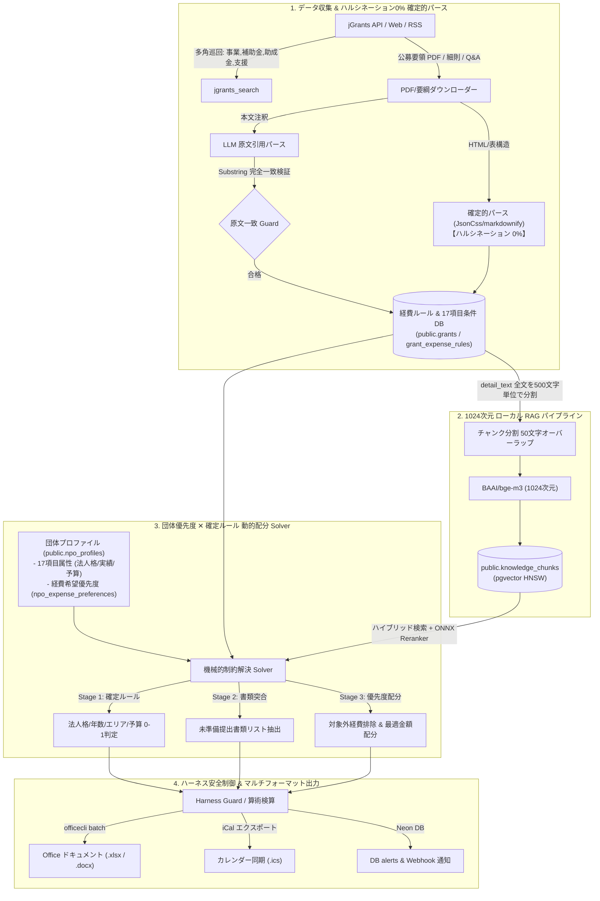

# 助成金データパイプライン & リサーチ拡張機能統合仕様書 (grant_pipeline_spec.md)

## 0. システム全体アーキテクチャ図 (End-to-End System Architecture)



---

## 1. 全 6 大 Agent Skills ディレクトリ構造 & スクリプト割り当て

```text
skills/
├── jgrants_search/                       # 1. 全件・条件検索スキル
│   ├── SKILL.md
│   └── scripts/
│       ├── search_jgrants.py             # jGrants API 多角巡回・一次絞り込み & DB保存 (--save-db) CLI
│       └── sync_grants_cron.py           # 深夜帯の差分同期 & 受付終了 (CLOSED) 更新スクリプト
│
├── grant_eligibility_checker/            # 2. 17項目要件適合 & 書類チェック
│   ├── SKILL.md
│   └── scripts/
│       └── check_eligibility.py          # 団体プロファイル(--org-id) ✕ 助成金 17項目自動照合 CLI
│
├── past_award_analyzer/                  # 3. 過去採択事例 & 勝因パターン分析
│   ├── SKILL.md
│   └── scripts/
│       └── analyze_past_awards.py        # 過去採択事例の 5大視点分析 & 勝因抽出 CLI
│
├── grant_expense_validator/              # 4. 経費ルール適合 & 動的配分 Solver
│   ├── SKILL.md
│   └── scripts/
│       └── validate_expenses.py          # 公募細則照合・対象外経費検知 & ハーネス算術検算 CLI
│
├── grant_form_filler/                    # 5. 申請書自動起草 & Office出力
│   ├── SKILL.md
│   └── scripts/
│       └── generate_proposal_docx.py     # 申請原稿自動生成 & officecli 経由 Word/Excel 出力 CLI
│
└── grant_lifecycle_manager/              # 6. タスク・カレンダー同期 & 採択予測
    ├── SKILL.md
    └── scripts/
        ├── predict_win_rate.py           # 実効的 8軸モデルによる採択勝率 (0-100%) 予測 CLI
        └── export_calendar_ics.py        # 公募締切 & 準備タスクの iCal (.ics) カレンダー出力 CLI
```

---

## 2. 差分同期 & ステータス管理エンジン (`grants_sync_engine`)

### 目的
公募終了（`CLOSED`）や新規・更新データの検出を自動化し、データベース (`public.grants`) の整合性を維持します。

### データフロー & 処理アルゴリズム
1. **Cron 起動**: 毎日 01:00 UTC にバッチ起動。
2. **現行 ID の全件巡回**:
   * API (`/subsidies`) より `acceptance=1` (受付中) の全 ID 集合 $S_{api}$ を取得。
3. **ステータス自動変更 (`OPEN` $\to$ `CLOSED`)**:
   * DB 内の `source = 'jgrants'` かつ `status = 'OPEN'` の ID 集合 $S_{db}$ と比較。
   * $S_{closed} = S_{db} \setminus S_{api}$ の対象レコードの `status` を `'CLOSED'` へ更新。
4. **新規・更新データの Upsert (自動Cron & CLI手動同期)**:
   * Cron バッチ時および `search_jgrants.py --save-db` 実行時に `ON CONFLICT (source, source_grant_id) DO UPDATE` を実行し、`public.grants` テーブルへ即時保存・更新。

### 二重保存防止 ＆ 安全制御ガイドライン (Upsert Safeguards)
* **二重登録の完全防止**: 複合ユニークインデックス `uq_grants_source_grant_id (source, source_grant_id)` により、同一 ID の助成金が複数回保存されても既存行の上書き更新となり、重複登録を 100% 排除する。
* **限定カラム更新 (既存リソースの非破壊)**: `DO UPDATE` 時は `title`, `provider`, `amount_max`, `deadline`, `details_url`, `target_area`, `is_rate_10_10`, `is_advance_payment`, `detail_text`, `status`, `updated_at` のみを上書きし、既に解析済みの `is_ocr_processed` や `grant_expense_rules`（経費ルール）、`knowledge_chunks`（ベクトルデータ）は保持する。
* **不備データの事前スキップ**: `source_grant_id` や `title` が欠損している不完全データは DB 書き込み前にバリデーションで弾き、保存を自動スキップする。
* **一括バッチ処理**: 大量データを保存する際は単一トランザクション内で一括処理し、DB コネクション負荷とレスポンス遅延を防止する。

---

## 3. 添付資料パース & OCR エンジン (`attachment_ocr_processor`)

### 目的
公募要領 PDF、実施細則、Q&A 集などの添付資料からテキストを抽出し、`detail_text` に統合および経費ルール DB (`grant_expense_rules`) へ確定パースします。

### 処理仕様
1. **対象**: `attachment_urls` が非空かつ `is_ocr_processed = FALSE` のレコード。
2. **抽出ツールチェーン**:
   * **PDF/Office**: `MarkItDown` (Microsoft 製 Python ライブラリ) によるテキスト抽出。
   * **スキャン PDF (画像ベース)**: `Surya OCR` (ローカル実行) でテキスト化。
3. **確定的経費ルール抽出 (ハルシネーション 0%)**:
   * **表データ**: `JsonCss` / `markdownify` / `Crawl4AI` による HTML/PDF 表構造の機械的型変換。
   * **本文注釈テキスト**: LLM 抽出結果に対し `Substring Match Guard` で原文完全一致を検証。不一致時は即時棄却 (Reject)。
4. **格納**: 抽出テキストを `detail_text` に追記し、経費ルールを `public.grant_expense_rules` へインサート。完了後 `is_ocr_processed = TRUE` に更新。

---

## 4. ベクトル埋め込み & ハイブリッド RAG 検索 (`embedding_rag_engine`)

### 目的
助成金の本文テキスト (`detail_text`) を 1024 次元ベクトルに変換し、意味検索とキーワード検索のハイブリッドで高精度な情報取得を実現します。

### 仕様
* **埋め込みモデル**: **`BAAI/bge-m3`**（日本語・多言語標準 1024 次元ベクトル `vector(1024)`）
* **チャンク長**: 最大 8,192 トークン対応（オーバーラップ 100 トークン）。
* **実行環境**: `fastembed` / `@huggingface/transformers`（ローカル / WASM 完結）
* **ハイブリッド検索構成**:
  1. **一次絞り込み (BM25 + pgvector)**: 完全一致キーワード (`pg_trgm`) とコサイン類似度 (`vector_cosine_ops`) を RRF (Reciprocal Rank Fusion) でスコア統合して上位 20 件を抽出。
  2. **二次リランク (Cross-Encoder)**: 軽量 ONNX リランカー (`bge-reranker-base`) によりスコアリングし、最上位 5 件を厳選。
* **格納処理**: `public.knowledge_chunks` テーブルに `grant_id` 参照付きでインサート。
* **インデックス**: HNSW コサイン類似度インデックス (`idx_knowledge_chunks_embedding_hnsw`) による超高速検索。

---

## 5. API レートリミット & レジリエンス制御 (`http_resilience_client`)

### 目的
外部 API の制限や障害に対してシステムの安定動作を保証します。

### 仕様
* **並行数制限**: `asyncio.Semaphore(5)` （最大同時 5 接続）。
* **指数バックオフ**: HTTP 429 / 5xx 発生時、初期 1秒から `wait = 2 ** attempt + jitter` で最大 3 回リトライ。
* **サーキットブレーカー**: 連続 10 回失敗時にログアラートを発行し、ローカルスナップショット (`.cache/snapshots/`) にフォールバック。

---

## 6. マッチング & アラート通知エンジン (`grant_matching_engine`)

### 目的
登録団体プロファイル (`public.npo_profiles` / `company_profiles`) と助成金公募要件 (`public.grants`) を 17 項目にわたって照合し、要件適合性 (Eligibility Clearance) および必要書類の準備状況を全自動で判定します。

### 3 段階ハイブリッド判定アルゴリズム (3-Tier Hybrid Engine)
1. **Stage 1: ルールベース確定判定 (Deterministic Matching)**
   * ハルシネーションゼロで確定判定する条件。
   * **対象項目**: 法人格一致 (`organization_type IN eligible_org_types`)、設立後実績年数 (`years_active >= min_years_active`)、対象活動地域 (`target_area`)、助成上限額の予算適正比率。
2. **Stage 2: 書類自動突合判定 (Document Readiness Matching)**
   * 公募要領の `required_documents` と団体の `prepared_documents` を集合比較し、差分となる「申請に必要な未準備書類リスト」を自動生成。
3. **Stage 3: LLM セマンティック適合 + 根拠引用 (Semantic Quote Extraction)**
   * 活動目的やターゲット層の整合性など定性要件のみを LLM で評価。
   * 判定時に公募要領 PDF / 本文の **該当ページ・文章の引用句 (`evidence_quote`)** を必須付与。

### 判定・通知出力
* **適合スコア**: 0 〜 100%
* **提出書類チェックリスト**: 準備完了書類 vs 要取得書類の提示
* **アクション**:
  * DB テーブル `public.alerts` に新着適合通知レコードを作成。
  * Webhook (Slack) / Email 通知用イベントを発行。

---

## 7. 団体希望優先度 ✕ 確定ルール動的配分 Solver (`grant_expense_optimizer`)

### 目的
団体の「使いたい経費の優先順位」と助成金の「確定経費ルール (`public.grant_expense_rules`)」を機械的に照合し、対象外経費を 100% 排除した最適な経費ポートフォリオを動的に自動生成します。

### 入力データ
* **団体の希望優先度**: `public.npo_expense_preferences` (priority, category_code, desired_amount)
* **助成金の経費ルール**: `public.grant_expense_rules` (category_code, allowed, max_limit, max_ratio)

### 配分アルゴリズム
1. 優先度順に経費区分を走査。
2. `allowed = FALSE` の区分はスキップし、理由と代替提案をレポート出力。
3. `allowed = TRUE` の区分は `min(desired_amount, max_limit, total * max_ratio)` で確定配分。
4. 残枠がある場合は次の優先度の区分へ繰り越し。

### 安全制御 (Harness Guard)
* **算術検算**: 各経費区分の配分合計が助成上限を超過していないか、補助率計算が正確か検証。
* **不備検知**: 必須項目の欠損や形式不正を自動チェック。
* 全バリデーション合格後に `officecli batch` で申請書出力を許可。

---

## 8. 過去採択事例の 5 大視点分析 (`past_award_analyzer`)

### 目的
対象助成金の過去の採択事例 (`public.grant_past_awards`) を収集・分析し、審査員が高く評価する「勝因パターン」を抽出して自社申請案に反映します。

### 5 大分析視点
1. **課題設定の切り口** (Problem Framing): どんな社会的課題を提示したか
2. **解決アプローチ・体制** (Solution Model): 連携体制の有無・構成
3. **金額・予算の相場感** (Budget Range): 平均採択額・満額率
4. **定量成果・KPI指標** (Impact Metrics): 提示された数値目標
5. **審査評・選定理由** (Evaluator Feedback): 財団・行政の評価コメント

### 分析ワークフロー
1. `grant_past_awards_list(grant_id)` で過去 3 年分の採択事例を取得。
2. `grant_past_award_analysis_run(award_ids)` で 5 大視点クラスタリングを実行。
3. 自社プロファイルとの勝因ギャップを算出し、改善アドバイスを生成。

---

## 9. 実効的 8 軸採択予測 & Win-Rate スコアリング (`win_rate_predictor`)

### 目的
単なる要件適合を超え、審査員の実際の採点基準に沿った 8 軸で採択可能性を予測します。

### 8 大評価軸
1. **新規性・先駆性** (Uniqueness)
2. **事業実現可能性・体制** (Feasibility)
3. **自走性・自己資金確保** (Sustainability)
4. **課題の深刻さ・エビデンス** (Severity)
5. **社会的インパクト・横展開** (Scalability)
6. **積算の妥当性・費用根拠** (Budget Precision)
7. **助成趣旨・テーマ適合** (Funder Intent)
8. **過去の完了・信用実績** (Track Record)

### 出力
* **総合スコア**: 0 〜 100 点 (A/B/C/D ランク)
* **軸別レーダーチャート**: 各軸のスコアと改善ポイント
* **弱点修正アドバイス**: 落とされるリスクの高い軸への具体的改善提案

---

## 10. ハーネス安全制御 & マルチフォーマット出力

### 算術・ルール検算 (Harness Guard)
* 生成データと経費合計値が計算一致するかコードレベルで検証。
* 必須書類の存在チェック (PDF / 添付ファイル)。
* 全バリデーション合格後のみ出力を許可。

### 出力フォーマット
* **Office ドキュメント**: `officecli` 経由の `.xlsx` / `.docx` 自動生成。
* **カレンダー**: 公募締切・準備タスクの iCal (`.ics`) エクスポート。
* **通知**: `public.alerts` への DB 登録および Webhook / Email イベント発行。
