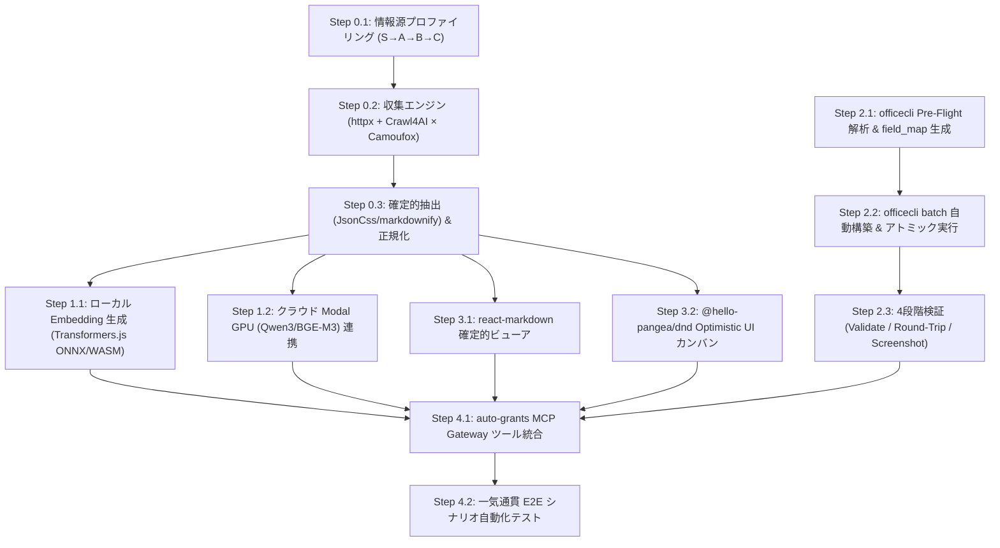

# auto-grants-integrated 全体実装フロー仕様書

> **Version**: 1.0  
> **更新日**: 2026-07-31  
> **ステータス**: Draft  
> **関連仕様書**:  
> - [source_registry_list.md](file:///Users/2005nk/Works/npo/civic/auto-grants-integrated/docs/source_registry_list.md)  
> - [ingest_embedding_ui_spec.md](file:///Users/2005nk/Works/npo/civic/auto-grants-integrated/docs/ingest_embedding_ui_spec.md)  
> - [officecli_form_filling_spec.md](file:///Users/2005nk/Works/npo/civic/auto-grants-integrated/docs/officecli_form_filling_spec.md)

---

## 1. 全体実装アーキテクチャ & 依存マップ

---

## 2. フェーズ別詳細実装手順

### Phase 0: 情報源リサーチ & 確定的インジェスト基盤 (Ingest Foundation)

#### Step 0.1: 情報源リサーチ・プロファイリングの実行
[source_registry_list.md](file:///Users/2005nk/Works/npo/civic/auto-grants-integrated/docs/source_registry_list.md) の優先順位に従い、生データの収集と `DOMProfile` の作成を実施する。

* **優先度 S (即着手)**: `api_jgrants`, `api_jfc_navi`, `gov_cao_janpia` (休眠預金), `pvt_nippon_foundation` (日本財団)
* **優先度 A**: `gov_cfa` (こども家庭庁), `gov_mhlw` (厚労省), `gov_env` (環境省), `gov_maff` (農水省), `gov_toyama_pref`, `gov_toyama_city`
* **優先度 B**: `gov_mlit_kanko` (観光庁), `pub_wam`, `pvt_akaihane` (赤い羽根), `gov_bunka`, `gov_sports`, `gov_chusho`, `pvt_canpan`
* **優先度 C**: `gl_gitcoin`, `gl_globalgiving`, `gl_google_org`, `gl_mozilla`, `gl_patagonia`

**成果物**:
1. `.cache/snapshots/<source_id>/` 内の生 HTML / JSON スナップショット（オフラインテスト用 Fixtures）
2. `collectors/profiles/<source_id>.json` (`DOMProfile` 定義コード)

#### Step 0.2: 収集エンジンの実装 (`collectors/engine/`)
* **軽量 API / RSS 通信層 (`httpx` + `feedparser`)**: `jGrants` / `JFC` API および自治体 RSS ポーリングクラスの実装。
* **統合 Web クローリング層 (`Crawl4AI × Camoufox`)**:
  * `AsyncWebCrawler` に `AsyncCamoufox` のブラウザコンテキストを注入した統合収集クラスの実装。
  * `CrawlerSession`Context Manager の実装（.parentlock 監視と `atexit` フックによるゾンビプロセス自動強制終了）。

#### Step 0.3: 確定的パース & 正規化パイプライン (`extract/` & `normalize/`)
* **確定的抽出 (`CSSExtractor` / `markdownify`)**:
  * `JsonCss` による CSS セレクターパース。
  * `markdownify` による DOM AST 確定変換と UI ノイズ行 (`_NOISE_PATTERNS`) フィルタリング。
* **`DropRecord` ガードレール**: 必須フィールド (`title`, `provider`, `url`) 欠落時に推測補完せず、`DropRecord` として追跡。
* **`Crawl4AIExtractor`**: 未知ページ向け Pydantic スキーマ強制 LLM 抽出フォールバック。
* **正規化パイプライン**:
  * `identity.py` (URL SHA-256 / `fingerprint` 重複排除)。
  * `direct_contract_filter.py` (`has_matching_keyword_without_negation` による否定構文考慮キーワードマッチング)。

---

### Phase 1: ハイブリッド Embedding & セマンティック検索 (Vector Engine)

#### Step 1.1: ローカル Embedding 環境 (`ai/local_embed.ts`)
* `@huggingface/transformers` (`bge-base-ja-v1.5`, 768次元) の Singleton ローダー実装。生成したベクトルを Supabase pgvector に保存。

#### Step 1.2: クラウド GPU 推論環境 (`ai/cloud_embed.py`)
* Modal GPU / Local Serverless (`bge-base-ja-v1.5` 768d / `bge-reranker-base`) 呼び出しと `p-limit` (limit=3) リトライ制限。

#### Step 1.3: ハイブリッド制御レイヤー (`ai/hybrid_embed.ts`)
* DB テーブル `grants` へ `embedding_source` (`local`/`cloud`) カラムの追加。
* クラウド復旧・バッチ処理用のバックグラウンド再ベクトル化タスクの実装。

---

### Phase 2: officecli 申請書自動記入エンジン (Office Filling Engine)

#### Step 2.1: Pre-Flight 構造解析器 (`office_engine/preflight.py`)
* `officecli view text/forms` および `query "cell[mergeAnchor=true]"` による OpenXML 構造の確定抽出。
* 相対アンカー検索（「団体名」等の文字列ラベルから右隣/下の Top-Left 座標を機械的に確定）。
* `field_map.json` の自動ドラフト生成ロジック。

#### Step 2.2: `officecli batch` 自動構築 & アトミック実行器 (`office_engine/batch_builder.py`)
* 記入データ (`fill_data.json`) と `field_map.json` から `batch` 用 JSON 配列を自動構築。
* 1文字1マス (`char_per_cell`) の分割、数式セル (`writable: false`) 保護、結合セル Top-Left 強制。

#### Step 2.3: 4 段階検証 & テンプレートプロファイル管理 (`office_engine/validator.py`)
* `officecli validate` (XML 整合性)。
* `officecli get` による書き戻し検証 (Round-Trip Check)。
* `officecli view screenshot` / `pdf` によるページ数オーバー・枠はみ出し検知。
* 頻出テンプレート (日本財団、赤い羽根等) の `templates/profiles/` プロファイル永続化。

---

### Phase 3: React 19 UI & カンバン管理 (Frontend & DX)

#### Step 3.1: 確定的 Markdown ビューア (`components/GrantDetailView.tsx`)
* `react-markdown` + `remark-gfm` による VDOM レンダリング。
* XSS 防止対策 (`target="_blank" rel="noopener noreferrer"` 強制、script タグ無効化)。
* 「確定抽出」/「AI 抽出」ステータスバッジ表示。

#### Step 3.2: Optimistic UI カンバンボード (`components/GrantKanban.tsx`)
* `@hello-pangea/dnd` によるステージ別 (発見/調査/準備/提出/採択) カンバンボード。
* **Optimistic UI パターン** (操作直後に UI 更新 → バックエンド非同期 API 同期 → 失敗時自動ロールバック)。

---

### Phase 4: E2E 統合 & MCP Gateway 連携 (Integration & E2E)

#### Step 4.1: auto-grants MCP ツール群のバックエンド接続
* `fill_excel_template`, `fill_docx_template` を Phase 2 の `officecli` エンジンへ接続。
* `template_render_pdf`, `template_validate_preflight/postflight` の統合。

#### Step 4.2: シナリオ E2E テスト
* 助成金発見 (Crawl4AI×Camoufox) → 確定抽出 (JsonCss/markdownify) → セマンティックマッチング (Modal/Transformers.js) → `fill_data.json` 生成 → 申請書出力 (officecli batch) → 視覚的プレビュー (PDF) の一気通貫フローをテストコード化。

---

## 3. マイルストーン & 開発順序サマリー

| マイルストーン | 対象フェーズ | 完了定義・検証項目 |
|---|---|---|
| **M0: 確定的インジェスト完了** | Phase 0 | 優先度 S/A の 10 情報源からハルシネーション 0% で全項目が確定抽出できること |
| **M1: ベクトル検索稼働** | Phase 1 | ローカル ONNX Embedding 生成 → Supabase pgvector で類似度検索が正常動作すること |
| **M2: 申請書記入エンジン完成** | Phase 2 | エクセル神エクセル・Word 枠の申請書がレイアウト崩れなしに 100% 確定記入できること |
| **M3: フロントエンド連携完了** | Phase 3 | 確定的 Markdown 表示と DND カンバンボードの Optimistic UI が動作すること |
| **M4: MCP 統合 & E2E 自動化** | Phase 4 | 助成金探索から申請書 PDF 生成までの全自動シームレスパイプラインの動作確認 |
