# 統合アーキテクチャ設計 & 実装計画 (最新ベストプラクティス対応版)

`subsidy-radar` の稼働しているバックエンド資産と、`auto-grants-integrated` のフロントエンド構想を、2026年現在の最新ベストプラクティス（**FastAPI ドメイン駆動設計 + uv + React 19 + Hey API フル自動生成**）の構成で統合します。

---

## 1. 統合アーキテクチャとトレンド技術

### A. バックエンド: ドメイン駆動設計 (Domain-Oriented) と `uv`
今後、助成金（subsidy）だけでなく、デジタル民主主義（plurality）やボランティア（volunteer）などの機能群（元7プロジェクト）を拡張していくため、従来のフラットな構造から**ドメイン駆動のディレクトリ構造**にアップグレードします。
また、Pythonのパッケージ管理には従来の `pip` や `poetry` ではなく、現代のデファクトスタンダードである超高速ツール **`uv`** を採用します。

### B. フロントエンド: Hey API によるフル自動生成
型定義だけでなく、データフェッチ、キャッシュ、クライアントバリデーションまでのボイラープレートコードを一切手書きしない「スキーマ駆動」を徹底します。

```mermaid
graph TD
    %% 1. 情報源 (Information Sources)
    subgraph Info_Sources ["情報源 (Information Sources)"]
        GovPlan["行政文書 / 総合計画 (PDF/Word)"]
        GovRFP["公募仕様書 (RFP)"]
        JFC_API["助成金ナビ (JFC API)"]
        WebDOM["民間財団Webサイト (HTML/DOM)"]
        LocalRSS["富山ローカルRSS / 自治体HP"]
        DelibVote["市民合意・投票データ (Quadratic Voting)"]
        NpoAsset["団体アセット (活動実績・プロフィール)"]
    end

    %% 2. 収集・正規化パイプライン (Ingest & Normalization)
    subgraph Ingest_Pipeline ["インジェスト・正規化パイプライン (uv / Python)"]
        Collector["コレクター群 (jGrants API, Tree Crawler, Playwright, RSS Watcher)"]
        Normalizer["Document Normalizer<br/>(PDF/Office/HTML -> Text)"]
        QGate["クオリティゲート (Coverage >= 0.95)"]
        SelfHealing["LLM 自己修復 (learn_profile / repair_extract)"]
        
        Collector --> Normalizer
        Normalizer --> QGate
        QGate -- 失敗 --> SelfHealing
        SelfHealing --> Collector
    end

    %% 3. データストア & ナレッジ化
    subgraph Data_Store_Knowledge ["データストア & ナレッジ化"]
        PG[("PostgreSQL 15 + pgvector<br>(助成金・予算・投票・ボランティア・ZKPデータ)")]
        Realtime["Supabase Realtime Engine<br>(クラファン決済・応募の即時通知)"]
        ModalGPU["Modal GPU Serverless<br/>(Qwen3-Embedding / Reranker / スキルマッチング)"]
        GraphRAG["GraphRAG (政策・施策構造化)"]
        
        QGate -- 合格/登録 --> PG
        QGate -- 合格/構造化 --> GraphRAG
        GraphRAG --> PG
        PG <--> ModalGPU
        PG --> Realtime
    end

    %% 4. 統合バックエンド (FastAPI)
    subgraph Backend_Space ["統合バックエンド (FastAPI / auto-grantsv2 ベース)"]
        Main["FastAPI Entry (main.py)"]
        
        subgraph Subsidies_Domain ["助成金・予算ドメイン"]
            S_Router["routes.py (検索・一覧)"]
            S_Rep["db.py (助成金リポジトリ)"]
        end

        subgraph GovPro_Domain ["提案書生成・シミュレーションドメイン"]
            P_Gen["proposal_generator.py (ProposalGenerator)"]
            P_Sim["採択シミュレーター (Simulate API)"]
        end

        subgraph Plurality_Domain ["市民参加 (Plurality) ドメイン"]
            P_Vote["quadratic_voting.py (二次投票処理)"]
            P_Thread["deliberation.py (合意形成スレッド)"]
        end

        subgraph Action_Domain ["実行・資金調達ドメイン"]
            A_Vol["volunteer_service.py (スキルマッチング)"]
            A_CF["crowdfunding.py (クラファン・資金監査)"]
        end

        subgraph Security_Domain ["認証・ZKP・DID ドメイン"]
            Sec_Auth["did_resolver.py (DID/VC検証・バッジ発行)"]
            Sec_ZKP["zk_proof_verifier.py (zk-SNARKs検証)"]
        end

        MCP_GW["MCP Gateway (Stdio/HTTP)<br>(67+ LLMツール公開)"]
        
        Main --> S_Router
        Main --> P_Gen
        Main --> P_Sim
        Main --> Plurality_Domain
        Main --> Action_Domain
        Main --> Security_Domain
        Main --> MCP_GW
        
        S_Router --> S_Rep
        S_Rep --> PG
        
        P_Gen -->|団体アセット取得| PG
        P_Gen -->|政策適合エビデンス検索| GraphRAG
        P_Sim -->|RFP適合度判定| PG
        
        Plurality_Domain --> PG
        Action_Domain --> PG
        Security_Domain --> PG
    end

    %% 5. 外部連携サービス
    subgraph External_Services ["外部連携サービス"]
        SupabaseAuth["Supabase Auth (JWT認証)"]
        StripeAPI["Stripe API (寄付決済)"]
        FCM["Firebase Cloud Messaging<br>(OS標準プッシュ通知)"]
    end

    %% 6. フロントエンド (React 19)
    subgraph Client_Space ["フロントエンド (Vite / React 19 / TS)"]
        subgraph Web_Client ["PC用 Web画面"]
            Dashboard["ダッシュボード (Active Grants, タイムライン)"]
            Sankey["予算フロー可視化 (Sankey + 資金監査)"]
            Globe["グローバルマップ (Globe)"]
            GovProUI["提案書エディタ (根拠付き自動生成)"]
            MobileBanner["アプリ移行促進バナー (モバイルWebアクセス時)"]
        end

        subgraph Mobile_App ["モバイル用アプリ (PWA / Capacitor)"]
            CivicUI["協議・投票 (Quadratic Voting)"]
            VolunteerUI["ボランティア (スキルマッチング)"]
            WalletUI["シビック・ウォレット (秘密鍵・オープンバッジ管理)"]
            ZKP_WASM["zk-SNARKs Prover (Client WASM)"]
            
            CivicUI --> ZKP_WASM
            VolunteerUI --> WalletUI
        end

        ClientAPI["API クライアント層<br/>(自動生成: Query / Zod / SDK)"]
        SecureStore["デバイスセキュアストレージ (Keystore / Secure Enclave)"]

        Dashboard --> ClientAPI
        Sankey --> ClientAPI
        Globe --> ClientAPI
        GovProUI --> ClientAPI
        
        CivicUI --> ClientAPI
        VolunteerUI --> ClientAPI
        WalletUI --> SecureStore
    end

    %% 外部連携 & 同期
    ClientAPI -->|HTTPS / JSON| Main
    Realtime -->|WebSocket| ClientAPI
    Dashboard -.->|非同期プリウォーム| ModalGPU
    Main --> SupabaseAuth
    Action_Domain --> StripeAPI
    Security_Domain --> FCM
    ZKP_WASM -->|ZKP証明書送信| Security_Domain
    Info_Sources --> Collector
    DelibVote --> PG
    NpoAsset --> PG
```



---

## 2. ディレクトリ構造仕様

ドメイン駆動およびモノレポ構成を採用したディレクトリツリーです。

```
auto-grants-integrated/
├── README.md
├── docker-compose.yml           # PostgreSQL 15 / pgvector
├── .env.example
│
├── backend/
│   ├── pyproject.toml           # uv 用プロジェクト設定
│   ├── uv.lock                  # uv ロックファイル
│   ├── config/
│   │   ├── settings.yaml
│   │   └── settings.example.yaml
│   ├── src/
│   │   └── civic_grants/        # 統一パッケージ名（リネーム想定）
│   │       ├── __init__.py
│   │       ├── main.py          # FastAPI エントリーポイント
│   │       ├── core/            # 共通設定、セキュリティ、ロガー
│   │       │   ├── config.py
│   │       │   └── logger.py
│   │       └── domains/         # 機能ドメイン別のカプセル化
│   │           └── subsidies/   # 助成金関連
│   │               ├── __init__.py
│   │               ├── router.py   # API ルート定義
│   │               ├── models.py   # Pydantic スキーマ
│   │               ├── schema.py   # PostgreSQL DDL
│   │               └── db.py       # リポジトリ層 (CRUD)
│   └── tests/
│       ├── conftest.py          # テスト用DB起動ヘルパー
│       └── domains/
│           └── subsidies/       # 助成金ドメインのテスト
│
├── frontend/
│   ├── package.json
│   ├── tsconfig.json
│   ├── vite.config.ts
│   ├── openapi-ts.config.ts     # Hey API 設定
│   ├── index.html
│   └── src/
│       ├── main.tsx
│       ├── index.css            # Cosmic Glass デザインシステム
│       ├── client/              # [GENERATED] 自動生成コード一式
│       │   ├── sdk.gen.ts       # プレーンなSDKクライアント
│       │   ├── services.gen.ts  # TanStack Query カスタムフック (useQuery等)
│       │   ├── types.gen.ts     # TypeScript 型定義
│       │   └── schemas.gen.ts   # Zod スキーマ定義
│       ├── components/          # 共通UI部品
│       └── pages/               # 画面コンポーネント
│
└── docs/                        # 各種ドキュメントマージ先
```

---

## 3. 各テクノロジーの最新設定仕様

### A. フロントエンド: `openapi-ts.config.ts` の最新構成
Hey API のプラグインアーキテクチャをフル活用し、型・クライアント・React Query・Zodを同時に出力します。

```typescript
import { defineConfig } from '@hey-api/openapi-ts';

export default defineConfig({
  input: 'http://localhost:8000/openapi.json',
  output: 'src/client',
  plugins: [
    '@hey-api/typescript',   // TypeScriptの型定義を生成
    '@hey-api/sdk',          // HTTPクライアント（SDK）を生成
    '@tanstack/react-query', // TanStack Query v5 用のフックを生成
    '@hey-api/zod',          // Zodバリデーションスキーマを生成
  ],
});
```

### B. フロントエンドでの実装例 (React 19)
自動生成されたフックとZodスキーマをフォームバリデーションに組み合わせる例です。

```tsx
import { useQueryClient } from '@tanstack/react-query';
import { useListSubsidiesQuery, useCreateSubsidyMutation } from './client/services.gen';
import { subsidySchema } from './client/schemas.gen'; // Zodスキーマ

export const SubsidyManager = () => {
  // 1. データ取得（ローディング、キャッシュ、再検証が自動化）
  const { data: subsidies, isLoading } = useListSubsidiesQuery({
    query: { status: '公募中' }
  });

  const queryClient = useQueryClient();
  // 2. ミューテーション（書き込み）
  const mutation = useCreateSubsidyMutation({
    onSuccess: () => {
      // キャッシュの無効化と再取得
      queryClient.invalidateQueries({ queryKey: ['listSubsidies'] });
    }
  });

  if (isLoading) return <div>Loading...</div>;

  return (
    <div>
      {/* リスト表示 */}
      {subsidies?.map(s => <div key={s.id}>{s.title}</div>)}
    </div>
  );
};
```

---

## 4. ユーザー承認・決定事項

> [!IMPORTANT]
> ### 1. パッケージマネージャーの選択
> フロントエンド側の依存関係管理において、どれを使用しますか？
> - **npm** (デフォルト)
> - **pnpm** (高速・ディスク容量節約。モノレポ構成で主流)
>
> ### 2. パッケージ名のリネーム
> `subsidy_radar` から `civic_grants` へリネームし、ドメイン駆動ディレクトリへ移植する形で進めてよいか。
>
> ### 3. Git履歴の引き継ぎ
> `subsidy-radar` のコミット履歴を引き継ぐか（`git subtree`を使用）、ファイルコピーのみとするか。

---

## 5. 検証計画 (Verification Plan)

### バックエンドの検証
*   `backend` ディレクトリで `uv run pytest` を実行し、既存テストが正常にパスすることを確認。

### APIスキーマ・型生成の検証
*   FastAPIサーバーを起動し、フロントエンド側で `npm run api:sync` (または `pnpm api:sync`) を実行。`src/client/` 内に正確なコードが自動生成されるかを確認。

### フロントエンドのビルド検証
*   `pnpm dev`（または `npm run dev`）で開発サーバーが起動すること、TypeScriptのエラーがないことを確認する。
