# 統合アーキテクチャ設計 & 実装計画 (最新ベストプラクティス対応版)

`subsidy-radar` の稼働しているバックエンド資産と、`auto-grants-integrated` のフロントエンド構想を、2026年現在の最新ベストプラクティス（**FastAPI ドメイン駆動設計 + uv + React 19 + Hey API フル自動生成 + turbovec 軽量類似検索 + オンデマンドOSSビジュアルRAG**）の構成で統合します。

---

## 1. 統合アーキテクチャとトレンド技術

### A. バックエンド: ドメイン駆動設計 (Domain-Oriented) と `uv`
今後、助成金（subsidy）だけでなく、デジタル民主主義（plurality）やボランティア（volunteer）などの機能群（元7プロジェクト）を拡張していくため、従来のフラットな構造から**ドメイン駆動のディレクトリ構造**にアップグレードします。
また、Pythonのパッケージ管理には従来の `pip` や `poetry` ではなく、現代のデファクトスタンダードである超高速ツール **`uv`** を採用します。

### B. フロントエンド: Hey API によるフル自動生成
型定義だけでなく、データフェッチ、キャッシュ、クライアントバリデーションまでのボイラープレートコードを一切手書きしない「スキーマ駆動」を徹底します。

### C. ベクトル検索の軽量化 ＆ オンデマンドOSSビジュアルRAGの採用
大規模なベクトルデータベース（pgvector など）へのクエリ負荷とメモリ消費を最小限に抑えるため、Google Research の **TurboQuant** アルゴリズムに基づく Rust 製ベクトル検索エンジン **`turbovec`** を採用し、インメモリ類似度検索キャッシュとして機能させます。
さらに、レイアウト崩れや表の誤読による情報損失をゼロにするため、検索時には「テキスト」で高速かつ安価にページ特定を行い、回答生成時のみ対象ページを一時画像化してプライベート環境の **「OSS Vision LLM」** に入力する **「オンデマンドOSSビジュアルRAG」** アプローチを採用します。これにより、外部商用APIへのデータ流出を防ぎつつ、インフラコストを最小化します。

```mermaid
graph TD
    %% 1. 情報源
    subgraph Info_Sources ["情報源 (Information Sources)"]
        GovDocs["行政文書/仕様書 (PDF/HTML)"]
        JFC_API["助成金ナビ (JFC API)"]
        DelibVote["市民投票・合意データ"]
        NpoAsset["団体実績・プロフィール"]
    end

    %% 2. 収集・解析
    subgraph Ingest_Pipeline ["データ収集・解析 (uv / Python)"]
        Collector["Collector (Playwright/RSS/APIs)"]
        Normalizer["Document Normalizer (Markdown抽出)"]
        DupCheck["turbovec (インメモリ重複排除)"]
        QGate["Quality Gate (Coverage >= 0.95)"]
        SelfHealing["LLM 自己修復ループ"]
        
        Collector --> Normalizer --> DupCheck --> QGate
        QGate -- 失敗 --> SelfHealing --> Collector
    end

    %% 3. GCPデータストア & ナレッジ
    subgraph GCP_Data_Space ["GCP データストア & ナレッジ基盤"]
        PG[("PostgreSQL 15 + pgvector (ag-postgres)")]
        DocStorage[("GCS / Supabase Storage (安価なPDF書庫)")]
        Realtime["Supabase Realtime Engine (通知/同期)"]
        ModalGPU["Modal GPU Serverless (Reranker/Embed)"]
        GraphRAG["GraphRAG (政策ナレッジグラフ)"]
        
        PG <--> ModalGPU
        PG --> Realtime
    end

    %% 4. バックエンド (FastAPI / civic_grants)
    subgraph Backend_Space ["統合バックエンド (FastAPI / GCP)"]
        Main["FastAPI Entry (main.py)"]
        S_Domain["助成金ドメイン (subsidies)"]
        Gov_Domain["提案書・採択シミュレーション"]
        Plurality_Domain["市民参加・投票 (plurality)"]
        Sec_Domain["DID/VC・ZKP検証 (security)"]
        
        T_Cache["turbovec (インメモリ検索キャッシュ)"]
        PDFRenderer["PDF Renderer (オンデマンド画像化モジュール)"]
        SchemaExporter["Schema Exporter (export_openapi.py)"]
        MCP_GW["MCP Gateway (67+ LLMツール)"]
        
        Main --> S_Domain
        Main --> Gov_Domain
        Main --> Plurality_Domain
        Main --> Sec_Domain
        Main --> MCP_GW
        Main --> SchemaExporter
        
        S_Domain --> T_Cache
        T_Cache <-->|高速ハイブリッド検索| PG
        S_Domain -->|ページ番号指定| PDFRenderer
        PDFRenderer <-->|該当ページのみロード| DocStorage
        
        Gov_Domain -->|団体アセット取得| PG
        Gov_Domain -->|エビデンス検索| GraphRAG
        Plurality_Domain --> PG
        Sec_Domain --> PG
    end

    %% 5. API連携 & スキーマ同期
    SchemaExporter -.->|ビルド時出力| OpenAPISchema["openapi.json (API定義ファイル)"]

    %% 6. フロントエンド (PC Web)
    subgraph PC_Web_App ["PC用 Web Client (React 19 / pnpm)"]
        Dashboard["ダッシュボード (Active Grants, タイムライン)"]
        Sankey["予算フロー可視化 (Sankey)"]
        GovProUI["提案書エディタ (自動生成)"]
        Web_ClientAPI["Client API 層 (openapi-ts)"]
        
        Dashboard --> Web_ClientAPI
        Sankey --> Web_ClientAPI
        GovProUI --> Web_ClientAPI
    end

    %% 7. フロントエンド (モバイルApp)
    subgraph Mobile_App ["モバイル用 App (Capacitor / PWA)"]
        CivicUI["投票・協議 (Quadratic Voting)"]
        WalletUI["シビック・ウォレット (バッジ管理)"]
        ZKP_WASM["zk-SNARKs Prover (snarkjs WASM)"]
        SecureStore["Device Secure Store (Secure Enclave)"]
        Mob_ClientAPI["Client API 層 (openapi-ts)"]
        
        CivicUI --> ZKP_WASM
        CivicUI --> Mob_ClientAPI
        WalletUI --> SecureStore
        WalletUI --> Mob_ClientAPI
    end

    %% 接続関係の整理
    %% 情報源からパイプライン/DB
    GovDocs --> Collector
    JFC_API --> Collector
    DelibVote --> PG
    NpoAsset --> PG
    
    QGate -- テキスト/ベクトル登録 --> PG
    QGate -- 原本PDF保存 --> DocStorage
    QGate -- 構造化 --> GraphRAG
    
    %% API連携
    OpenAPISchema -.->|codegen| Web_ClientAPI
    OpenAPISchema -.->|codegen| Mob_ClientAPI
    
    Web_ClientAPI -->|HTTPS / JSON| Main
    Mob_ClientAPI -->|HTTPS / JSON| Main
    Realtime -->|WebSocket| Web_ClientAPI
    Realtime -->|WebSocket| Mob_ClientAPI
    
    ZKP_WASM -->|証明データ| Mob_ClientAPI
    WalletUI -.->|did:key署名| CivicUI
    
    %% 外部サービス
    Main --> SupabaseAuth["Supabase Auth"]
    S_Domain --> Stripe["Stripe API (決済)"]
    PDFRenderer -->|レンダリング画像ストリーム| VLM["OSS Vision LLM (Qwen2.5-VL / Modal)"]
```



---

## 2. ディレクトリ構造仕様

ドメイン駆動およびモノレポ構成を採用したディレクトリツリーです。

```
auto-grants-integrated/
├── README.md
├── docker-compose.yml           # PostgreSQL 15 / pgvector
├── .env.example
│
├── backend/
│   ├── pyproject.toml           # uv 用プロジェクト設定
│   ├── uv.lock                  # uv ロックファイル
│   ├── config/
│   │   ├── settings.yaml
│   │   └── settings.example.yaml
│   ├── src/
│   │   └── civic_grants/        # 統一パッケージ名（リネーム想定）
│   │       ├── __init__.py
│   │       ├── main.py          # FastAPI エントリーポイント
│   │       ├── core/            # 共通設定、セキュリティ、ロガー
│   │       │   ├── config.py
│   │       │   ├── logger.py
│   │       │   └── pdf_renderer.py # PDFオンデマンド画像レンダラー
│   │       └── domains/         # 機能ドメイン別のカプセル化
│   │           └── subsidies/   # 助成金関連
│   │               ├── __init__.py
│   │               ├── router.py   # API ルート定義
│   │               ├── models.py   # Pydantic スキーマ
│   │               ├── schema.py   # PostgreSQL DDL
│   │               ├── db.py       # リポジトリ層 (CRUD)
│   │               └── search.py   # turbovec を用いた高速類似検索
│   └── tests/
│       ├── conftest.py          # テスト用DB起動ヘルパー
│       └── domains/
│           └── subsidies/       # 助成金ドメインのテスト
│
├── frontend/
│   ├── package.json
│   ├── tsconfig.json
│   ├── vite.config.ts
│   ├── openapi-ts.config.ts     # Hey API 設定
│   ├── index.html
│   └── src/
│       ├── main.tsx
│       ├── index.css            # Cosmic Glass デザインシステム
│       ├── client/              # [GENERATED] 自動生成コード一式
│       │   ├── sdk.gen.ts       # プレーンなSDKクライアント
│       │   ├── services.gen.ts  # TanStack Query カスタムフック (useQuery等)
│       │   ├── types.gen.ts     # TypeScript 型定義
│       │   └── schemas.gen.ts   # Zod スキーマ定義
│       ├── components/          # 共通UI部品
│       └── pages/               # 画面コンポーネント
│
└── docs/                        # 各種ドキュメントマージ先
```

### フロントエンド・バックエンドの初期化および整理手順

現在のリポジトリルートに仮置きされている `package.json` や `index.css` を、計画通りの `frontend / backend` 構造に整理し、開発を開始するための手順です。

#### 1. フロントエンドの初期セットアップ (`frontend/`)
フロントエンドは設計通り `pnpm` を使用して Vite + React + TypeScript 構成で初期化します。

1. **Vite プロジェクトの作成**:
   ルートディレクトリで以下を実行し、`frontend` ディレクトリを生成します。
   ```bash
   pnpm create vite frontend --template react-ts
   ```
2. **依存関係の追加**:
   `frontend/` ディレクトリに移動し、要件定義書に記載されている可視化ライブラリおよびスキーマ駆動開発に必要なツールを追加します。
   ```bash
   cd frontend
   pnpm add @nivo/sankey react-globe.gl recharts
   pnpm add -D @hey-api/openapi-ts @tanstack/react-query zod
   ```
3. **デザインシステム (Cosmic Glass) の適用**:
   ルートに仮置きされている `index.css` を `frontend/src/index.css` に移動（既存のボイラープレートを上書き）します。
4. **ルートの仮置きファイルのクリーンアップ**:
   不要になった以下のルートファイルを削除します。
   * `package.json`
   * `package-lock.json`
   * `index.css`

#### 2. バックエンドの初期セットアップ (`backend/`)
バックエンドは超高速パッケージマネージャー `uv` を使用して Python 仮想環境を構成します。

1. **プロジェクトの初期化**:
   ルートで以下を実行し、`backend` ディレクトリと `pyproject.toml` を自動生成します。
   ```bash
   uv init backend --app
   ```
2. **必要な依存関係の追加**:
   `backend/` ディレクトリへ移動し、FastAPI などの依存関係を `uv` で管理に追加します。
   ```bash
   cd backend
   uv add fastapi uvicorn pydantic pymupdf
   ```

#### 3. ルート `.gitignore` の整備
フロントエンドとバックエンドの不要ファイルおよび秘匿情報が誤ってコミットされるのを防ぐため、ルートの `.gitignore` を以下の通り設定します。
```gitignore
# Node / Frontend
node_modules/
dist/
build/
.DS_Store
*.local
npm-debug.log*
yarn-debug.log*
yarn-error.log*
pnpm-debug.log*

# Python / Backend (uv)
.venv/
__pycache__/
*.py[cod]
*$py.class
.pytest_cache/
.mypy_cache/
.ruff_cache/
openapi.json

# IDEs
.idea/
.vscode/
*.suo
*.ntvs*
*.njsproj
*.sln
*.sw?
```

---

## 3. 各テクノロジーの最新設定仕様

### A. バックエンド: OpenAPI スキーマのローカル出力
フロントエンドのコード自動生成時にローカルサーバーの起動を不要にするため、バックエンド側で OpenAPI スキーマファイル（`openapi.json`）を出力するスクリプトを用意します。
```python
# backend/src/civic_grants/core/export_openapi.py
import json
from civic_grants.main import app

def export_schema():
    with open("openapi.json", "w") as f:
        json.dump(app.openapi(), f, indent=2)

if __name__ == "__main__":
    export_schema()
```

### B. フロントエンド: `openapi-ts.config.ts` の最新構成
Hey API では、出力された `openapi.json` ファイルを直接インプットとして指定し、型・クライアント・React Query・Zodを同時に出力します。

```typescript
import { defineConfig } from '@hey-api/openapi-ts';

export default defineConfig({
  input: '../backend/openapi.json', // ローカルファイルを参照
  output: 'src/client',
  plugins: [
    '@hey-api/typescript',   // TypeScriptの型定義を生成
    '@hey-api/sdk',          // HTTPクライアント（SDK）を生成
    '@tanstack/react-query', // TanStack Query v5 用のフックを生成
    '@hey-api/zod',          // Zodバリデーションスキーマを生成
  ],
});
```

### C. フロントエンドでの実装例 (React 19)
自動生成されたフックとZodスキーマをフォームバリデーションに組み合わせる例です。

```tsx
import { useQueryClient } from '@tanstack/react-query';
import { useListSubsidiesQuery, useCreateSubsidyMutation } from './client/services.gen';
import { subsidySchema } from './client/schemas.gen'; // Zodスキーマ

export const SubsidyManager = () => {
  // 1. データ取得（ローディング、キャッシュ、再検証が自動化）
  const { data: subsidies, isLoading } = useListSubsidiesQuery({
    query: { status: '公募中' }
  });

  const queryClient = useQueryClient();
  // 2. ミューテーション（書き込み）
  const mutation = useCreateSubsidyMutation({
    onSuccess: () => {
      // キャッシュの無効化と再取得
      queryClient.invalidateQueries({ queryKey: ['listSubsidies'] });
    }
  });

  if (isLoading) return <div>Loading...</div>;

  return (
    <div>
      {/* リスト表示 */}
      {subsidies?.map(s => <div key={s.id}>{s.title}</div>)}
    </div>
  );
};
```

### D. 開発環境の統合設定 (NEW)

フロントエンドとバックエンドがローカル環境で円滑に連携するための各種構成。

#### 1. Vite 開発用プロキシ設定 (`frontend/vite.config.ts`)
ローカル開発時は、フロントエンド（`localhost:5173`）からバックエンド（`localhost:8000`）への API リクエストを CORS エラーを回避しつつシームレスに転送するため、Vite のプロキシ機能を使用する。

```typescript
import { defineConfig } from 'vite';
import react from '@vitejs/plugin-react';

export default defineConfig({
  plugins: [react()],
  server: {
    proxy: {
      '/api': {
        target: 'http://localhost:8000',
        changeOrigin: true,
        secure: false,
      },
    },
  },
});
```

#### 2. バックエンド CORS ミドルウェア設定 (`backend/src/civic_grants/main.py`)
開発時の直接アクセスや本番デプロイ時（別ドメインの場合）に備え、FastAPI に CORS 設定を適用する。

```python
from fastapi import FastAPI
from fastapi.middleware.cors import CORSMiddleware
import os

app = FastAPI(title="Civic Grants API", version="1.0.0")

# CORS 設定
origins = [
    "http://localhost:5173", # ローカル開発用 React
]
# 本番/検証環境用: FRONTEND_URL が設定されている場合のみ追加
frontend_url = os.environ.get("FRONTEND_URL")
if frontend_url:
    origins.append(frontend_url)

app.add_middleware(
    CORSMiddleware,
    allow_origins=origins,
    allow_credentials=True,
    allow_methods=["*"],
    allow_headers=["*"],
)
```

#### 3. 環境変数テンプレート (`.env.example`)

**バックエンド側 (`backend/.env.example`)**:
```env
PORT=8000
SUPABASE_URL=https://your-project.supabase.co
SUPABASE_SERVICE_KEY=your-supabase-service-role-key
STRIPE_API_KEY=sk_test_...
STRIPE_WEBHOOK_SECRET=whsec_...
MODAL_TOKEN_ID=ak-...
MODAL_TOKEN_SECRET=as-...
```

**フロントエンド側 (`frontend/.env.example`)**:
```env
# 開発環境時はプロキシ経由のため空（または "/"）、本番環境時はフルパスを指定
VITE_API_BASE_URL=
VITE_SUPABASE_URL=https://your-project.supabase.co
VITE_SUPABASE_ANON_KEY=your-supabase-anon-key
```

#### 4. `pnpm api:sync` コマンド定義 (`frontend/package.json`)
OpenAPI スキーマから Hey API クライアントコードを自動生成するタスクを容易に実行できるよう、スクリプトを追加する。

```json
{
  "scripts": {
    "api:sync": "openapi-ts"
  }
}
```

### E. Makefile / タスクランナー統合 (NEW)

モノレポ全体の開発コマンドを一元管理するための `Makefile` をプロジェクトルートに配置する。

```makefile
.PHONY: dev dev-backend dev-frontend api-sync setup test build

setup:
	@echo "Setting up workspace..."
	cd backend && uv sync
	cd frontend && pnpm install

dev-backend:
	cd backend && uv run uvicorn civic_grants.main:app --reload --port 8000

dev-frontend:
	cd frontend && pnpm dev

dev:
	@echo "Starting development servers..."
	$(MAKE) -j2 dev-backend dev-frontend

api-sync:
	@echo "Syncing API contract..."
	cd backend && uv run python -m civic_grants.core.export_openapi
	cd frontend && pnpm api:sync

test:
	cd backend && uv run pytest
	cd frontend && pnpm test

build:
	cd backend && uv build
	cd frontend && pnpm build
```

---

## 4. 採用決定事項

本計画の策定にあたり、以下の設計方針を採用しました。

*   **パッケージマネージャー**: **pnpm** を採用。モノレポ（`backend` / `frontend`）環境における依存管理の高速化とディスク効率を最大化します。
*   **パッケージ名のリネーム**: 旧 `subsidy_radar` はドメイン駆動構成への移植に伴い **`civic_grants`** にリネーム統一します。
*   **Git履歴の引き継ぎ**: 旧リポジトリのコミット履歴を追跡可能にするため、**`git subtree`** を用いて履歴を引き継ぎながら移植します。

---

## 5. デプロイ設計 (GCP / VM / Cloud Run)

本バックエンドサーバーは、開発・検証および本番環境として GCP (Google Cloud Platform) 上にデプロイします。

### A. GCE VM (`nexloom-gce`) での Docker Compose デプロイ
*   GCP プロジェクト: `decoded-pilot-502615-k6`
*   ホスト: `nexloom-gce` (asia-northeast1-a)
*   デプロイ構成: `/home/nexloom/deploy/docker-compose.ghcr.yml` 下で `ag-mcp` (Port 8002) などのコンテナとして実行。
*   デプロイ手順:
    1. ローカルでビルドしたイメージを GitHub Container Registry (GHCR) にプッシュ。
    2. VM に SSH 接続し、docker compose で最新イメージをプル・コンテナ再起動。
    ```bash
    gcloud compute ssh nexloom-gce --zone=asia-northeast1-a --project=decoded-pilot-502615-k6 \
      --command="sudo -u nexloom docker compose -f /home/nexloom/deploy/docker-compose.ghcr.yml pull && \
                 sudo -u nexloom docker compose -f /home/nexloom/deploy/docker-compose.ghcr.yml --env-file /home/nexloom/deploy/stack.env restart <service-name>"
    ```

### B. Cloud Run でのサーバーレスデプロイ
スケールアウトの必要性やAPIのエンドポイント分離に応じて、Cloud Run サービスへのデプロイも対応します。
*   **ポートバインド要件**: Cloud Run コンテナは環境変数 `PORT` (デフォルト `8080`) をリッスンする必要があります。FastAPI 起動時にポートを `int(os.environ.get("PORT", 8000))` のように動的に解決するように実装します。
*   **ビルド・デプロイ**: Google Cloud Build を使用して Artifact Registry にビルドし、Cloud Run にデプロイします。

---

## 6. 信頼・プライバシー基盤 (ZKP & DID) の技術選定

市民参加型投票（Quadratic Voting）の匿名性確保と、ボランティア活動実績（オープンバッジ）の改ざん防止を実現するため、以下の技術スタックを採用します。

### A. ゼロ知識証明 (ZKP / zk-SNARKs) の構成
*   **証明生成 (Client Prover)**:
    *   **技術選定**: **Circom** + **snarkjs (WASM)**
    *   **実装内容**: クライアント側（PWA/Capacitor）で投票者の秘密鍵や属性を隠したまま「適正な有権者であること」の証明 (Proof) を WASM 上で生成。
    *   **最適化**: モバイルデバイスでの負荷を最小限に抑えるため、回路 (Circuit) を極力シンプルに設計し、`.zkey` / `.wasm` などの鍵・バイナリファイルを CDN でキャッシュ配信し初期化をプリウォームします。
*   **証明検証 (Server Verifier)**:
    *   **技術選定**: FastAPI (Python) から **Rust/C++ bindings** もしくは **WebAssembly** 経由で snarkjs verifier を呼び出し、ミリ秒単位で高速に検証します。

### B. 分散型ID (DID) & 信頼証明 (Verifiable Credentials)
*   **DID Method**: **`did:key`** をベースに採用。
    *   公開鍵から直接決定論的に生成されるため、高コストなブロックチェーンや分散型レジストリ（VDR）の参照なしに、オフラインかつサーバーレスで DID の名前解決（DID Resolution）が可能です。
*   **デジタルバッジ (VC / Verifiable Credentials)**:
    *   W3C の Verifiable Credentials Data Model に準拠。
    *   活動実績や投票権限をバッジとして暗号署名付き JSON-LD / JWT 形式で発行 (Issue) し、ユーザーのシビック・ウォレットに保管。
*   **秘密鍵の保管 (Wallet UI)**:
    *   Capacitor のセキュアストレージプラグインを経由し、iOS の **Secure Enclave** および Android の **Keystore** (ハードウェア保護領域) を利用して秘密鍵を保護します。

---

## 7. 軽量・低コストなビジュアルRAG（turbovec ＋ オンデマンド画像化）の採用設計

インフラ負荷（メモリ消費・DBへのクエリ負荷）の軽減、および複雑な表やレイアウトの解釈精度（無損失）を両立するため、テキスト検索とオンデマンド画像化を組み合わせたハイブリッド方式を採用します。

### A. データ収集時のインメモリ重複排除 (DupCheck)
*   **配置**: インジェスト・解析パイプライン (`backend/src/civic_grants/domains/subsidies/collector`)
*   **用途**: クロールした文書がすでに登録済みデータと類似していないかを、DBを圧迫せずにパイプライン内のメモリ上で高速に重複判定します。
*   **保管**: 解析対象の原本PDFファイルは、安価なオブジェクトストレージ `DocStorage` (GCS / Supabase Storage など) にそのまま保存されます。

### A-2. DocStorage のアクセスパターンとキャッシュ戦略
*   **ストレージ選定基準**: 初期フェーズでは Supabase Storage（S3互換、既存インフラとの親和性）を採用し、月間ストレージ量が 100GB を超過した段階で GCS への移行を検討。
*   **ローカルキャッシュ**: PDF Renderer がアクセスする際、直近リクエストされたPDFファイルをバックエンドのローカルディスク（tmpfs / `/tmp`）に LRU キャッシュ（上限 512MB）として一時保持し、同一PDFへの連続アクセス時のネットワークラウンドトリップを回避。
*   **サイズ制限**: 1ファイルあたり最大 50MB。超過する場合はインジェスト時に分割処理を行う。

### B. バックエンドのインメモリ検索キャッシュ (T_Cache)
*   **配置**: 助成金ドメイン API (`backend/src/civic_grants/domains/subsidies/`)
*   **用途**: 直近の助成金データやアクセス頻度の高いベクトルデータをメモリ上に `turbovec` インデックスとしてロードし、1次検索（テキストおよびIDでの高速絞り込み）を行います。
*   **フォールバック戦略**: turbovec インデックスの構築失敗時やメモリ不足時には、pgvector への直接クエリにフォールバックする。切り替えは `search.py` 内の try/except で自動制御。
*   **ベンチマーク目標値**: Recall@10 ≥ 0.95、レイテンシ p99 ≤ 5ms（助成金データ 10,000件規模）。
*   **メモリ見積もり**: 384次元ベクトル × 10,000件 ≈ 約 15MB（量子化適用時）。上限 256MB を超過した場合は古いインデックスを自動 evict。

### C. オンデマンド画像レンダリング (PDF Renderer) のフロー
*   **配置**: バックエンドの共通コアモジュール (`backend/src/civic_grants/core/pdf_renderer.py`)
*   **ライブラリ選定**: **PyMuPDF (`fitz`)** を採用。poppler ベースの `pdf2image` と比較して、外部バイナリ依存がなく（pure Python + C拡張）、単一ページのレンダリングで約 3〜10 倍高速（150dpi で 10〜50ms/ページ）。Docker イメージサイズへの影響も最小限。
*   **用途**: 
    1. 検索APIが `turbovec` からドキュメントIDとヒットした「ページ番号」を特定。
    2. `PDF Renderer` は `DocStorage`（またはローカルLRUキャッシュ）から該当PDFファイルをロードし、指定された**対象ページのみをメモリ上で一時的に画像（PNG/WebP）にレンダリング**。
    3. この一時画像データを、プロンプトテキストとともにプライベートホストした **OSS Vision LLM (Qwen2.5-VL 等のオープンソースモデル)** へ直接ストリーム送信し、回答を生成させます。
*   **効果**: 画像のベクトル情報をベクトルDBのメモリ（RAM）に載せる必要がなくなり、画像ファイル自体の事前蓄積も不要に。ストレージコストとDBの維持費を最小限（数分の一以下）に抑えつつ、最高精度の視覚的RAGを実現します。

### D. 完全プライベート化（OSS構成）の選択肢
*   **モデル選定**: ドキュメントや表・グラフの視覚理解力においてオープンソース最高峰である **`Qwen2.5-VL` (7B / 72B)** を採用。
*   **実行環境**: すでにアーキテクチャに含まれる `Modal GPU Serverless` にホスト。
*   **メリット**: 行政文書などの機密データを外部の商用API（OpenAIやGoogle）に一切送信せず、自社のインフラ内部だけで完結するセキュアな構成と、GPU稼働時間のみの極めて低コストな運用を実現します。

---

## 8. 検証計画 (Verification Plan)

### バックエンドの検証
*   `backend` ディレクトリで `uv run pytest` を実行し、既存テストが正常にパスすることを確認。

### APIスキーマ・型生成の検証
*   バックエンドで `uv run python src/civic_grants/core/export_openapi.py` を実行し `openapi.json` を更新。
*   フロントエンド側で `pnpm api:sync` を実行し、`src/client/` 内に正確なコードが自動生成されるかを確認。

### フロントエンドのビルド検証
*   `pnpm dev` で開発サーバーが起動すること、TypeScript のエラーがないこと、ビルド (`pnpm build`) が正常に通ることを確認。

### turbovec 類似度検索の動作検証
*   `backend` ディレクトリで、`turbovec` を用いたインメモリ重複判定およびフィルタリング検索のユニットテストを実行し、意図した Recall レベルおよび動作速度が得られるか検証。

### PDF Renderer (オンデマンド画像化) の検証
*   指定したPDFの特定ページが、サーバー負荷をかけずに高速（ミリ秒単位）で画像データ（バイナリストリーム）にレンダリングされ、外部 VLM API に正常に送信できるかを単体テストで検証。

### GCPデプロイの検証
*   デプロイ後に動作確認用のヘルスチェックエンドポイント（`/health` または `/docs`）にアクセスし、正常に応答が返ることを確認。
