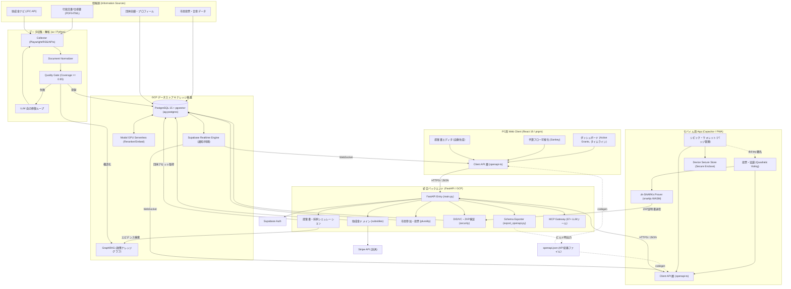

# 統合アーキテクチャ設計 & 実装計画 (最新ベストプラクティス対応版)

`subsidy-radar` の稼働しているバックエンド資産と、`auto-grants-integrated` のフロントエンド構想を、2026年現在の最新ベストプラクティス（**FastAPI ドメイン駆動設計 + uv + React 19 + Hey API フル自動生成**）の構成で統合します。

---

## 1. 統合アーキテクチャとトレンド技術

### A. バックエンド: ドメイン駆動設計 (Domain-Oriented) と `uv`
今後、助成金（subsidy）だけでなく、デジタル民主主義（plurality）やボランティア（volunteer）などの機能群（元7プロジェクト）を拡張していくため、従来のフラットな構造から**ドメイン駆動のディレクトリ構造**にアップグレードします。
また、Pythonのパッケージ管理には従来の `pip` や `poetry` ではなく、現代のデファクトスタンダードである超高速ツール **`uv`** を採用します。

### B. フロントエンド: Hey API によるフル自動生成
型定義だけでなく、データフェッチ、キャッシュ、クライアントバリデーションまでのボイラープレートコードを一切手書きしない「スキーマ駆動」を徹底します。



---

## 2. ディレクトリ構造仕様

ドメイン駆動およびモノレポ構成を採用したディレクトリツリーです。

```
auto-grants-integrated/
├── README.md
├── docker-compose.yml           # PostgreSQL 15 / pgvector
├── .env.example
│
├── backend/
│   ├── pyproject.toml           # uv 用プロジェクト設定
│   ├── uv.lock                  # uv ロックファイル
│   ├── config/
│   │   ├── settings.yaml
│   │   └── settings.example.yaml
│   ├── src/
│   │   └── civic_grants/        # 統一パッケージ名（リネーム想定）
│   │       ├── __init__.py
│   │       ├── main.py          # FastAPI エントリーポイント
│   │       ├── core/            # 共通設定、セキュリティ、ロガー
│   │       │   ├── config.py
│   │       │   └── logger.py
│   │       └── domains/         # 機能ドメイン別のカプセル化
│   │           └── subsidies/   # 助成金関連
│   │               ├── __init__.py
│   │               ├── router.py   # API ルート定義
│   │               ├── models.py   # Pydantic スキーマ
│   │               ├── schema.py   # PostgreSQL DDL
│   │               └── db.py       # リポジトリ層 (CRUD)
│   └── tests/
│       ├── conftest.py          # テスト用DB起動ヘルパー
│       └── domains/
│           └── subsidies/       # 助成金ドメインのテスト
│
├── frontend/
│   ├── package.json
│   ├── tsconfig.json
│   ├── vite.config.ts
│   ├── openapi-ts.config.ts     # Hey API 設定
│   ├── index.html
│   └── src/
│       ├── main.tsx
│       ├── index.css            # Cosmic Glass デザインシステム
│       ├── client/              # [GENERATED] 自動生成コード一式
│       │   ├── sdk.gen.ts       # プレーンなSDKクライアント
│       │   ├── services.gen.ts  # TanStack Query カスタムフック (useQuery等)
│       │   ├── types.gen.ts     # TypeScript 型定義
│       │   └── schemas.gen.ts   # Zod スキーマ定義
│       ├── components/          # 共通UI部品
│       └── pages/               # 画面コンポーネント
│
└── docs/                        # 各種ドキュメントマージ先
```

---

## 3. 各テクノロジーの最新設定仕様

### A. バックエンド: OpenAPI スキーマのローカル出力
フロントエンドのコード自動生成時にローカルサーバーの起動を不要にするため、バックエンド側で OpenAPI スキーマファイル（`openapi.json`）を出力するスクリプトを用意します。
```python
# backend/src/civic_grants/core/export_openapi.py
import json
from civic_grants.main import app

def export_schema():
    with open("openapi.json", "w") as f:
        json.dump(app.openapi(), f, indent=2)

if __name__ == "__main__":
    export_schema()
```

### B. フロントエンド: `openapi-ts.config.ts` の最新構成
Hey API では、出力された `openapi.json` ファイルを直接インプットとして指定し、型・クライアント・React Query・Zodを同時に出力します。

```typescript
import { defineConfig } from '@hey-api/openapi-ts';

export default defineConfig({
  input: '../backend/openapi.json', // ローカルファイルを参照
  output: 'src/client',
  plugins: [
    '@hey-api/typescript',   // TypeScriptの型定義を生成
    '@hey-api/sdk',          // HTTPクライアント（SDK）を生成
    '@tanstack/react-query', // TanStack Query v5 用のフックを生成
    '@hey-api/zod',          // Zodバリデーションスキーマを生成
  ],
});
```

### C. フロントエンドでの実装例 (React 19)
自動生成されたフックとZodスキーマをフォームバリデーションに組み合わせる例です。

```tsx
import { useQueryClient } from '@tanstack/react-query';
import { useListSubsidiesQuery, useCreateSubsidyMutation } from './client/services.gen';
import { subsidySchema } from './client/schemas.gen'; // Zodスキーマ

export const SubsidyManager = () => {
  // 1. データ取得（ローディング、キャッシュ、再検証が自動化）
  const { data: subsidies, isLoading } = useListSubsidiesQuery({
    query: { status: '公募中' }
  });

  const queryClient = useQueryClient();
  // 2. ミューテーション（書き込み）
  const mutation = useCreateSubsidyMutation({
    onSuccess: () => {
      // キャッシュの無効化と再取得
      queryClient.invalidateQueries({ queryKey: ['listSubsidies'] });
    }
  });

  if (isLoading) return <div>Loading...</div>;

  return (
    <div>
      {/* リスト表示 */}
      {subsidies?.map(s => <div key={s.id}>{s.title}</div>)}
    </div>
  );
};
```

---

## 4. 採用決定事項

本計画の策定にあたり、以下の設計方針を採用しました。

*   **パッケージマネージャー**: **pnpm** を採用。モノレポ（`backend` / `frontend`）環境における依存管理の高速化とディスク効率を最大化します。
*   **パッケージ名のリネーム**: 旧 `subsidy_radar` はドメイン駆動構成への移植に伴い **`civic_grants`** にリネーム統一します。
*   **Git履歴の引き継ぎ**: 旧リポジトリのコミット履歴を追跡可能にするため、**`git subtree`** を用いて履歴を引き継ぎながら移植します。

---

## 5. デプロイ設計 (GCP / VM / Cloud Run)

本バックエンドサーバーは、開発・検証および本番環境として GCP (Google Cloud Platform) 上にデプロイします。

### A. GCE VM (`nexloom-gce`) での Docker Compose デプロイ
*   GCP プロジェクト: `decoded-pilot-502615-k6`
*   ホスト: `nexloom-gce` (asia-northeast1-a)
*   デプロイ構成: `/home/nexloom/deploy/docker-compose.ghcr.yml` 下で `ag-mcp` (Port 8002) などのコンテナとして実行。
*   デプロイ手順:
    1. ローカルでビルドしたイメージを GitHub Container Registry (GHCR) にプッシュ。
    2. VM に SSH 接続し、docker compose で最新イメージをプル・コンテナ再起動。
    ```bash
    gcloud compute ssh nexloom-gce --zone=asia-northeast1-a --project=decoded-pilot-502615-k6 \
      --command="sudo -u nexloom docker compose -f /home/nexloom/deploy/docker-compose.ghcr.yml pull && \
                 sudo -u nexloom docker compose -f /home/nexloom/deploy/docker-compose.ghcr.yml --env-file /home/nexloom/deploy/stack.env restart <service-name>"
    ```

### B. Cloud Run でのサーバーレスデプロイ
スケールアウトの必要性やAPIのエンドポイント分離に応じて、Cloud Run サービスへのデプロイも対応します。
*   **ポートバインド要件**: Cloud Run コンテナは環境変数 `PORT` (デフォルト `8080`) をリッスンする必要があります。FastAPI 起動時にポートを `int(os.environ.get("PORT", 8000))` のように動的に解決するように実装します。
*   **ビルド・デプロイ**: Google Cloud Build を使用して Artifact Registry にビルドし、Cloud Run にデプロイします。

---

## 6. 信頼・プライバシー基盤 (ZKP & DID) の技術選定

市民参加型投票（Quadratic Voting）の匿名性確保と、ボランティア活動実績（オープンバッジ）の改ざん防止を実現するため、以下の技術スタックを採用します。

### A. ゼロ知識証明 (ZKP / zk-SNARKs) の構成
*   **証明生成 (Client Prover)**:
    *   **技術選定**: **Circom** + **snarkjs (WASM)**
    *   **実装内容**: クライアント側（PWA/Capacitor）で投票者の秘密鍵や属性を隠したまま「適正な有権者であること」の証明 (Proof) を WASM 上で生成。
    *   **最適化**: モバイルデバイスでの負荷を最小限に抑えるため、回路 (Circuit) を極力シンプルに設計し、`.zkey` / `.wasm` などの鍵・バイナリファイルを CDN でキャッシュ配信し初期化をプリウォームします。
*   **証明検証 (Server Verifier)**:
    *   **技術選定**: FastAPI (Python) から **Rust/C++ bindings** もしくは **WebAssembly** 経由で snarkjs verifier を呼び出し、ミリ秒単位で高速に検証します。

### B. 分散型ID (DID) & 信頼証明 (Verifiable Credentials)
*   **DID Method**: **`did:key`** をベースに採用。
    *   公開鍵から直接決定論的に生成されるため、高コストなブロックチェーンや分散型レジストリ（VDR）の参照なしに、オフラインかつサーバーレスで DID の名前解決（DID Resolution）が可能です。
*   **デジタルバッジ (VC / Verifiable Credentials)**:
    *   W3C の Verifiable Credentials Data Model に準拠。
    *   活動実績や投票権限をバッジとして暗号署名付き JSON-LD / JWT 形式で発行 (Issue) し、ユーザーのシビック・ウォレットに保管。
*   **秘密鍵の保管 (Wallet UI)**:
    *   Capacitor のセキュアストレージプラグインを経由し、iOS の **Secure Enclave** および Android の **Keystore** (ハードウェア保護領域) を利用して秘密鍵を保護します。

---

## 7. 検証計画 (Verification Plan)

### バックエンドの検証
*   `backend` ディレクトリで `uv run pytest` を実行し、既存テストが正常にパスすることを確認。

### APIスキーマ・型生成の検証
*   バックエンドで `uv run python src/civic_grants/core/export_openapi.py` を実行し `openapi.json` を更新。
*   フロントエンド側で `pnpm api:sync` を実行し、`src/client/` 内に正確なコードが自動生成されるかを確認。

### フロントエンドのビルド検証
*   `pnpm dev` で開発サーバーが起動すること、TypeScript のエラーがないこと、ビルド (`pnpm build`) が正常に通ることを確認。

### GCPデプロイの検証
*   デプロイ後に動作確認用のヘルスチェックエンドポイント（`/health` または `/docs`）にアクセスし、正常に応答が返ることを確認。

