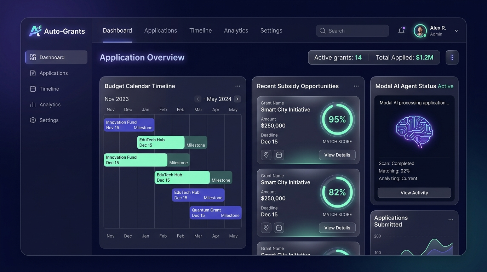

# auto-grants-integrated UI/UX デザイン仕様書

> **Version**: 1.0  
> **更新日**: 2026-07-15  
> **ステータス**: Draft

---

## 🎨 ダッシュボード UI モックアップ

以下は、本統合プロジェクトのデザインシステムを反映したダッシュボード画面のビジュアルイメージです。

---

## 💎 デザインシステムの定義

### 1. カラーパレット
* **背景 (Background)**: ディープネイビーとダークインディゴのグラデーション (`#0B0F19` から `#162032`)。
* **カード・コンポーネント (Surfaces)**: 背景を半透明に透過させたグラスモフィズム（アクリル調）質感。
* **プライマリカラー**: エレクトリック・インディゴ (`#5E5CE6`)。ボタンやアクティブタブに使用。
* **アクセントカラー**: ネオン・ミント (`#30D158`)。適合度（マッチスコア）や正常ステータスを強調。

### 2. 主要な画面構成

#### 📅 予算カレンダータイムライン (Budget Calendar Timeline)
* **概要**: 国の予算成立・概算要求マイルストーンや、個別助成金の申請締切をガントチャート形式で直感的に把握できるエリア。

#### 🎯 新着・推薦助成金 (Recent Subsidy Opportunities)
* **概要**: 富山県/富山市のクローラーが取得した最新データにAIが算出したマッチスコア（例: 95%）をバッジとして重ねて表示するカード。

#### 🧠 AIエージェントステータス (Modal AI Agent Status)
* **概要**: Modal上のQwen3/BgeRerankerの稼働状況（ウォームアップ中、処理完了等）をリアルタイムに示すウィジェット。

---

## 🔗 現状の仕様・ワークフローとの統合設計

本 UI/UX デザインは、標準スキル `grant_application_workflow` で定義されている Phase 0 〜 Phase 7 の各手順およびシステムフローを可視化・操作するために設計されています。

| ワークフローフェーズ | UI/UX での具体的な統合・表現方法 |
|---|---|
| **Phase 0-1 (登録と収集)** | ・新着収集された補助金が `Recent Subsidy Opportunities` カードに自動追加。 ・クローラーのバッチ実行や進捗が `Modal AI Agent Status` に連携表示。 |
| **Phase 2 (RAG適合判定とエビデンス)** | ・補助金カードの「詳細表示 (View Details)」から、ハルシネーション防止ルールに基づく**「募集要項の直接引用 (Quote)」と「出典」を紐付けた適合性判定テーブル**をモーダル表示。 |
| **Phase 3 (期待値評価)** | ・`MATCH SCORE`（ミント色のプログレスリング）の裏付けとして、「金額効率」「採択見込み」「書類負担」「戦略整合性」の4軸レーダーチャートを表示。 |
| **Phase 4-5 (計画と下書き作成)** | ・`Applications` ビューから、保護された「原本テンプレート」と、AIが自動記入した「`*_filled.xlsx` 複製ファイル」をワンクリックで切り替えてダウンロード・プレビュー可能。 |
| **Phase 6 (進捗連携)** | ・`Budget Calendar Timeline` において、国の予算マイルストーンと、`ai-note-meet` から登録された具体的な申請タスク・カレンダー予定をガントチャート上にマージして表示。 |
| **Phase 7 (提出前検証・プリフライト)** | ・申請書のエクスポート画面で、`grant_submission_preflight_run` の実行プログレスと、エラーや入力漏れ（カバレッジ不足）がある場合の警告シグナルを分かりやすく提示。 |

---

## 🚀 今後の実装ステップ
1. **デザインシステム構築**: `index.css` にカラーコードやグラスモフィズム用のユーティリティクラス（`backdrop-filter: blur(16px)`など）を CSS 変数として定義。
2. **コンポーネント作成**: React + Vanilla CSS でカード、タイムライン、マッチスコアのリングなどを実装。
