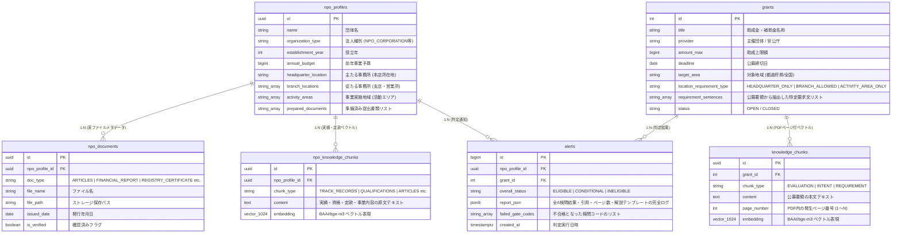

# スキル仕様書: 6段階動的検問ゲート適合チェッカー (check_eligibility.py)

## 1. システム概要 & アーキテクチャ設計

### 1.1 目的・方針
本システムは、登録団体のプロファイル・実ドキュメント (`public.npo_profiles`, `public.npo_documents`, `public.npo_knowledge_chunks`) と助成金データ (`public.grants`, `public.knowledge_chunks`) を照合し、**「6段階動的検問ゲート (6-Stage Agentic Gate System)」** によって厳格に要件適合判定を行うモジュールである。

従来の平均点（〇〇%）による判定を全廃し、「1つでも必須条件を満たさなければ即不適合 (INELIGIBLE)」とする審査フローを完全再現する。また、**PDFページ番号付き確証引用 (Page Citation Grounding)** と **確定引用＋構造化テンプレート解説** を組み合わせることで、外部LLM不要・ハルシネーション 0% の厳格な判定と説明責任（Explainability）を両立する。

### 1.2 全体システム構成図 (Mermaid)



---

## 2. データベース DDL & マイグレーション詳細仕様

本機能の適用には以下の SQL マイグレーション (`20260802_add_page_num_and_documents.sql`) を実行する。

```sql
-- 1. npo_knowledge_chunks の UNIQUE 制約緩和 (同一団体・同一タイプの複数実績保存に対応)
ALTER TABLE public.npo_knowledge_chunks DROP CONSTRAINT IF EXISTS uq_npo_chunk_type;
ALTER TABLE public.npo_knowledge_chunks DROP CONSTRAINT IF EXISTS uq_npo_knowledge_chunks_type;
CREATE INDEX IF NOT EXISTS idx_npo_knowledge_chunks_lookup ON public.npo_knowledge_chunks(npo_profile_id, chunk_type);

-- 2. knowledge_chunks (助成金チャンク) に page_number カラムを追加
ALTER TABLE public.knowledge_chunks ADD COLUMN IF NOT EXISTS page_number INTEGER DEFAULT 1;
CREATE INDEX IF NOT EXISTS idx_knowledge_chunks_page ON public.knowledge_chunks(grant_id, page_number);

-- 3. grants テーブルに特定要求文リストカラムを追加
ALTER TABLE public.grants ADD COLUMN IF NOT EXISTS requirement_sentences TEXT[] DEFAULT '{}'::TEXT[];
ALTER TABLE public.grants ADD COLUMN IF NOT EXISTS location_requirement_type TEXT DEFAULT 'BRANCH_ALLOWED';

-- 4. public.npo_documents (書類メタデータ管理テーブル) の新規作成
CREATE TABLE IF NOT EXISTS public.npo_documents (
  id UUID PRIMARY KEY DEFAULT gen_random_uuid(),
  npo_profile_id UUID NOT NULL REFERENCES public.npo_profiles(id) ON DELETE CASCADE,
  doc_type TEXT NOT NULL,
  file_name TEXT NOT NULL,
  file_path TEXT NOT NULL,
  issued_date DATE,
  is_verified BOOLEAN DEFAULT TRUE,
  created_at TIMESTAMPTZ DEFAULT NOW()
);
CREATE INDEX IF NOT EXISTS idx_npo_documents_profile ON public.npo_documents(npo_profile_id);

-- 5. alerts テーブルの拡張 (構造化検問レポート保存用)
ALTER TABLE public.alerts ADD COLUMN IF NOT EXISTS overall_status TEXT DEFAULT 'INELIGIBLE';
ALTER TABLE public.alerts ADD COLUMN IF NOT EXISTS report_json JSONB DEFAULT '{}'::JSONB;
ALTER TABLE public.alerts ADD COLUMN IF NOT EXISTS failed_gate_codes TEXT[] DEFAULT '{}'::TEXT[];
CREATE INDEX IF NOT EXISTS idx_alerts_overall_status ON public.alerts(overall_status);
```

---

## 3. データ抽出・解析パイプライン仕様

### 3.1 PDF 解析 & ページ番号分断 (`skills/jgrants_search/scripts/extract_pdf.py`)
1. **PyMuPDF (`fitz`) ブロック読み込み**:
   `doc = fitz.open(stream=pdf_bytes)` で開いた後、ページごとの `page.get_text("blocks")` をループ走査し、各テキストブロックごとに `page_number = page.number + 1` を付与する。
2. **チャンク保存**:
   `knowledge_chunks` テーブルにレコード挿入する際、`page_number` カラムに正確な発生ページ番号を格納する。
3. **ページ境界チャンク割当ルール**:
   500文字チャンク分割時にページ境界を跨ぐ場合、**チャンク開始位置のページ番号** を `page_number` として採用する。具体的には、PyMuPDF パース時に各テキストブロックの `(text, page_number)` タプルのリストを保持し、チャンク分割後に `chunk_start_offset` がどのブロック範囲に属するかで `page_number` を逆算する。
   ```python
   # ページ割当の疑似コード
   for chunk in chunks:
       chunk.page_number = page_map.get_page_at_offset(chunk.start_offset)
   ```

### 3.2 所在地要件パターンパース
`extract_location_requirement_deterministic(text: str) -> str`
- **`HEADQUARTER_ONLY` パターン**: `r"(主たる事務所|登記簿|本社所在地|登記地)[\s\S]{0,60}?(に限る|必須|対象とする|のみ)"`
- **`ACTIVITY_AREA_ONLY` パターン**: `r"(事業実施場所|活動エリア|現地|現場)[\s\S]{0,60}?(のみ|を実施すること|で事業を行う)"` (かつ「拠点」「支店」の記載がない場合)
- **`BRANCH_ALLOWED` パターン**: 上記以外（デフォルト）
- **距離制限**: `.*?` ではなく `[\s\S]{0,60}?` を使用し、キーワードと修飾子の間が最大60文字以内のみマッチさせる。全文一行化後の遠距離誤マッチを防止する。

### 3.3 特定要求文パース (`extract_requirement_sentences`)
`extract_requirement_sentences(text: str) -> List[str]`
- 公募要領から「応募資格」「対象要件」「助成対象」セクションを抽出。
- 箇条書き記号 (`〇`, `・`, `(1)`, `①`, `【要件】`) または文末修飾子 (`〜すること`, `〜であること`, `〜を有する法人`, `〜を満たすこと`) を基準に文章を分割。
- 重複および 10 文字未満の短文を除外し、最大 15 個の要件文リストとして `grants.requirement_sentences` に配列保存。

---

## 4. 6 段階動的検問ゲート (6-Stage Agentic Gate System) アルゴリズム詳細

```text
               ┌────────────────────────────────────────────────────────┐
               │ 6-Stage Gate Evaluator (check_eligibility.py)          │
               └──────────────────────────┬─────────────────────────────┘
                                          │
    ┌─────────────────────────────────────┼─────────────────────────────────────┐
    │                                     │                                     │
    ▼                                     ▼                                     ▼
┌──────────────────────────┐  ┌──────────────────────────┐  ┌──────────────────────────┐
│ Gate 1: 基本ルール (SQL)  │  │ Gate 2: 拠点要件 (多重)  │  │ Gate 3: 予算規模比率50%  │
│ 法人型/活動年数/公募期限 │  │ 本店/支店/活動エリア検証 │  │ 助成上限 <= 年予算 * 0.5 │
└────────────┬─────────────┘  └────────────┬─────────────┘  └────────────┬─────────────┘
             │                            │                            │
             └────────────────────────────┼────────────────────────────┘
                                          │ ALL PASS
                                          ▼
┌──────────────────────────┐  ┌──────────────────────────┐  ┌──────────────────────────┐
│ Gate 4: 多軸セマンティック│  │ Gate 5: 動的 RAG 検索    │  │ Gate 6: 書類網羅性 & 日付 │
│ 3軸最小値 >= 0.55 足切り │  │ 助成金要件 -> NPOチャンク│  │ 差分集合 + 3ヶ月制限判定 │
└──────────────────────────┘  └──────────────────────────┘  └──────────────────────────┘
```

### 4.1 各検問の判定詳細仕様

#### 【Gate 1: 基本ルール判定 (GATE_1_BASIC_RULES)】
- **organization_type**: `npo.organization_type IN grant.eligible_org_types`
- **years_active**: `(現在年 - npo.establishment_year) >= grant.min_years_active` (未設定時は 0年)
- **grant_status**: `grant.status == 'OPEN'` かつ `grant.deadline >= 現在日`
- **不合格条件**: 1項目でも不一致があれば `FAIL` ➔ 総合ステータス `INELIGIBLE` で打切り。

#### 【Gate 2: 所在地・拠点要件判定 (GATE_2_LOCATION)】
- **地域マッチングアルゴリズム (都道府県前方一致)**:
  単純な `in` 部分一致ではなく、**都道府県名の前方一致** を行う。`"京都" in "東京都千代田区"` が `True` となる誤判定を防止するため、以下のロジックを採用する:
  ```python
  PREFECTURES = ["北海道","青森県","岩手県",...,"沖縄県"]  # 47都道府県
  def normalize_prefecture(text: str) -> str:
      for p in PREFECTURES:
          if text.startswith(p): return p
      return text  # フォールバック
  def area_match(grant_area: str, location: str) -> bool:
      return normalize_prefecture(grant_area) == normalize_prefecture(location)
  ```
- **`HEADQUARTER_ONLY` の場合**: `grant_area == '全国'` または `area_match(grant_area, npo.headquarter_location)` (フォールバック: `npo.location`)。
- **`BRANCH_ALLOWED` の場合**: `grant_area == '全国'` または `[headquarter_location] + branch_locations` のいずれかが `area_match` で一致。
- **`ACTIVITY_AREA_ONLY` の場合**: `grant_area == '全国'` または `activity_areas` のいずれかが `area_match` で一致。
- **不合格条件**: 不適合時は `FAIL` ➔ 理由 `「公募エリア '東京都' (本店限定要件) vs 本店拠点 '富山県富山市'」` ➔ 総合ステータス `INELIGIBLE` で打切り。

#### 【Gate 3: 予算規模整合性判定 (GATE_3_BUDGET)】
- **計算式**: `grant.amount_max <= npo.annual_budget * 0.50`
- **不合格条件**: 超過時は `FAIL` ➔ 理由 `「助成上限 13,700,000円 / 前年予算 10,000,000円 (比率 137.0% > 50%上限)」` ➔ 総合 `INELIGIBLE` で打切り。

#### 【Gate 4: 多軸分野適合セマンティックゲート (GATE_4_MULTI_AXIS_SEMANTIC)】
- **計算式**: 以下の 3 軸の個別の類似度を `BAAI/bge-m3` で計算し、**その最小値 (Min Score)** を求める。
  1. `sim_activity` = `npo_chunk(chunk_type='ACTIVITY_TAGS')` vs `grant_chunks`
  2. `sim_target` = `npo_chunk(chunk_type='TARGET_AUDIENCE')` vs `grant_chunks`
  3. `sim_purpose` = `npo_chunk(chunk_type='DESCRIPTION')` vs `grant_chunks`
- **キャリブレーション閾値**: `min(sim_activity, sim_target, sim_purpose) >= 0.55`
- **不合格条件**: 最小値が `0.55` 未満の場合は `FAIL` ➔ 理由 `「多軸類似度最小値 0.42 (ターゲット層不一致) < 0.55」` ➔ 総合 `INELIGIBLE` で打切り。

#### 【Gate 5: 特定要件動的 RAG 検索 & 自己検証 (GATE_5_SPECIFIC_RAG_REQUIREMENTS)】
- **検索クエリ**: `grant.requirement_sentences` の各要求文 1 文ずつ。
- **SQL クエリ (正方向検索)**:
  ```sql
  SELECT nkc.content, nkc.chunk_type, 1 - (nkc.embedding <=> %s::vector) AS similarity
  FROM public.npo_knowledge_chunks nkc
  WHERE nkc.npo_profile_id = %s
  ORDER BY nkc.embedding <=> %s::vector
  LIMIT 1;
  ```
- **項目のステータス判定**:
  - `similarity >= 0.70`: `PASS` (十分な実績文脈あり)
  - `0.50 <= similarity < 0.70`: `WARN` (関連記述あり・要追記/要確認)
  - `similarity < 0.50`: `FAIL` (該当する実績・文脈なし)
- **構造化テンプレート解説生成** (外部LLM不要):
  `FAIL` または `WARN` の要求文に対し、確定引用データ（要求文・マッチ実績・類似度）から **テンプレートベースで** `explanation` と `user_advice` を自動生成する。外部LLMに依存しないため、レイテンシ・コスト・ハルシネーションのリスクがゼロ。
  - **テンプレート構造**:
    ```python
    def generate_explanation(item: dict) -> dict:
        req = item["grant_requirement"]
        evidence = item["npo_matched_evidence"]
        sim = item["similarity_score"]
        status = item["status"]

        if status == "FAIL":
            explanation = (
                f"公募要件『{req}』に対する十分な関連実績が"
                f"団体データ内に確認できませんでした (類似度: {sim:.2f})。"
                f"最も近い実績: 『{evidence[:60]}』"
            )
        else:  # WARN
            explanation = (
                f"公募要件『{req}』に関連する記述が見つかりましたが、"
                f"十分な適合とは判定できません (類似度: {sim:.2f})。"
                f"関連実績: 『{evidence[:60]}』"
            )
        advice = "該当する実績がある場合は、団体プロファイルの実績情報にテキストを追記して再判定してください。"
        return {"explanation": explanation, "user_advice": advice}
    ```
  - **将来拡張**: テンプレート生成で不十分な場合、MCP ツール (`auto-grants` サーバーの `research_answer` 等) を呼び出す拡張パスを後日追加可能。その際も `explanation` / `user_advice` のインターフェースは変更しない。
- **Gate 5 全体のステータス判定ルール**:
  - `FAIL` 項目が 1 つ以上 → Gate 5 全体 `FAIL`
  - `FAIL` なし かつ `WARN` 項目が 1 つ以上 → Gate 5 全体 `WARN`
  - 全項目 `PASS` → Gate 5 全体 `PASS`

#### 【Gate 6: 書類網羅性 & 日付検証 (GATE_6_DOCUMENTS)】
- **書類差分**: `missing_docs = grant.required_documents - npo.prepared_documents`
- **日付検証**: `REGISTRY_CERTIFICATE` (登記簿) の場合、`npo_documents.issued_date` が現在日から 3 か月以内か検証。
- **ステータス判定**: 欠品あり または 発行日超過の場合 `WARN` (要準備)。

---

## 5. クラス定義・Python 関数シグネチャ仕様

`skills/grant_eligibility_checker/scripts/check_eligibility.py` 内の主要クラスと型定義：

```python
from typing import Dict, Any, List, Optional, Tuple
from dataclasses import dataclass
from datetime import datetime

@dataclass
class GateResult:
    gate_code: str
    gate_name: str
    status: str  # 'PASS' | 'WARN' | 'FAIL'
    reason: str
    details: Optional[Dict[str, Any]] = None
    items: Optional[List[Dict[str, Any]]] = None

class Stage1RuleEvaluator:
    @staticmethod
    def evaluate(npo: Dict[str, Any], grant: Dict[str, Any]) -> GateResult: ...

class Stage2LocationEvaluator:
    @staticmethod
    def evaluate(npo: Dict[str, Any], grant: Dict[str, Any]) -> GateResult: ...

class Stage3BudgetEvaluator:
    @staticmethod
    def evaluate(npo: Dict[str, Any], grant: Dict[str, Any]) -> GateResult: ...

class Stage4MultiAxisSemanticEvaluator:
    @classmethod
    def evaluate(cls, cur: Any, npo: Dict[str, Any], grant: Dict[str, Any]) -> GateResult: ...

class Stage5DynamicRAGGateEvaluator:
    @classmethod
    def evaluate(cls, cur: Any, npo: Dict[str, Any], grant: Dict[str, Any], embedder: Any) -> GateResult: ...

class Stage6DocumentEvaluator:
    @classmethod
    def evaluate(cls, cur: Any, npo: Dict[str, Any], grant: Dict[str, Any]) -> GateResult: ...

class EligibilityChecker:
    def __init__(self, db_url: str):
        self.db_url = db_url

    def run(self, org_id: str, grant_id: str) -> Dict[str, Any]:
        """
        全 6 段階検問ゲートを走査し、総合ステータス (ELIGIBLE / CONDITIONAL / INELIGIBLE)
        および構造化 JSON レポートを返却し、public.alerts テーブルに保存する。
        """
        ...
```

---

## 6. 判定結果データ構造 (Report Output JSON Schema)

```json
{
  "grant_id": 2,
  "grant_title": "東京都若者世代職場定着促進助成金（令和８年度第４回申請受付）",
  "npo_profile_id": "018f67bc-1234-7000-8000-000000000001",
  "npo_name": "特定非営利活動法人 Open Coral Network",
  "overall_status": "CONDITIONAL",
  "passed_gates": 5,
  "total_gates": 6,
  "failed_gate_codes": ["GATE_5_SPECIFIC_RAG_REQUIREMENTS"],
  "gates": [
    {
      "gate_code": "GATE_1_BASIC_RULES",
      "gate_name": "検問1: 基本要件",
      "status": "PASS",
      "reason": "法人型 'NPO_CORPORATION' / 活動年数 1年 / 公募期限内"
    },
    {
      "gate_code": "GATE_2_LOCATION",
      "gate_name": "検問2: 拠点要件",
      "status": "PASS",
      "reason": "公募エリア '東京都' (支店認容要件) vs 支店拠点 '東京都千代田区'"
    },
    {
      "gate_code": "GATE_3_BUDGET",
      "gate_name": "検問3: 予算規模",
      "status": "PASS",
      "reason": "助成上限 1,260,000円 / 前年予算 10,000,000円 (12.6% <= 50%上限)"
    },
    {
      "gate_code": "GATE_4_MULTI_AXIS_SEMANTIC",
      "gate_name": "検問4: 多軸分野適合",
      "status": "PASS",
      "reason": "3軸最小類似度: 0.58 [活動分野: 0.62, ターゲット: 0.60, 目的: 0.58] (基準値 0.55 クリア)"
    },
    {
      "gate_code": "GATE_5_SPECIFIC_RAG_REQUIREMENTS",
      "gate_name": "検問5: 特定要件動的 RAG 検索",
      "status": "WARN",
      "items": [
        {
          "grant_requirement": "都が実施する就職支援事業の利用者を正規雇用していること",
          "page_number": 3,
          "citation_url": "file:///path/to/grant_guide.pdf#page=3",
          "npo_matched_evidence": "地域NPOと連携し子ども向けプログラミング教育を実施",
          "similarity_score": 0.32,
          "status": "FAIL",
          "explanation": "公募要件は『都の就職支援事業を利用した若者の雇用実績』を求めていますが、貴団体のプロファイルにはプログラミング教育の実績のみで、該当する雇用記録が確認できません。",
          "user_advice": "※過去に該当する雇用実績がある場合は、団体プロファイルの「実績情報」にテキストを追記して再判定してください。"
        }
      ]
    },
    {
      "gate_code": "GATE_6_DOCUMENTS",
      "gate_name": "検問6: 提出書類準備率",
      "status": "PASS",
      "reason": "必要書類 0件 未準備"
    }
  ],
  "evaluated_at": "2026-08-02T18:35:00Z"
}
```

---

## 7. エラーハンドリング・フォールバック・ログ仕様

### 7.1 DB 接続障害
- `strict=True` の場合は即座に `ValueError` を送出。
- `strict=False` の場合は全検問を `WARN` とし、`overall_status = 'CONDITIONAL'`, `reason = 'DB未接続のため標準フォールバック判定'` を返却。

### 7.2 Embedding モデル障害
- 遅延ロード (`@property model`) で `BAAI/bge-m3` を自動ロード。
- ロード不可の場合は Gate 4 をルールベースキーワード検索に自動フォールバック (フォールバックスコア: 75点 → 閾値は `0.55 * 100 = 55` 以上で PASS とみなす)。
- Gate 5 では Embedding 不可時に Gate 全体を `WARN` + `reason = 'Embeddingモデル未ロード'` として処理続行。

### 7.3 Gate 5 解説生成
- テンプレートベースのため外部サービス障害の影響を受けない。
- `similarity_score` や `npo_matched_evidence` が空の場合は汎用テンプレートで補完:
  ```text
  explanation: 「公募要件『{requirement}』に対応する実績データが登録されていません」
  user_advice: 「該当する実績がある場合は、団体プロファイルの実績情報にテキストを追記して再判定してください」
  ```
