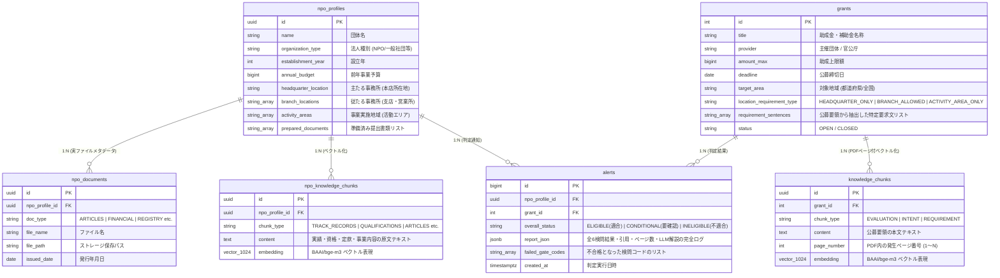

# スキル仕様書: 6段階動的検問ゲート適合チェッカー (check_eligibility.py)

## 1. 概要 & 目的
登録団体のプロファイル情報・書類 (`public.npo_profiles` / `public.npo_documents` / `public.npo_knowledge_chunks`) と助成金の公募要件 (`public.grants` / `public.knowledge_chunks`) を受け取り、**全 6 段階の動的検問ゲート (6-Stage Agentic Gate System)** で判定を行います。

曖昧なスコア平均化を撤廃し、「1つでも必須要件を満たさなければ失格」とする実務審査フローを完全再現します。また、**PDFページ番号付き確証引用 (Page Citation Grounding)** と **ローカルLLMによる読み解き解説** により、ハルシネーション0%かつトレーサブルな判定結果を `public.alerts` に保存します。

---

## 2. データベース & ドキュメント保存アーキテクチャ

### ① ドキュメント保存の 3 層レイヤー構造

```text
[ユーザーが書類をアップロード / ローカル配置]
                     │
                     ▼
 ┌────────────────────────────────────────────────────────┐
 │ Layer 1: 実ファイル保存 (ストレージ)                    │
 │  パス: storage/npo_documents/<npo_id>/<doc_type>/... │
 └───────────────────┬────────────────────────────────────┘
                     │
                     ▼ 【自動テキストパース & メタデータ登録】
 ┌────────────────────────────────────────────────────────┐
 │ Layer 2: DB メタデータ管理 (public.npo_documents)     │
 │  ・書類種別, ファイル名, パス, 発行年月日, 有効期限       │
 └───────────────────┬────────────────────────────────────┘
                     │
                     ▼ 【BAAI/bge-m3 ベクトル化】
 ┌────────────────────────────────────────────────────────┐
 │ Layer 3: RAG知識ベース (public.npo_knowledge_chunks)   │
 │  ・テキスト文章 + BGE-M3 ベクトル(1024)                 │
 └────────────────────────────────────────────────────────┘
```

#### Layer 1: ディレクトリ構造
```text
storage/npo_documents/
└── <npo_profile_id>/
    ├── ARTICLES/                     # 定款・規約
    ├── FINANCIAL_REPORT/             # 決算書・財務諸表
    ├── ACTIVITY_REPORT/              # 事業報告書・実績テキスト
    ├── BOARD_LIST/                   # 役員・構成員名簿
    └── REGISTRY_CERTIFICATE/         # 履歴事項全部証明書・登記簿
```

#### Layer 2: `public.npo_documents` (書類メタデータテーブル)
```sql
CREATE TABLE IF NOT EXISTS public.npo_documents (
  id UUID PRIMARY KEY DEFAULT gen_random_uuid(),
  npo_profile_id UUID NOT NULL REFERENCES public.npo_profiles(id) ON DELETE CASCADE,
  doc_type TEXT NOT NULL, -- 'ARTICLES', 'FINANCIAL_REPORT', 'REGISTRY_CERTIFICATE' etc.
  file_name TEXT NOT NULL,
  file_path TEXT NOT NULL,
  issued_date DATE,        -- 発行年月日 (登記簿の3ヶ月以内チェック等で使用)
  is_verified BOOLEAN DEFAULT TRUE,
  created_at TIMESTAMPTZ DEFAULT NOW()
);
```

---

### ② データベース ER 図 (PostgreSQL / Neon / pgvector)



---

## 3. 6 段階動的検問ゲート仕様 (6-Stage Agentic Gate System)

```text
[公募助成金] ──► [検問1: 基本要件 (法人型・年数・期限)] ──► FAIL ➔ 🔴 不適合 (INELIGIBLE)
                 │ PASS (SQL確定的チェック)
                 ▼
                [検問2: 拠点要件 (本店/支店/活動地)] ──► FAIL ➔ 🔴 不適合 (INELIGIBLE)
                 │ PASS (多重拠点ロジカル検証)
                 ▼
                [検問3: 予算規模 (上限比率50%制限)]  ──► FAIL ➔ 🔴 不適合 (INELIGIBLE)
                 │ PASS (数値計算)
                 ▼
                [検問4: 分野適合セマンティックゲート]──► FAIL ➔ 🔴 不適合 (INELIGIBLE)
                 │ PASS (目的・対象類似度 >= 0.45)
                 ▼
                [検問5: 特定要件動的 RAG 検索]       ──► FAIL ➔ 🔴 不適合 / WARN ➔ 🟡 条件付き適合
                 │ (要求文分解 ➔ RAGベクトル検索 ➔ ページ番号引用 ➔ ローカルLLM読み解き)
                 ▼
                [検問6: 提出書類準備率チェック]     ──► WARN ➔ 🟡 要書類手配
                 │ (集合差分判定)
                 ▼
                🟢 完全適合 (ELIGIBLE: 全検問をクリア)
```

---

## 4. 判定レポート出力フォーマット (Report Output Schema)

```json
{
  "grant_id": 2,
  "grant_title": "東京都若者世代職場定着促進助成金（令和８年度第４回申請受付）",
  "npo_profile_id": "uuid-1234-5678",
  "npo_name": "特定非営利活動法人 Open Coral Network",
  "overall_status": "CONDITIONAL",
  "passed_gates": 5,
  "total_gates": 6,
  "gates": [
    {
      "gate_code": "GATE_1_BASIC_RULES",
      "gate_name": "検問1: 基本要件",
      "status": "PASS",
      "reason": "法人型 'NPO_CORPORATION' / 活動年数 1年 / 公募期限内"
    },
    {
      "gate_code": "GATE_2_LOCATION",
      "gate_name": "検問2: 拠点要件",
      "status": "PASS",
      "reason": "公募エリア '東京都' (支店認容要件) vs 支店拠点 '東京都千代田区'"
    },
    {
      "gate_code": "GATE_3_BUDGET",
      "gate_name": "検問3: 予算規模",
      "status": "PASS",
      "reason": "助成上限 1,260,000円 / 前年予算 10,000,000円 (12.6% <= 50%上限)"
    },
    {
      "gate_code": "GATE_4_SEMANTIC_OVERALL",
      "gate_name": "検問4: 大枠分野適合",
      "status": "PASS",
      "reason": "目的・対象層コサイン類似度: 0.52 (基準値 0.45 以上クリア)"
    },
    {
      "gate_code": "GATE_5_SPECIFIC_RAG_REQUIREMENTS",
      "gate_name": "検問5: 特定要件動的 RAG 検索",
      "status": "WARN",
      "items": [
        {
          "grant_requirement": "都が実施する就職支援事業の利用者を正規雇用していること",
          "page_number": 3,
          "citation_url": "file:///path/to/grant_guide.pdf#page=3",
          "npo_matched_evidence": "地域NPOと連携し子ども向けプログラミング教育を実施",
          "similarity_score": 0.32,
          "status": "FAIL",
          "llm_explanation": "公募要件は『都の就職支援事業を利用した若者の雇用実績』を求めていますが、貴団体のプロファイルにはプログラミング教育の実績のみで、該当する雇用記録が確認できません。",
          "user_advice": "※過去に該当する雇用実績がある場合は、団体プロファイルの「実績情報」にテキストを追記して再判定してください。"
        }
      ]
    },
    {
      "gate_code": "GATE_6_DOCUMENTS",
      "gate_name": "検問6: 提出書類準備率",
      "status": "PASS",
      "reason": "必要書類 0件 未準備"
    }
  ],
  "evaluated_at": "2026-08-02T18:20:00Z"
}
```
