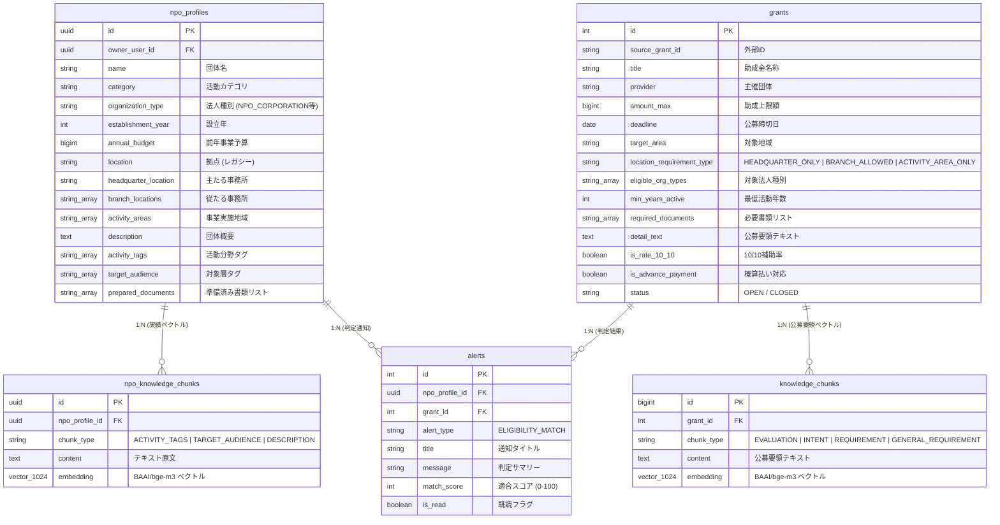

# スキル仕様書: 助成金要件適合チェッカー (check_eligibility.py)

## 1. 概要 & 目的

### 1.1 方針
登録団体のプロファイル (`public.npo_profiles`) ・実績ベクトル (`public.npo_knowledge_chunks`) と助成金データ (`public.grants`) ・公募要領ベクトル (`public.knowledge_chunks`) を照合し、**3 段階ハイブリッド判定 (3-Stage Hybrid Evaluation)** で要件適合を判定するモジュールである。

- **Stage 1**: 確定的ルール判定（5 項目: 法人格 / 実績年数 / 拠点多重判定 / 予算比率 / 公募ステータス）
- **Stage 2**: 提出書類差分チェック（集合差分判定）
- **Stage 3**: セマンティック適合判定（pgvector コサイン類似度 3 軸 + キーワード/フラグ 5 軸 = 計 8 項目）

Stage 1 で **1 つでも不合格 → 即 FAIL** とし、無駄なベクトル計算を回避する。Stage 1 通過後は Stage 2 (40%) + Stage 3 (60%) の重み付けスコアで総合判定する。

### 1.2 Embedding 統一仕様
- **モデル**: `BAAI/bge-m3` (1024 次元) — `sentence-transformers` ライブラリで実行
- **正規化**: 全ての `model.encode()` 呼び出しで **`normalize_embeddings=True`** を必ず指定すること
- **ベクトル保存先**: pgvector `vector(1024)` カラム（HNSW インデックス）

---

## 2. データベーススキーマ（現行）

以下は `supabase/migrations/` に実際に存在するマイグレーションから構築されるスキーマである。

### 2.1 ER 図



### 2.2 重要な制約・インデックス

| テーブル | 制約/インデックス | 内容 |
|---|---|---|
| `npo_knowledge_chunks` | `UNIQUE (npo_profile_id, chunk_type)` | **1 団体 1 chunk_type につき 1 行のみ** |
| `alerts` | `UNIQUE (npo_profile_id, grant_id, alert_type)` | 同一団体×助成金×タイプで Upsert |
| `knowledge_chunks` | HNSW `vector_cosine_ops` | ベクトル近傍検索用 |
| `npo_knowledge_chunks` | HNSW `vector_cosine_ops` | ベクトル近傍検索用 |

---

## 3. データ抽出パイプライン（現行実装）

### 3.1 助成金 PDF 解析 (`skills/jgrants_search/scripts/extract_pdf.py`)

1. **テキスト抽出**: PyMuPDF (`fitz`) で各ページのテキストブロックを取得。ページ先頭に `--- ページ N ---` を文字列挿入。
2. **チャンク分割**: 500 文字単位（50 文字オーバーラップ）で分割。
3. **Embedding 生成**: `SentenceTransformer("BAAI/bge-m3").encode(chunks, normalize_embeddings=True)` でバッチ生成。
4. **DB 保存**: `knowledge_chunks` テーブルに `(grant_id, chunk_type, content, embedding)` を INSERT。
5. **構造化抽出**: `extract_structured_requirements()` で以下を抽出し `grants` テーブルを UPDATE:
   - `required_documents` (TEXT[])
   - `location_requirement_type` (TEXT)
   - `detail_text` (TEXT)

### 3.2 NPO プロファイル Embedding (`scripts/ingest_npo_profile.py`)

1. `npo_profiles` から `activity_tags`, `target_audience`, `description` を取得。
2. 以下の 3 つの chunk_type でテキスト整形:
   - `ACTIVITY_TAGS`: `"活動分野・主要テーマ: {tags}"`
   - `TARGET_AUDIENCE`: `"支援対象・ターゲット層: {audiences}"`
   - `DESCRIPTION`: `"団体概要・事業目的: {description}"`
3. `SentenceTransformer("BAAI/bge-m3").encode(contents, normalize_embeddings=True)` でバッチ生成。
4. `npo_knowledge_chunks` テーブルに `ON CONFLICT (npo_profile_id, chunk_type) DO UPDATE` で Upsert。

### 3.3 所在地要件パース (`extract_pdf.py`)

`extract_location_requirement_deterministic(text: str) -> str`
- **`HEADQUARTER_ONLY`**: `r"(主たる事務所|登記簿|本社所在地|登記地)[\s\S]{0,60}?(に限る|必須|対象とする|のみ)"`
- **`ACTIVITY_AREA_ONLY`**: `r"(事業実施場所|活動エリア|現地|現場)[\s\S]{0,60}?(のみ|を実施すること|で事業を行う)"` (かつ「拠点」「支店」非記載)
- **`BRANCH_ALLOWED`**: デフォルト

---

## 4. 3 段階ハイブリッド判定アルゴリズム

```text
[助成金 + NPO プロファイル]
         │
         ▼
┌───────────────────────────────────────────────────────┐
│ Stage 1: 確定ルール判定 (5項目)                        │
│ 法人格 / 実績年数 / 拠点多重 / 予算比率 / 公募ステータス │
└───────────────────────┬───────────────────────────────┘
                        │
                  1項目でもFAIL?
                 ╱            ╲
               Yes             No
                │               │
       total_score = 0         ▼
       status = "FAIL"  ┌──────────────────────────────┐
                        │ Stage 2: 書類差分チェック      │
                        │ required_documents ∩ prepared  │
                        │ → score (0〜100)               │
                        └──────────────┬───────────────┘
                                       │
                                       ▼
                        ┌──────────────────────────────┐
                        │ Stage 3: セマンティック判定     │
                        │ pgvector 3軸 + キーワード 5軸  │
                        │ → score (0〜100)               │
                        └──────────────┬───────────────┘
                                       │
                                       ▼
                  total_score = Stage2 * 0.4 + Stage3 * 0.6
                  status = "PASS" (≥70) / "WARNING" (<70)
```

### 4.1 Stage 1: 確定ルール判定

| # | 項目 | 判定ロジック | 不合格時 |
|---|---|---|---|
| 1 | 法人格 | `npo.organization_type IN grant.eligible_org_types` | FAIL → 即打切り |
| 2 | 実績年数 | `(現在年 - npo.establishment_year) >= grant.min_years_active` | FAIL → 即打切り |
| 3 | 拠点要件 | `location_requirement_type` に応じた都道府県マッチング (§4.2) | FAIL → 即打切り |
| 4 | 予算比率 | `grant.amount_max <= npo.annual_budget * 0.50` | FAIL → 即打切り |
| 5 | 公募ステータス | `grant.status == 'OPEN'` かつ `grant.deadline >= 現在日` | FAIL → 即打切り |

### 4.2 拠点要件の判定ロジック

`grant.location_requirement_type` の値に応じて異なる拠点リストと照合する:

| タイプ | 照合対象 |
|---|---|
| `HEADQUARTER_ONLY` | `headquarter_location` (フォールバック: `location`) |
| `BRANCH_ALLOWED` | `[headquarter_location] + branch_locations` (フォールバック: `[location]`) |
| `ACTIVITY_AREA_ONLY` | `activity_areas` (フォールバック: `[location]`) |

**地域マッチング**: 都道府県前方一致を使用し `"京都" in "東京都"` 問題を防止する:
```python
PREFECTURES = ["北海道","青森県","岩手県",...,"沖縄県"]  # 47都道府県
def normalize_prefecture(text: str) -> str:
    for p in PREFECTURES:
        if text.startswith(p): return p
    return text
def area_match(grant_area: str, location: str) -> bool:
    return normalize_prefecture(grant_area) == normalize_prefecture(location)
```

> [!WARNING]
> 現行実装 ([L76](file:///Users/2005nk/Works/npo/civic/auto-grants-integrated/skills/grant_eligibility_checker/scripts/check_eligibility.py#L76)) は `in` 部分一致を使用しており、上記の `area_match` は **未実装（要修正）**。

### 4.3 Stage 2: 書類差分チェック

```python
required_docs = set(grant.get("required_documents") or
                    {"ARTICLES", "FINANCIAL_REPORT", "BOARD_LIST", "REGISTRY_CERTIFICATE"})
prepared_docs = set(npo.get("prepared_documents") or [])
missing_docs = required_docs - prepared_docs
score = len(required_docs & prepared_docs) / len(required_docs) * 100
```

### 4.4 Stage 3: 8 軸セマンティック判定

| # | 項目名 | chunk_type / 判定方法 | フォールバック |
|---|---|---|---|
| 1 | `activity_category` | pgvector: `ACTIVITY_TAGS` vs `knowledge_chunks` | キーワード一致カウント |
| 2 | `target_audience` | pgvector: `TARGET_AUDIENCE` vs `knowledge_chunks` | キーワード一致カウント |
| 3 | `purpose_match` | pgvector: `DESCRIPTION` vs `knowledge_chunks` | テキスト長チェック |
| 4 | `partnership_req` | `detail_text` 内キーワード検索 (連携/協働/パートナー等) | — |
| 5 | `uniqueness_req` | `detail_text` 内キーワード検索 (新規/先進/モデル等) | — |
| 6 | `cost_burden` | `grant.is_rate_10_10` フラグ | — |
| 7 | `advance_payment` | `grant.is_advance_payment` フラグ | — |
| 8 | `compliance` | 定数 100 点 | — |

**pgvector ベクトル検索 SQL** (項目 1〜3):
```sql
SELECT sub.content, sub.similarity
FROM public.npo_knowledge_chunks nc,
LATERAL (
    SELECT kc.content,
           1 - (kc.embedding <=> nc.embedding) AS similarity
    FROM public.knowledge_chunks kc
    WHERE kc.grant_id = %s
    ORDER BY kc.embedding <=> nc.embedding
    LIMIT 1
) sub
WHERE nc.npo_profile_id = %s AND nc.chunk_type = %s;
```

**フォールバック**: pgvector クエリ失敗時・データ未投入時はスコア **75 点**を返す。

**総合スコア**: 8 項目の算術平均。

---

## 5. 出力フォーマット

### 5.1 Python 戻り値構造

```python
{
    "grant_id": int,
    "grant_title": str,
    "npo_profile_id": str,
    "npo_name": str,
    "match_score": int,           # 0-100 (Stage1 FAIL時は 0)
    "status": str,                # "PASS" | "WARNING" | "FAIL"
    "stage1_results": {
        "all_pass": bool,
        "details": {
            "organization_type": {"pass": bool, "reason": str},
            "years_active": {"pass": bool, "reason": str},
            "target_area": {"pass": bool, "reason": str},
            "budget_ratio": {"pass": bool, "reason": str},
            "grant_status": {"pass": bool, "reason": str}
        }
    },
    "stage2_results": {
        "score": int,
        "required": List[str],
        "prepared": List[str],
        "missing": List[str]
    },
    "stage3_results": {
        "score": int,
        "criteria_scores": {
            "activity_category": int,
            "target_audience": int,
            "purpose_match": int,
            "partnership_req": int,
            "uniqueness_req": int,
            "cost_burden": int,
            "advance_payment": int,
            "compliance": int
        },
        "evidence_quotes": List[str]
    },
    "evaluated_at": str  # ISO 8601
}
```

### 5.2 DB 保存 (`public.alerts`)

```sql
INSERT INTO public.alerts (npo_profile_id, grant_id, alert_type, title, message, match_score, is_read)
VALUES (%s, %s, 'ELIGIBILITY_MATCH', '【適合率 N%】{title}', '{summary}', N, false)
ON CONFLICT ON CONSTRAINT uq_alerts_npo_grant_type
DO UPDATE SET title = EXCLUDED.title, message = EXCLUDED.message,
             match_score = EXCLUDED.match_score, is_read = false, created_at = NOW();
```

---

## 6. エラーハンドリング

### 6.1 DB 接続障害
- レコード不存在時は `ValueError` を送出。

### 6.2 Embedding モデル障害
- 遅延ロード (`@property model`) で `BAAI/bge-m3` を自動ロード。
- ロード不可の場合は Stage 3 項目 1〜3 がフォールバックスコア (75 点) を返す。

---

## 7. Phase 2: 将来拡張ロードマップ

> [!NOTE]
> 以下は現行実装には含まれない将来拡張計画である。実装着手前に個別の詳細設計を行うこと。

### 7.1 6-Gate リファクタリング

現行 3-Stage を 6 独立ゲートに分割し、`GateResult` dataclass で統一する:
- Gate 1 (基本ルール) / Gate 2 (拠点) / Gate 3 (予算) ← 現 Stage 1 を分離
- Gate 4 (セマンティック) ← 現 Stage 3 の 8 軸を維持したまま移行
- Gate 5 (特定要件 RAG) ← **新規開発** (下記 §7.2)
- Gate 6 (書類拡張) ← 現 Stage 2 + `npo_documents` テーブル

出力を `overall_status` (ELIGIBLE / CONDITIONAL / INELIGIBLE) に移行。

### 7.2 Gate 5: 特定要件動的 RAG 検索（新規開発）

**前提条件** (全て新規実装が必要):
1. `extract_requirement_sentences()` メソッドの新規実装 (`extract_pdf.py`)
2. `grants.requirement_sentences` カラムの追加マイグレーション
3. `knowledge_chunks.page_number` カラムの追加マイグレーション
4. `npo_knowledge_chunks` UNIQUE 制約の緩和 + `ingest_npo_profile.py` の ON CONFLICT 書き換え
5. ベクトル検索方向の反転（助成金要件文 → NPO 実績チャンクの正方向検索）

**設計概要**:
- `grants.requirement_sentences` の各要求文を `BAAI/bge-m3` でベクトル化。
- NPO 実績チャンクに対し正方向ベクトル検索を実行。
- 類似度閾値: `>= 0.70` PASS / `0.50〜0.70` WARN / `< 0.50` FAIL。
- テンプレートベースで `explanation` と `user_advice` を生成。

### 7.3 書類管理拡張

**前提条件**:
- `public.npo_documents` テーブルの新規作成マイグレーション

**設計概要**:
- 実ファイル保存 (`storage/npo_documents/<npo_id>/<doc_type>/`)
- 書類メタデータ (ファイル名 / パス / 発行日) の DB 管理
- `REGISTRY_CERTIFICATE` の発行日 3 ヶ月以内チェック

### 7.4 DB マイグレーション (Phase 2 実行時)

```sql
-- Phase 2 で実行するマイグレーション (現時点では未適用)

-- 1. npo_knowledge_chunks の UNIQUE 制約緩和
ALTER TABLE public.npo_knowledge_chunks DROP CONSTRAINT IF EXISTS uq_npo_knowledge_chunks_type;
CREATE INDEX IF NOT EXISTS idx_npo_knowledge_chunks_lookup ON public.npo_knowledge_chunks(npo_profile_id, chunk_type);

-- 2. knowledge_chunks に page_number カラムを追加
ALTER TABLE public.knowledge_chunks ADD COLUMN IF NOT EXISTS page_number INTEGER DEFAULT 1;

-- 3. grants テーブルに特定要求文リストカラムを追加
ALTER TABLE public.grants ADD COLUMN IF NOT EXISTS requirement_sentences TEXT[] DEFAULT '{}'::TEXT[];

-- 4. public.npo_documents テーブルの新規作成
CREATE TABLE IF NOT EXISTS public.npo_documents (
  id UUID PRIMARY KEY DEFAULT gen_random_uuid(),
  npo_profile_id UUID NOT NULL REFERENCES public.npo_profiles(id) ON DELETE CASCADE,
  doc_type TEXT NOT NULL,
  file_name TEXT NOT NULL,
  file_path TEXT NOT NULL,
  issued_date DATE,
  is_verified BOOLEAN DEFAULT TRUE,
  created_at TIMESTAMPTZ DEFAULT NOW()
);

-- 5. alerts テーブルの拡張
ALTER TABLE public.alerts ADD COLUMN IF NOT EXISTS overall_status TEXT DEFAULT 'INELIGIBLE';
ALTER TABLE public.alerts ADD COLUMN IF NOT EXISTS report_json JSONB DEFAULT '{}'::JSONB;
ALTER TABLE public.alerts ADD COLUMN IF NOT EXISTS failed_gate_codes TEXT[] DEFAULT '{}'::TEXT[];
```
